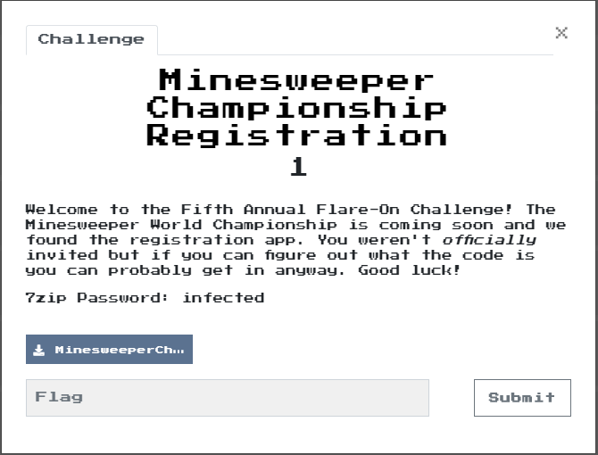
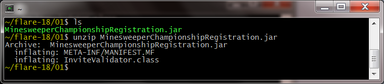
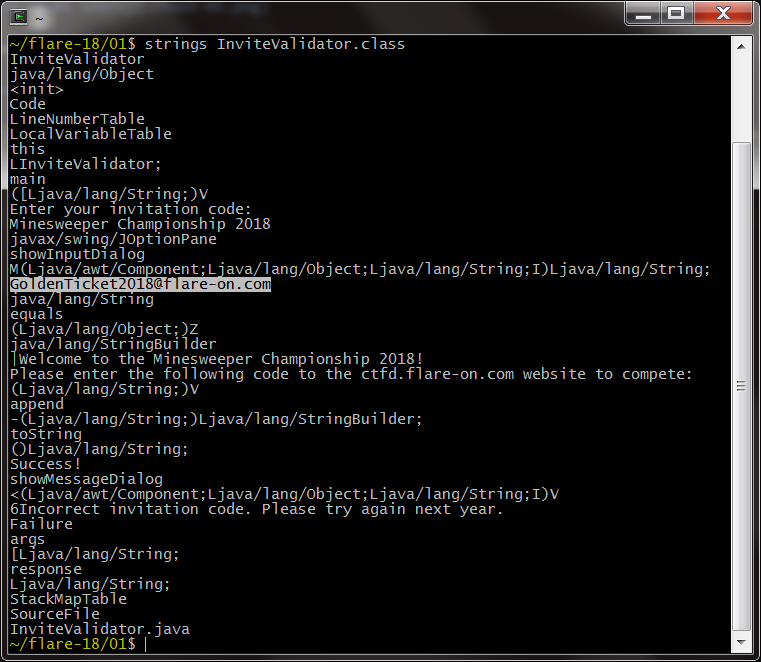

# 01 - Minesweeper Championship Registration



Challenge is in Java, delivered as a simple `.jar` file. We can unzip it to have a quick peek at the contents:



The `jar` contains a single class called `InviteValidator`. Running `strings` gives us the flag immediately:



Alternatively, we can run the class file through a Java decompiler. The best ones are [`JD`][JD] and [`CFR`][CFR] by [Lee Benfield][LeeAtBenf]. They have 
different strengths and weaknesses with `JD` offering a better GUI and integration with IDEs for easier deobfuscation
 whilst CFR is better at unpicking convoluted loops, switch statements and lambdas. Using either is overkill in this case, but still:

```java
/*
 * Decompiled with CFR 0_133.
 */
import javax.swing.JOptionPane;

public class InviteValidator {
    public static void main(String[] args) {
        String response = JOptionPane.showInputDialog(null, "Enter your invitation code:", "Minesweeper Championship 2018", 3);
        if (response.equals("GoldenTicket2018@flare-on.com")) {
            JOptionPane.showMessageDialog(null, "Welcome to the Minesweeper Championship 2018!\nPlease enter the following code to the ctfd.flare-on.com website to compete:\n\n" + response, "Success!", -1);
        } else {
            JOptionPane.showMessageDialog(null, "Incorrect invitation code. Please try again next year.", "Failure", 0);
        }
    }
}
```

While we're on the subject of [CFR][CFR], I have it on good authority that today 
is Lee Benfield's birthday, so in celebration:


[LeeAtBenf]:https://twitter.com/LeeAtBenf
[CFR]:http://www.benf.org/other/cfr/
[JD]:http://jd.benow.ca/

