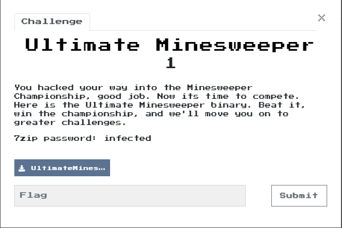
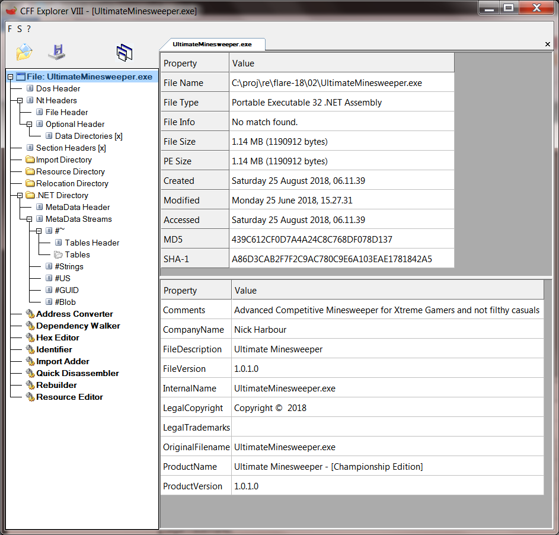
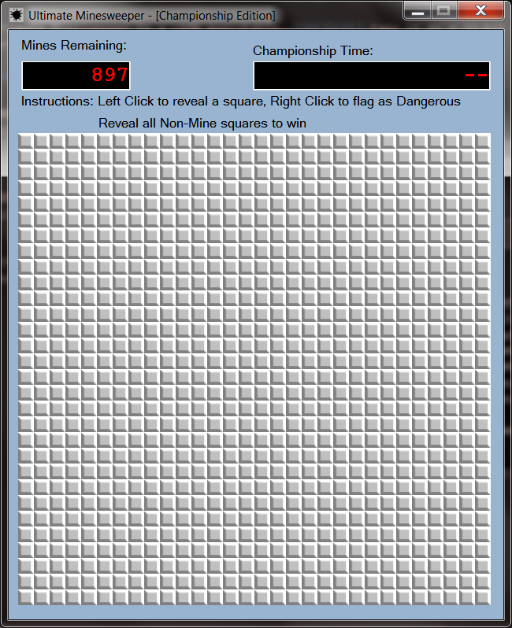
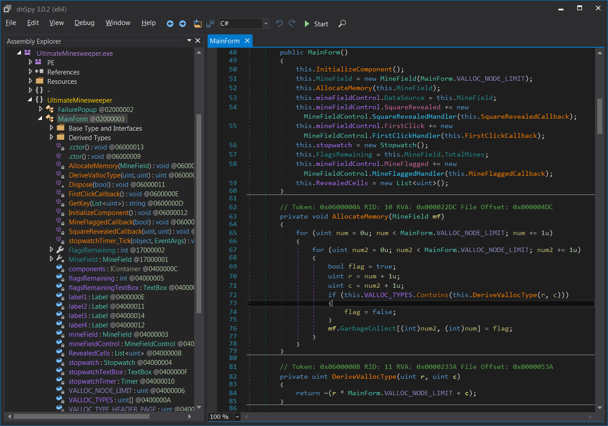

# 02 - Ultimate Minesweeper



Ultimate Minesweeper is a ~1MB executable. [CFF][CFF] tags it as a 32-bit .NET executable with some
very amusing properties. Time to break out [dotNetSpy][dnSpy].



Tools
---
- [CFF][CFF]: CFF Explorer (Explorer Suite) - Graphical PE file parser with built-in Resource and Hex Editors
- [dotNetSpy][dnSpy]: .NET reverse engineering framework with built-in debugger and much more

Xtreme Gaming
---

Running the executable (you're doing this in a VM, right?) presents us with the following Minesweeper grid:



A 30x30 grid with 897 mines. That's pretty ... extreme. We definitely need to peek under the hood if we are
to have any chance of finding the three mine-free squares, [dotNetSpy][dnSpy] to the rescue:

 

Ultimate Minesweeper is not heavily obfuscated, it consists of six classes with all the interesting
code being in `MainForm`. The `MineField` class is responsible for tracking the state of each cell
in the game grid. The weird thing about it is that it has two identical accessors for the grid:

```C#
// Token: 0x17000003 RID: 3
// (get) Token: 0x06000014 RID: 20 RVA: 0x00002AE4 File Offset: 0x00000CE4
// (set) Token: 0x06000015 RID: 21 RVA: 0x00002AEC File Offset: 0x00000CEC
public bool[,] MinesPresent
{
	get { return this.minesPresent; }
	set	 { this.minesPresent = value; }
}

// Token: 0x17000004 RID: 4
// (get) Token: 0x06000016 RID: 22 RVA: 0x00002AE4 File Offset: 0x00000CE4
// (set) Token: 0x06000017 RID: 23 RVA: 0x00002AEC File Offset: 0x00000CEC
public bool[,] GarbageCollect
{
	get { return this.minesPresent;  }
	set { this.minesPresent = value; }
}
```

The `GarbageCollect` property is just a misleading alias for the `MinePresent` property.
Going through the constructor code (shown in the `dotNetSpy` image of) brings us to a similarly
misleading method called `AllocateMemory` which uses the `GarbageCollect` property to initialize
the minefield. The constant `VALLOC_NODE_LIMIT` is the grid size (30) and the list called
`VALLOC_TYPES` contains the obfuscated locations of the only cells in the game that do not have
mines (`flag` is set to false when the mine location is contained the the `VALLOC_TYPES` list).
Location obfuscation is performed by the function `DeriveVallocType(uint r, uint c)` which
converts a 1-based grid location to a 32-bit unsigned by taking the binary complement of `r * NUM_COLUMNS + c`.
The `VALLOC_TYPES` array is initialized on construction as follows:

```C#
// Token: 0x04000007 RID: 7
private static uint VALLOC_TYPE_HEADER_PAGE = 4294966400u;

// Token: 0x04000008 RID: 8
private static uint VALLOC_TYPE_HEADER_POOL = 4294966657u;

// Token: 0x04000009 RID: 9
private static uint VALLOC_TYPE_HEADER_RESERVED = 4294967026u;

// Token: 0x0400000A RID: 10
private uint[] VALLOC_TYPES = new uint[]
{
    MainForm.VALLOC_TYPE_HEADER_PAGE,
    MainForm.VALLOC_TYPE_HEADER_POOL,
    MainForm.VALLOC_TYPE_HEADER_RESERVED
};
```

We can find the locations of the mine-free squares with a couple of lines of python:

```python
>>> def decm(k):
    k = ~k & 0xffffffff
    return (k/30, k%30)

>>> map(decm,[4294966400,4294966657,4294967026])
[(29L, 25L), (21L, 8L), (8L, 29L)]
>>> 
```

Once the game is won, the `GetKey` function is responsible for decoding the flag:

```C#
// Token: 0x0600000D RID: 13 RVA: 0x000023E4 File Offset: 0x000005E4
private string GetKey(List<uint> revealedCells)
{
	revealedCells.Sort();
	Random random = new Random(Convert.ToInt32(revealedCells[0] << 20 | revealedCells[1] << 10 | revealedCells[2]));
	byte[] array = new byte[32];
	byte[] array2 = new byte[]
	{ 245, 75, 65, 142, 68, 71, 100, 185, 74, 127, 62, 130, 231, 129, 254, 243, 28, 58,
	  103, 179, 60, 91, 195, 215, 102, 145, 154, 27, 57, 231, 241, 86
	};
	random.NextBytes(array);
	uint num = 0u;
	while ((ulong)num < (ulong)((long)array2.Length))
	{
		byte[] expr_5B_cp_0 = array2;
		uint expr_5B_cp_1 = num;
		expr_5B_cp_0[(int)expr_5B_cp_1] = (expr_5B_cp_0[(int)expr_5B_cp_1] ^ array[(int)num]);
		num += 1u;
	}
	return Encoding.ASCII.GetString(array2);
}
```

The variable `array2` contains the encrypted flag which `GetKey` decrypts by xor-ing with a 
byte stream generated from the `.NET` random number generator (`class Random`) seeded by the sorted
list of the (0-based) locations of mine-free squares (the `revealedCells` list). We can write
a bit of C# [code][./Program.cs] that uses the cell locations we've discovered to decrypt the flag,
but it's just easier to just run the game and click on the cells:


```
Ch3aters_Alw4ys_W1n@flare-on.com
```


[CFF]:http://www.ntcore.com/exsuite.php
[dnSpy]:https://github.com/0xd4d/dnSpy