# 03 - FLEGGO

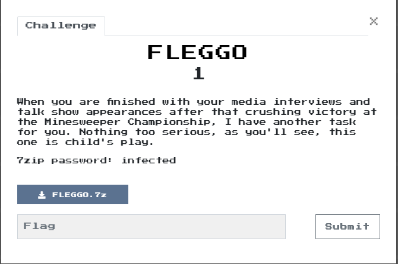

Tools
---
- [IDA Pro][IDA]: The best disassembler money can buy (there is a free edition of v7.0)
- [CFF Explorer Suite][CFF]: CFF Explorer (Explorer Suite) - Graphical PE file parser with built-in Resource and Hex Editors
- [PyCrypto][PyCrypto]: Crypto modules for Python
- [Pillow][Pillow]: Python image manipulation library (optional)

Child's Play
----

Unpacking the encrypted challenge archive produces `FLEGGO.zip`, another archive that in turn contains
no less than 48 executables with identical sizes (45,056). Looking at the first one (or any one) in
[CFF][CFF] shows it to be a 32bit executable with most of its weight in a single ~32KB (`0x8150` bytes) resource
of type `BRICK` and with id `101`.

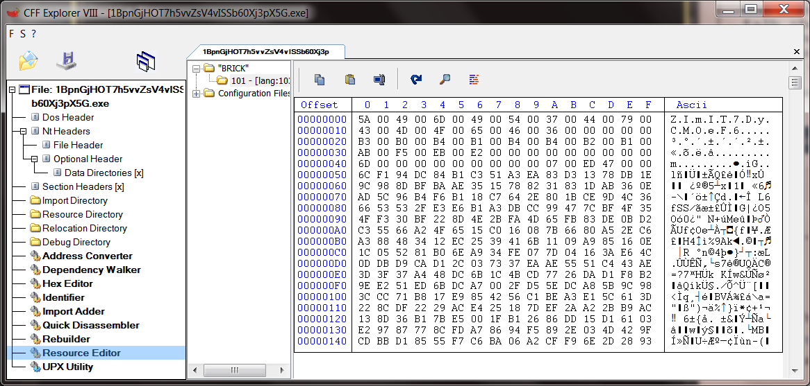

It looks like the resource has some sort of `0x50`-long low entropy header (or perhaps a UTF16-LE string?)
 followed by high entropy (encrypted?) data. Let's do a quick comparison between a couple of the executables to try
to figure out how diverse a population we're looking at:

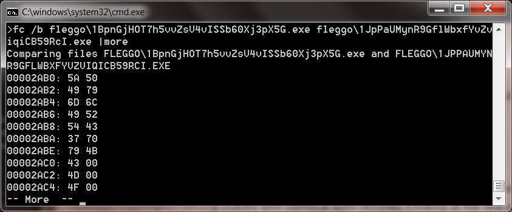

Thankfully the first differences are in the beggining of the resouces (`BRICK\101` starts at offset `0x2AB0` in the file), meaning
that all the executables share the same code and have a different `BRICK` resource. Running the
first one (in a VM) just prompts us for a password. On a whim, I typed the unicode string that was
visible at the header of the `BRICK` resource and got rewarded with the folowing cryptic message:

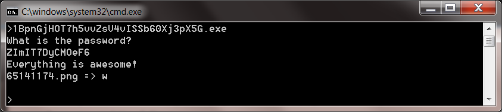

That seems to have worked! The executable dropped a PNG file with a picture of a Lego man:

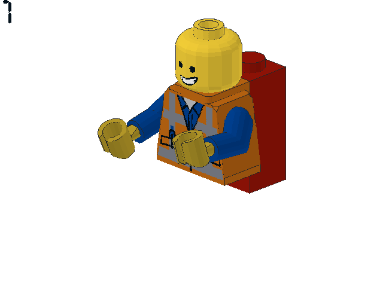

It also gave us some sort of single letter hint: `w`. The number `1` in the top-left corner of
the picture probably indicates that this is the first in a sequence of images. Similarly, we can
guess that the single letter is a part of the flag and our challenge will be to decrypt the resources
to obtain the images and the sequence of single letters. Since we're looking at 48 executables, we'll 
need to script all this up somehow. Anyway, enough exploratory analysis, time to break out [IDA][IDA].

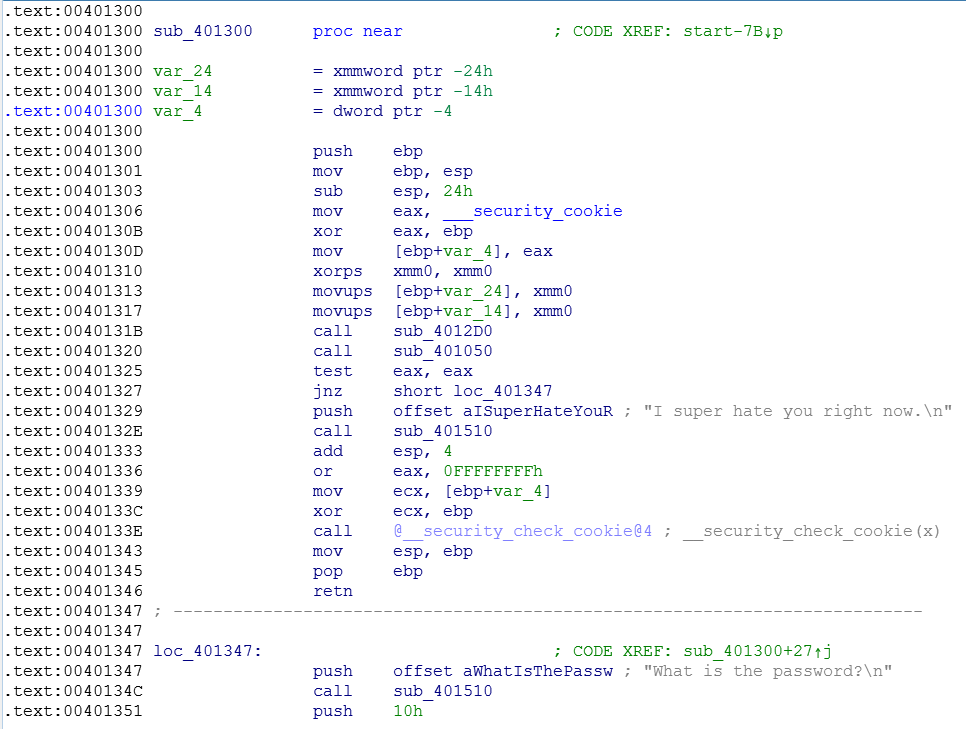

The `main` function is located at `0x401300` (if you're having trouble finding it, the heuristic
that works best with `C/C++` runtime is to start with entrypoint, follow the program flow ignoring
calls until you come to a call to a sub that is close to the start of the binary, has three arguments
and is usually one of the last three or four calls in the flow). It looks like `sub_401510` is
 actually `wprintf` (this becomes apparent later in `main` it gets called with a argument containing `%s`).

 `sub_4012D0` performs some sort of initialization:

 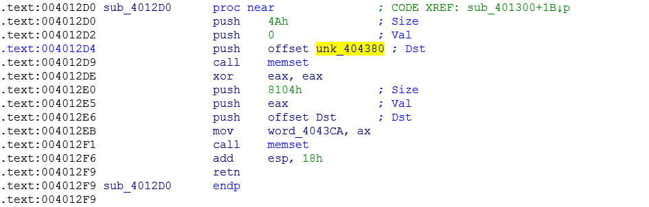

 Looks like it's initializing verious fields of a block that `0x8150` total length, starting
 at address `0x404380`. The initialization splits this block up into a `0x4A`-long piece,
 a single word and then a `0x8104`-long piece.
 Given the similarity with the structure of the `BRICK` resource, we
 can go ahead and mark those data fields in line with the `0x50`-long header we saw in the 
 resource. Notice that the last four bytes before the encrypted stream looked like a length
 field, which we can separate out here:

 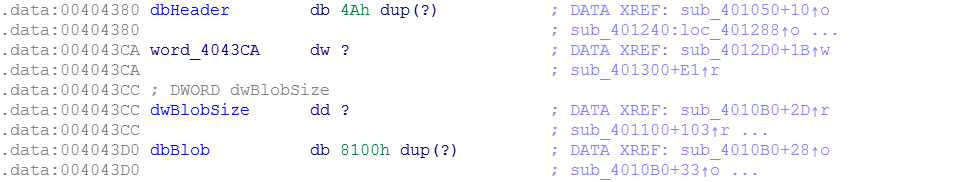

 After `sub_4012D0`, `main` calls `sub_401050` which uses `sub_401000` to load the `BRICK`
resource and copies its contents to the initialized buffer at `0x40380` (we renamed this `dbHeader`).
If this operation fails, `main` exits with the `"I super hate you right now"` message, otherwise
control flow contiues as follows (notice I've renamed `sub_401510` to `wprintf`):

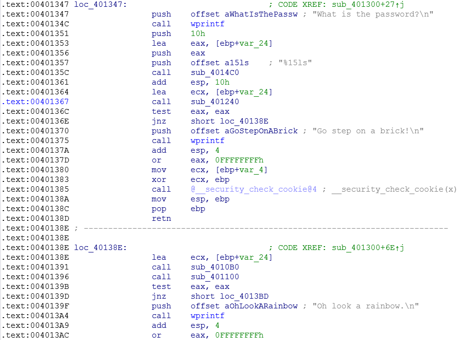

It prints the password prompt and then calls `sub_4014C0` (probably `wscanf`) to read utf-16le string
from `stdin` with max length of 16 `wchar_t` (15 characters plus null terminator). This string is stored
in the stack at `var_24`, which we shall can rename to `wsz_user_password`.
`main` then calls `sub_401230` with the user-supplied password as first argument (notice that it's using the
`__fastcall` calling convention which uses general registers to pass arguments). This function
probably validates the password as `main` terminates if it returns `false`. A quick look at
`sub_401230` can verify our guess: The function only returns `true` if the input psasword matches
the unicode string at the start of the resource blob. Incidentally, the function will respond to
the password `IronManSucks` by printing `Oh hello Batman`, but it will only return true if the 
input password matches the cleartext password at the start of the `BRICK` resource.

After matching the password, `main` calls `sub_4010B0` passing the password as the first arguemnt.
Let's have a closer look at this function:

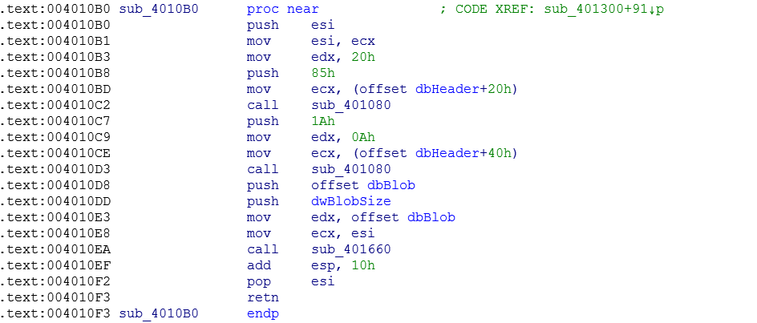

First of all, it looks like the header of the resource has a bit more structure than we'd originally
assumed. The first 32 bytes are reserved for the password, which is stored in UTF-16LE cleartext.
After that we have a couple of encrypted segments of lengths 32 and 10 respectively, followed by
a word of unknown purpose and a dword holding the size of the encrypted image. `sub_401080` is
used to decrypt two sections of the header. The decryption it performs is XOR with a single
value passed in as the third argument (remember the `__fastcall` calling convention means that
the first two arguments go into `ECX` and `EDX` and the third onwards are pushed on the stack).
Hence the unicode string at header offset `0x20` is decrypted with key `0x85` and the shorter string
at offset `0x40` is decrypted with key `0x1A` (the decryption algo is a bit quircky as it only
xor's non-zero values with the key, implying that no byte in the cleartext can be equal to the
key used for encryption). Finally `sub_401660` is called to decrypt the Lego image in the resource.
The decryption implemented by this function is a bit more complicated, so we'll park it for the
minute and continue unpicking the main program flow.
 Let's update the symbols we defined in the resource storage area to
incorporate the new information we got:

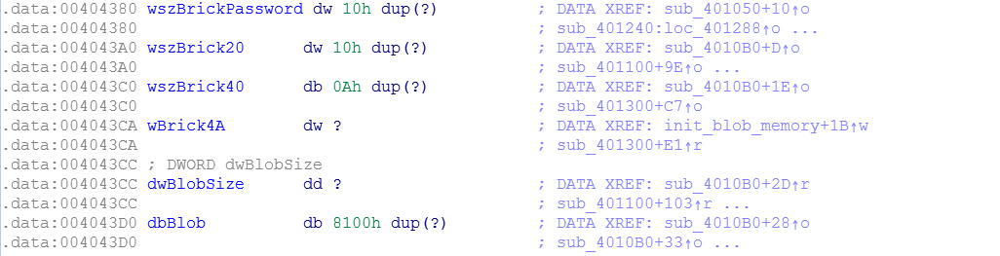

After the decryption function we just looked at (`sub_4010B0`), `main` calls `sub_401100` which
is responsible for creating the brick image file. `sub_401100` uses the `GetModuleFilenameA()`
to get the path of the `.exe` and saves the brick image in the same place. A couple of segments
of this function are interesting:

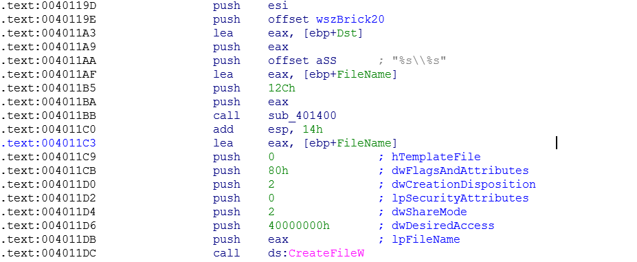 

The filename for the brick image is coming from offset `0x20` in the resource header.

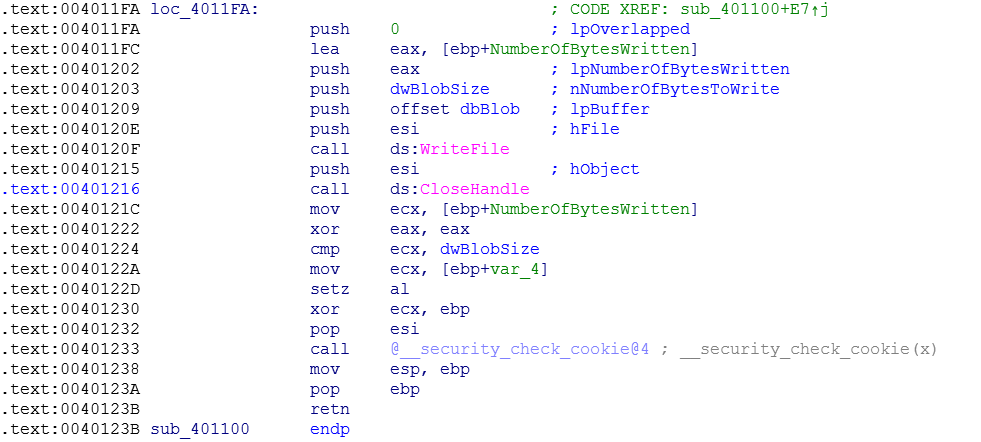

And the image file contents come directly from the decrypted blob, as we had guessed. Let's
continue with the program flow in `main`:

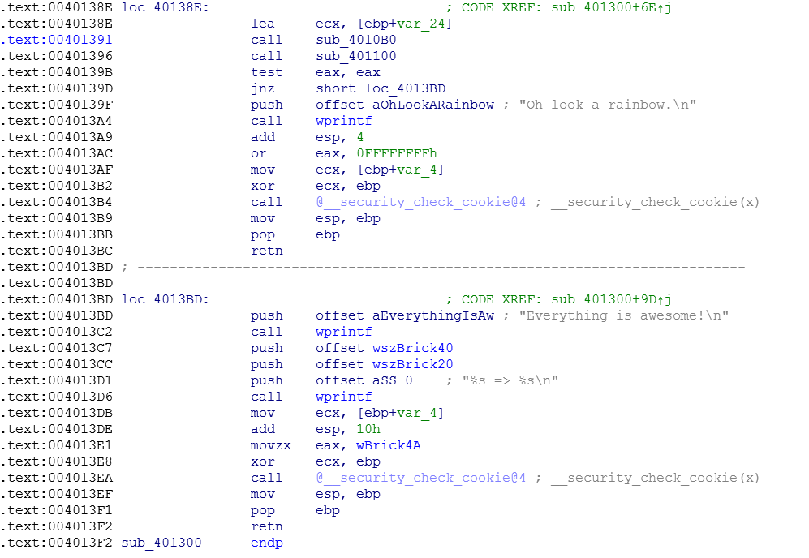

If `sub_401100` saves the image file successfully, `main` prints the `filename => letter`
message using the decrypted filename from offset `0x20` in the resource header and taking the letter
(which is actually a 5-character UTF-16LE string) from offset `0x40`. It then prints the
`everything is awesome` messages and exits with errorlevel set to the word at offset `0x4A`.
Putting together all the hints we've collected, we can now form a complete picture of the brick resource:

```C++
struct brick_resource_t {
    wchar_t        password[0x10];        // offset 00  cleartext
    wchar_t        filename[0x10];        // offset 20  encrypted with 0x85
    wchar_t        flag_segment[0x05];    // offset 40  encrypted with 0x1A
    unsigned short exit_errorlevel;       // offset 4A  cleartext
    size_t         image_size;            // offset 4C  cleartext
    unsigned char  image_data[0x8100];    // offset 50  encrypted with password
} ;
```
We now have enough information to decrypt the letters of the flag, but it's not clear how to order
them properly. At this stage, I took a leap of faith and guessed that the exit errorlevel (found 
at offset `0x4A` in the resource head) should be used for this purpose and it turned out to be correct!

We don't really need to decrypt the actual images, however it's fun to do so. If you remember,
`sub_401660` was used to decrypt the image block using the password as key.


We can infer that `sub_401540' plays the role of `setkey()` as its two arguments are the cipher
context (a 256-byte area on that stack at `ebp+var104`) and the password (remember that `__fastcall`
calling convention is being used, and the first argument is in `ecx` and passed straight through
to `sub_401540`). The 256-byte context is the hallmark of [RC4][RC4], and we can easily confirm that
we are looking at [RC4][RC4] or one of its variants by checking for the following characteristics:

- Context is initialized to the identity permutation on 256 elements (`S[i] = i`)
- Key scheduling has 256 loops, each executing a swap operation between two elements of the permutation
- Encryption / Decryption is performed by XOR'ing the text with `S[S[i] + S[j]]`

There are some variants of [RC4][RC4] that exhibit the same characteristics, but in this case it turns
out that we're looking at the genuine article and this is easy to check by attempting to decrypt one
of the images using a standard [RC4][RC4] implementation.

The following Python [script](./build_fleggo.py) puts all our conclusions together to derive the flag and save the
decrypted images. If you have the [Pillow][Pillow] package installed, it will also create an
animation of the brick images in the correct order (note that it requires [PyCrypto][PyCrypto]
and my Flare-On Python [utilities](../tools/readme.md) installed in `../tools`, it also expects to find the challenge
binaries in the subdirectory `FLEGGO`).

```Python
import os
import struct
from Crypto.Cipher import ARC4
import sys
sys.path.append('../tools')
from py_re_util import *
from collections import namedtuple

Brick = namedtuple('Brick', 'idx, flag, password, size, brick')

path = 'FLEGGO'
fleggo_animation_fname = 'fleggo_animation.gif'
fleggo = []
for fn in os.listdir(path):
    if not fn.endswith('.exe'):
        continue
    data = load_file(os.path.join(path, fn))
    password = trim_asciiz(data[0x2AB0:0x2AD0:2])
    brick_fname = xorbytes(trim_asciiz(data[0x2AD0:0x2AF0:2]), chr(0x85))
    flag = xorbytes(trim_asciiz(data[0x2AF0:0x2AFA:2]), chr(0x1a))
    idx, brick_size = struct.unpack('<HL', data[0x2AFA:0x2B00])
    brick_crypted = data[0x2B00:0x2B00 + brick_size]
    brick = ARC4.new(password).decrypt(brick_crypted)
    save_file(os.path.join(path, brick_fname), brick)
    fleggo.append(Brick(idx, flag, password, brick_size, brick))

fleggo = sorted(fleggo)     # sort by idx
print ''.join([ x.flag for x in fleggo ])

if not os.path.isfile(fleggo_animation_fname):
    try:
        from PIL import Image
        import io
        images = [ Image.open(io.BytesIO(x.brick)) for x in fleggo ]
        images[0].save('fleggo_animation.gif', save_all=True, append_images=images[1:], duration=200, loop=0)
    except:
        pass
```

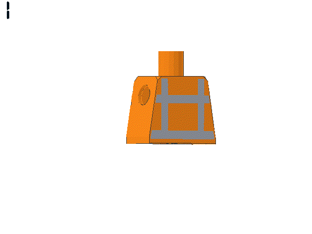

```
mor3_awes0m3_th4n_an_awes0me_p0ssum@flare-on.com
```

References
---

- RC4 Encryption algorithm: [https://en.wikipedia.org/wiki/RC4][RC4], accessed 01-Oct-2018

[IDA]:https://www.hex-rays.com/products/ida/support/download.shtml
[CFF]:http://www.ntcore.com/exsuite.php
[RC4]:https://en.wikipedia.org/wiki/RC4
[PyCrypto]:https://pypi.python.org/pypi/pycrypto
[Pillow]:https://python-pillow.org/