# 12 - help

<p align="center">
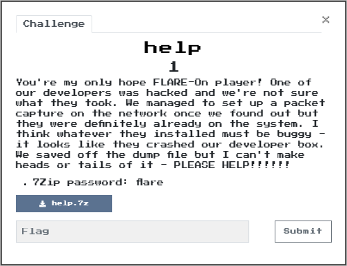
</p>

<!---->

---

Tools
---

- [Volatility][Volatility]: Open Source Memory Forensics toolkit with a multitude of plugins.
  This will be our main workhorse in this challenge. [Rekall][Rekall] is also a good (or even better?)
  alternative.
- [IDA Pro][IDA]: Excellent disassembler/decompiler/debugger (there is a free edition of v7.0)
- [WinDbg][WinDbg]: The standard Windows platform debugger
- [Wireshark][Wireshark]: Great packet capture and packet analysis engine, scriptable in Lua.
- [TCPflow][TCPflow]: Open Source Linux-based tool that extracts TCP streams from packet captures in bulk.

Python Packages
---

- [`pefile`]: PE File parsing for Python
- [`pdbparse`]: Parse Microsoft PDB files
- [`requests`]: High level, easy to use HTTP interface for python
- [`pywin32`]: Python interface to the native Win32 API
- [`PyCryptodome`]: Cryptographic primitives for Python, successor to [`PyCrypto`]
- [`capstone`]: Disassembler framework for mulitple processors
- [`keystone`]: Assembler framework for multiple processors
- [`unicorn`]: Universal processor emulator

---

Contents
---

1. [The Game Is Afoot](#a_c_the_game_is_afoot)
2. [`man` In The Kernel](#a_c_man_in_the_kernel)
3. [The Hidden Listener](#a_c_the_hidden_listener)
4. [Command & Conquer](#a_c_command_and_conquer)
5. [The Final Problem](#a_c_the_final_problem)
6. [Degreelessness Mode](#a_c_degreelessness_mode)
7. [The Shortening Of The Way](#a_c_kwisatz_haderach)
8. [The General Problem](#a_c_the_general_problem)
9. [COMING SOON - Hackery In The Kernel With `man.sys`](#a_c_hackery)
10. [Epilogue and Acknowledgements](#a_c_epilogue)
---

## 1.<span id="a_c_the_game_is_afoot"/> The Game Is Afoot

As promised in the intro, the `help.7z` archive contains a 2GB crash-dump and a 32MB packet capture
file in `PcapNg` format. This is going to be a 'forensic' challenge: It's a bit like a murder mystery
with us playing the role of the detective looking for clues in the giant haystack that is the crash-dump.
Like every successful detective, we'll need to keep an organized record of the evidence we've uncovered,
the active clues we are following and the conclusions we have drawn. 

Personally, I kept a central
'log' file with separate sections for the different parts of the investigation and a section at the
bottom listing my conclusions and open questions. I also set up separate folders for carved out binaries
(the crash-dump contains plenty) and the results of the various volatility scans as they are slow
to run and it's better to keep them around than re-run the scan whenever you want to look up some
specific process, driver, device or connection property.

After these initial preparation, grab your deerstalker, raincoat, pipe or other thinking tools and 
let's figure out who killed Captain Ntos.


 The introductory message makes it clear that the attackers were in the
system before the packet capture was set up, implying that we won't be able to find the communication
that cause the initial infection or the malware binaries in the capture like we did in 
Flare-On 4 Challenge 12 or Flare-On 5 Challenge 11. Therefore it makes sense to focus on the
crash-dump first. The message also suggest that the crash was caused by the malware, which
can only mean that we are dealing with **_kernel-mode malware!_** 

 [Volatility] will be our main analysis tool for the crash-dump. It can parse kernel
structures, run [yara] scans and has a plethora of plugins that can help with our investigation.
Our objectives for the initial exploratory analysis are:

1. Identify OS version (in order to use the correct [Volatility] profile)
2. Identify IP address of victim host (we'll need this to filter down the packet capture)
3. Triage open connections to identify possible IPs for the attacker
4. Collect additional facts about the victim: hostname, user names, running processes, etc
5. Identify the malware kernel module

The `crashinfo` plugin identifies the crash dump as coming from Windows Version 15 subversion 7601 (what is version 15?).
The 7601 part makes it clear that we are looking at Windows 7 SP1 x64 which can be handled by [Volatility] profile `Win7SP1x64`.<sup id="a_winver">[1](#f_winver)</sup>

After selecting the right profile, we can use the `netscan` plugin to get the IPs of the victim
and try to identify the attacker's host. You can find the full output in [netscan.txt](./scans/netscan.txt), but
the following parts are the most interesting:

```
Offset(P)          Proto    Local Address                  Foreign Address      State            Pid      Owner          Created
0x7d62e770         UDPv4    192.168.1.244:1900             *:*                                   2984     svchost.exe    2019-08-02 14:18:24 UTC+0000
0x7d6a7cf0         UDPv4    127.0.0.1:56043                *:*                                   2984     svchost.exe    2019-08-02 14:18:24 UTC+0000
0x7d6b3ec0         UDPv4    0.0.0.0:0                      *:*                                   1020     svchost.exe    2019-08-02 14:18:16 UTC+0000
-------------------snip------------------------------------snip----------------------------------------snip------------------------------------------
0x7d7c91d0         TCPv4    0.0.0.0:4444                   0.0.0.0:0            LISTENING        876      svchost.exe    
0x7d85bdc0         TCPv4    192.168.1.244:139              0.0.0.0:0            LISTENING        4        System         
0x7d8c5ad0         TCPv4    0.0.0.0:1029                   0.0.0.0:0            LISTENING        480      lsass.exe      
0x7d445010         TCPv4    192.168.1.244:1588             192.168.1.243:7777   FIN_WAIT1        876      svchost.exe    
0x7d626cf0         TCPv4    192.168.1.242:1578             192.168.1.232:8009   CLOSED           2660     chrome.exe     
0x7d62acf0         TCPv4    192.168.1.244:1586             192.168.1.243:7777   FIN_WAIT1        876      svchost.exe    
0x7d6686c0         TCPv4    192.168.1.244:4444             192.168.1.243:1060   CLOSE_WAIT       876      svchost.exe    
0x7d70d010         TCPv4    192.168.1.244:1633             192.168.1.243:8888   FIN_WAIT2        876      svchost.exe    
0x7d7d2010         TCPv4    -:0                            56.75.74.3:0         CLOSED           876      svchost.exe    
0x7d8bdae0         TCPv4    -:0                            56.107.135.1:0       CLOSED           1        0??????       
0x7d8bfcf0         TCPv6    -:0                            386b:8701:80fa:ffff:386b:8701:80fa:ffff:0 CLOSED           532      svchost.exe    
0x7d8dca90         TCPv4    -:0                            56.155.58.3:0        CLOSED           1        0??????       
0x7d8e3300         TCPv4    192.168.1.244:1636             192.168.1.243:8888   FIN_WAIT2        876      svchost.exe    
0x7d93b010         TCPv4    192.168.1.244:4444             192.168.1.243:1063   CLOSE_WAIT       876      svchost.exe    
0x7d94e930         TCPv4    192.168.1.242:1305             192.168.1.232:8009   CLOSED           2660     chrome.exe     
0x7d961010         TCPv4    192.168.1.244:1635             192.168.1.243:7777   FIN_WAIT1        876      svchost.exe    
0x7d96ecf0         TCPv4    192.168.1.244:1639             192.168.1.243:6666   FIN_WAIT2        876      svchost.exe    
0x7d96f3f0         TCPv4    192.168.1.244:1610             192.168.1.243:7777   FIN_WAIT1        876      svchost.exe    
0x7d98c010         TCPv4    192.168.1.242:1061             192.168.1.232:8009   CLOSED           2660     chrome.exe     
-------------------snip------------------------------------snip----------------------------------------snip------------------------------------------
```

The victim host is sitting on **192.168.1.244** and there seem to be quite a few connections with funny
ports like 4444, 6666, 7777, 8888 between the victim and **192.168.1.243** which is likely to be the attacker.
Port 4444 seems to be open on the victim side with a couple of old connections in `CLOSE_WAIT` states, whereas
ports 6666, 7777, 8888 are receiving data on the attacker side. All the suspicious activity seems to be
centred on process **`876 svchost.exe`**.<sup id="a_net_activity">[2](#f_net_activity)</sup>

We are now ready to triage the data in the packet capture. Let's pull up the capture in [Wireshark],
filter for the attacker's IP using `ip and ip.addr == 192.168.1.243` and visualize the TCP conversations
using Statistics->Conversations:

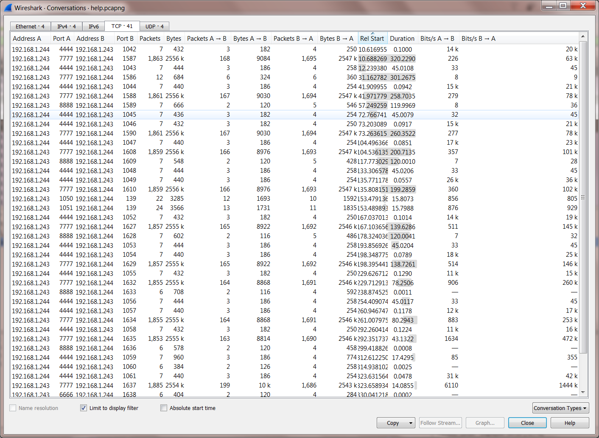

The pattern is very clear: The attacker issues commands by opening a TCP connection to victim port 4444
and then later receives responses when the victim opens connections to attacker ports 6666, 7777 and 8888.
The only other thing that seems relevant is an SMB session (port 139) between victim and attacker.
[Wireshark] can parse this stream, but it doesn't seem to contain much other than the attacker authenticating
and connecting anonymously to the `IPC$` resource of the victim. The SMB traffic also gives away
the host names for both attacker (`WIN-TO94970DNEU9`) and victim (`WIN-HJULHEAEK51`)
<sup id="a_hostname">[3](#f_hostname)</sup>.

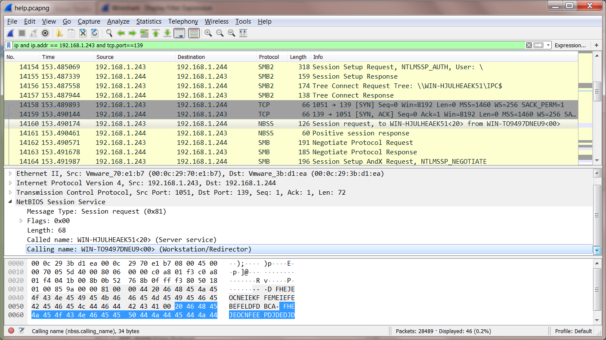

We can use [TCPFlow] to extract the TCP streams between victim and attacker. I separated them out
into a the subfolder [`streams`](./streams_dir.txt). Given the differences in shape of the data
sent to the different ports, we can speculate that each port corresponds to a different malware
'plugin', with port 7777 most probably receiving uncompressed screenshots in BMP format, as packets
 sent to it are roughly 2MB in size and low entropy with highly periodic data (zip can squash
 them down to 5% of their original size):

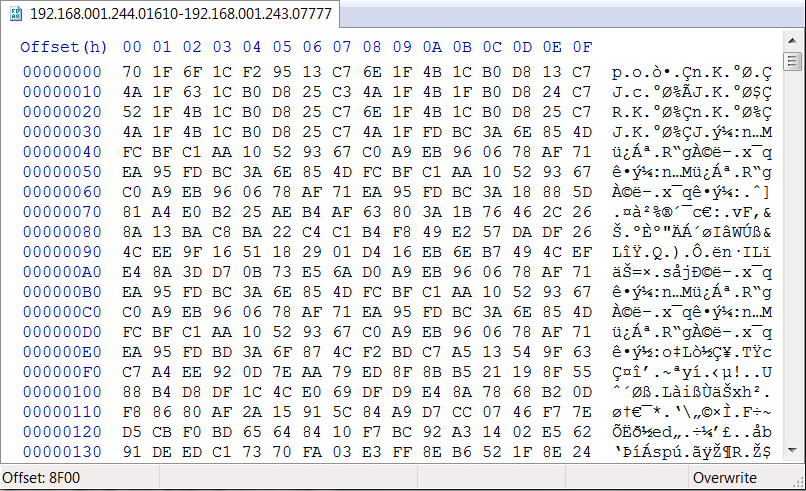

 All traffic looks encrypted, but given the picture above, we can guess that the attackers are using
a simple XOR cipher with an 8-byte key (clear 8-byte periodicity at the start of that hexdump),
 which seems quite low tech coming from an outfit that can produce kernel mode malware implants...

 To round off our initial analysis we deploy a number of [Volatility] plugins:
 * [`sessions`](./scans/sessions.txt) indicates only one logged in user (plus the `SYSTEM` desktop for services).
 * [`hashdump`](./scans/hashdump.txt) shows us that all accounts have no password and the main user is called `"FLARE ON 2019"`
  (yes, the spaces made me cringe too).
 * [`hivelist`](./scans/hivelist.txt) picks up the location of all loaded hives, confirming the username.
 * [`pslist`](./scans/pslist.txt) doesn't highlight anything anomalous except for a running copy of [KeePass] - 
   a database full of secret passwords sounds like the ideal juicy target for our evil kernel mode malware wielding attacher.
 * [`modules`](./scans/modules.txt) hits paydirt, identifying a kernel module called **`man.sys`** at address `0xfffff880033bc000`
   that has been loaded from the uesr's desktop folder - not at all suspicious!
 * [`drivermodule`](./scans/drivermodule.txt) connects module `man.sys` to a driver called `in`
  <sup id="a_driver_note">[4](#f_driver_note)</sup>, but also
   highlights a second suspicious driver called `FLARE_Loaded_0` which is not associated with any
   kernel module!
 * [`driverscan`](./scans/driverscan.txt) confirms the memory location of driver `in` and also gives
   us the memory location of `FLARE_Loaded_0`: `0xfffffa80042d0000`.

Our initial exploratory pass is now complete, we have managed to uncover more facts than we originally set 
out to and the various [Volatility] plugins have made the process relatively painless. Let's collect
everything we know so far in one table (this should be in your logbook):

<p style="center">

|Fact | Notes|
|-----|------|
|OS Version| Windows 7 SP1 x64, v6.1.7601|
|Victim host| 192.168.1.244, WIN-HJULHEAEK51 |
|Victim username| `FLARE ON 2019`, empty password|
|Attacker host| 192.168.1.243, WIN-TO94970DNEU9 |
|Implant location| process 876, listening on port 4444|
|Protocol|Encrypted communication, possible XOR cipher|
|        | Commands issued to 4444, responses to 6666, 7777, 8888|
|Anomalies|Kernel module `man.sys` loaded from user desktop|
||Unknown kernel driver `FLARE_Loaded_0` at `0xfffffa80042d0000` loaded dynamically?|
||Juicy target process `2648 KeePass.exe`|
||The presence of various `vm*` drivers and process `vmtoolsd.exe` suggest victim is a [VMWare] guest|

</p>

## 2.<span id="a_c_man_in_the_kernel"/> `man` In The Kernel

The most promising avenue we have for investigation is to dump the `man.sys` module and pick it
apart:

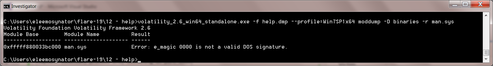

Okay, so that could have gone better. It looks like all is not well with the driver image, let's
jump into the [Volatility] Python shell to investigate:

```
C:\Users\eleemosynator\flare-19\12 - help>volatility_2.6_win64_standalone.exe -f help.dmp --profile=Win7SP1x64 volshell
Volatility Foundation Volatility Framework 2.6
Current context: System @ 0xfffffa80018cc090, pid=4, ppid=0 DTB=0x187000
Welcome to volshell! Current memory image is:
file:///C:/Users/eleemosynator/flare-19/12%20-%20help/help.dmp
To get help, type 'hh()'
```
```Python
>>> db(0xfffff880033bc000,0x80,addrspace())      # man.sys base address in kernel A/S
```
```
0xfffff880033bc000  00 00 00 00 00 00 00 00 00 00 00 00 00 00 00 00   ................
0xfffff880033bc010  00 00 00 00 00 00 00 00 00 00 00 00 00 00 00 00   ................
0xfffff880033bc020  00 00 00 00 00 00 00 00 00 00 00 00 00 00 00 00   ................
0xfffff880033bc030  00 00 00 00 00 00 00 00 00 00 00 00 00 00 00 00   ................
0xfffff880033bc040  00 00 00 00 00 00 00 00 00 00 00 00 00 00 00 00   ................
0xfffff880033bc050  00 00 00 00 00 00 00 00 00 00 00 00 00 00 00 00   ................
0xfffff880033bc060  00 00 00 00 00 00 00 00 00 00 00 00 00 00 00 00   ................
0xfffff880033bc070  00 00 00 00 00 00 00 00 00 00 00 00 00 00 00 00   ................
```
```Python
>>> db(0xfffff880033bc000+0x1000,0x100,addrspace())
```
```
0xfffff880033bd000  00 00 00 00 00 00 00 00 00 00 00 00 00 00 00 00   ................
0xfffff880033bd010  48 89 4c 24 08 48 8b 4c 24 08 48 8b 44 24 08 48   H.L$.H.L$.H.D$.H
0xfffff880033bd020  89 41 08 48 8b 4c 24 08 48 8b 44 24 08 48 89 01   .A.H.L$.H.D$.H..
0xfffff880033bd030  c3 cc cc cc cc cc cc cc cc cc cc cc cc cc cc cc   ................
0xfffff880033bd040  48 89 4c 24 08 48 83 ec 18 48 8b 4c 24 20 48 8b   H.L$.H...H.L$.H.
0xfffff880033bd050  44 24 20 48 39 01 75 06 c6 04 24 01 eb 04 c6 04   D$.H9.u...$.....
0xfffff880033bd060  24 00 8a 04 24 48 83 c4 18 c3 cc cc cc cc cc cc   $...$H..........
0xfffff880033bd070  48 89 4c 24 08 48 83 ec 18 48 8b 44 24 20 48 8b   H.L$.H...H.D$.H.
```

The code appears to be there, but the `MZ` header has been completely obliterated. Our best bet at this
stage is to dump the mapped memory image of the driver. We can do this in `volshell`:
```Python
>>> man_sys_img = addrspace().read(0xfffff880033bc000,0xf000)
>>> len(man_sys_img)      # Check the A/S object read the image successfully
61440
>>> open('binaries/man_sys_img.bin', 'wb').write(man_sys_img)
>>>
```
A quick scan of the resulting file turns up a second PE executable embedded in the driver:


And a search for long strings turns up the following debug filenames:

```bash
$ strings -n 50 man_try2_sys.bin
e:\dropbox\dropbox\flareon_2019\code\id\objchk_win7_amd64\amd64\man.pdb
e:\dropbox\dropbox\flareon_2019\code\cd\objchk_win7_amd64\amd64\m.pdb
```

Our mysterious driver `man.sys` comes from a project called `id` and contains the
main (only?) executable from a project called `cd`. It looks like `id` is the
kernel-mode component of the malware implant and `cd` is the user-mode side, the two
probably designed to work in tandem.
 Let's carve out the inner `cd` binary to a file called `payload.dll` and we can pull
both files in two sessions of [IDA] (64bit) so we can reverse-engineer them in parallel.

As the dumped image we have of the driver does not have any executable file header,
we need to tell [IDA] to treat it as a raw binary file and disassemble it in 64-bit mode.
[IDA] should have no trouble picking up most of the subs in the driver, but if that doesn't
work for your version, you can nudge it in the right direction by hitting '`P`' in a couple
of places until the call graph fills out. [IDA] will also need some help identifying the
imports - you can use the [Volatility] [`impscan`](./scans/impscan.txt) plugin which
can produce [`idc`](./scans/impscan.idc) output (you'll need to set the right base address before
you can import in [IDA]). Alternative you can use this simple python [script](./tag_man_sys_imports.py).

Paging through both the driver and the payload DLL turns up very similar sections of code where
stack strings are constructed and fed to a four parameter function:

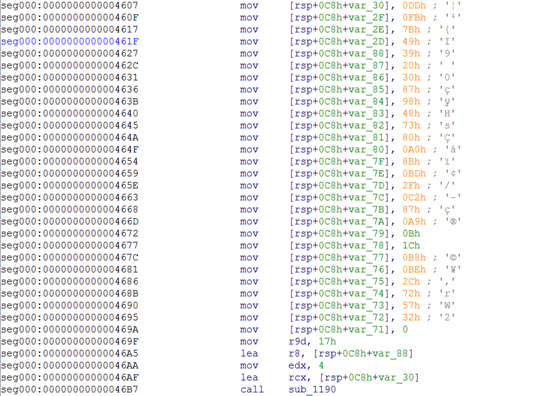

The body of the driver function `sub_1190` is identical to the function `sub_180001150` in the
payload<sup id="a_rip_relative">[5](#f_rip_relative)</sup>, and turns out to be an implementation
of the [RC4] Cipher. The Python script [`validate_rc4.py`](./validate_rc4.py) verifies that
`sub_1190` implements RC4 with signature:

```c++
rc4_crypt(const byte *key, unsigned key_size, byte *buffer, unsigned buffer_size);
```

As we are dealing with a malware platform with multiple plugins which will probably
use the same string obfuscation mechanism, it makes sense to create a general script
to automate the decryption of the stack strings. The decryptor should perform the following
steps:
* Locate `rc4_crypt()`.
* For each call into `rc4_crypt()`: 
  1. Emulate code to get stack strings
  2. Decrypt with [RC4]
  3. Produce a comment with the string
  4. Name the stack variable appropriately to make code more readable
  5. Remove all the redundant `var_XXX` definitions to clean stack frame
  

 The first step requires us to have a generic way of identifying the `rc4_crypt()` function.
The IDAPython script [`build_yara_string.py`](./build_yara_string.py) defines the function
`build_yara_string()` which can be called from the IDAPython command prompt and will
produce a [Yara] pattern (hex string with question marks for wildcards) that matches the
function at the cursor (`ScreenEA()`). <!-- I originally developed this to solve LabyREnth 2017
threat track challenge 2. --> We can run this on `sub_1190` to get the pattern for `rc4_crypt()`.

The decryptor is in [`decrypt_strings_v1.py`](./decrypt_strings_v1.py). It uses 
[`emu_helper.py`](../tools/emu_helper.py) from my [`tools`](../tools) directory and the [Unicorn]
emulator to run the code that populates the stack-frame. Running it will also produce a log
file with all the strings it decrypted.

After running the decryptor, it quickly becomes apparent that a lot of the obfuscated
strings are just system imports:

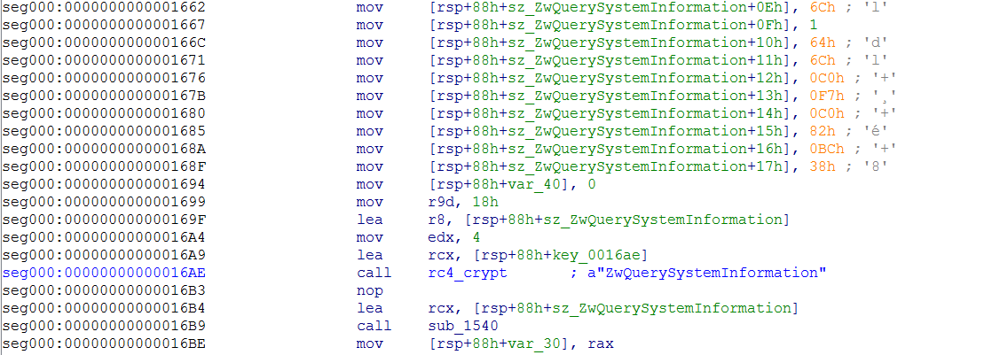

The driver uses `sub_1540` to call `MmGetSystemRoutineAddress` to resolve each import.
In a similar vein, the payload DLL function `sub_180001580` walks the [LDR Module List] of loaded
DLLs from the [PEB] to find a module by name and `sub_18000424A` which calls a specific export
in that module. We can include all these [Yara] patterns in our decryption script and make
it name the functions appropriately as well as tagging the return values (module handles)
with suitable names. All these extra features are in the final version of the deobfuscation
script: [`decrypt_strings.py`](./decrypt_strings.py).

Now we have our basic tooling in place, let's get back to reversing our image for `man.sys`.
We can start by identifying the main entrypoint, traditionally called [`DriverEntry`]. This
routine is meant to initialize the [`DRIVER_OBJECT`] structure defining the driver command
codes and set up any default devices using the [`IoCreateDevice`] call. Hence, the quickest way
to identify [`DriverEntry`] is to look for references to [`IoCreateDevice`] and walk up the call-tree
until we get to a sub that has no callers. `sub_5110` is the perfect fit here:

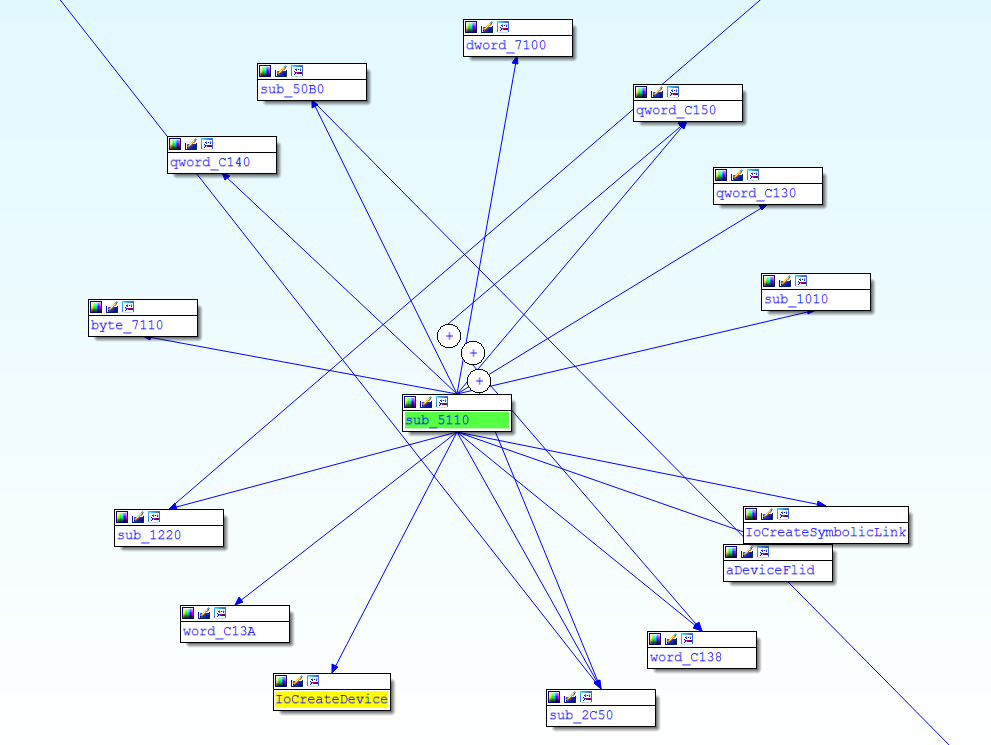

According to the MSDN page, the [`DriverEntry`] function has the following prototype:

```c++
NTSTATUS DriverInitialize(_DRIVER_OBJECT *DriverObject, PUNICODE_STRING RegistryPath)
```

As we loaded the file as a binary image, we have to manually add the type library for 64bit
Windows drivers (`ntddk64`) in [IDA] (`SHIFT-F11` to bring up the Type Libraries tab) and import
the relevant structure definitions into our structures tab.
With these tools, the [`DriverEntry`] routine is fairly easy to read and can be summarized as follows:

*  Keep pointer to [`DRIVER_OBJECT`] in `qword_C130` (renamed `g_pDriverObject`)
*  Set `DriverUnload` to `sub_1220` (renamed `DriverUnload`)
*  Keep copy of the registry path in `UNICODE_STRING64` structure at `0xC138` (renamed `g_RegistryPath`)
*  Note that Kernel pool allocations are tagged with `"FLAR"` (`0x52414C46`)
*  Keep copy of the default `MajorFunction` dispatch handler passed in [`DRIVER_OBJECT`] in `0xC150` (renamed `g_pfnDispatchMJ`)
*  Set all driver dispatch handlers to `sub_50B0`, which turns out to only handle [`DeviceIoControl`] (renamed [`DispatchDeviceControl`])
*  Call [`IoCreateDevice`] to create `\Device\FLID` of type `FILE_DEVICE_UNKNOWN` (`0x22`)
*  Keep resulting [`DEVICE_OBJECT`] pointer in `qword_C148` (renamed `g_pDeviceObjectFLID`) 
*  Create a symbolic link `\\??\FLID` so that user-space processes can access the `FLID` device.
*  Set `DO_BUFFERED_IO` and clear `DO_EXCLUSIVE` flags on the `FLID` device.
*  Use `sub_1010` (renamed `DLinkInit`) to initialize doubly-linked list at `0xC158` (defined as structure `DLink` with members `next` and `prev`)
*  Initialize Kernel Mutex at `0xC168` (defined as DDK structure `KMUTANT`)

Then an interesting thing happens:

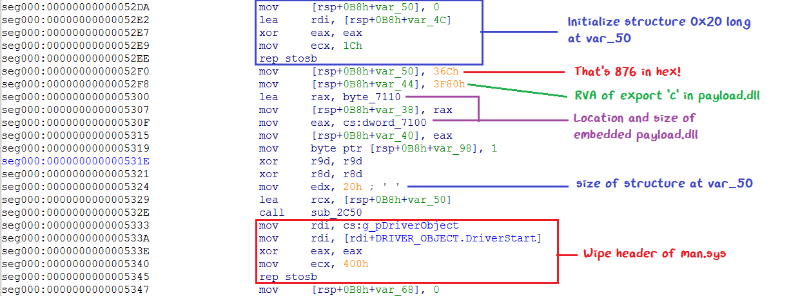

It looks like `sub_25C0` injects a PE image into a target process! Remember that 876 is the process ID
of the `svchost.exe` process that was listening on port 4444, as we saw in the [`netscan`](./scans/netscan.txt) 
results earlier. Quickly scanning through `sub_2C50` turns up calls to [`PsLookupProcessByProcessId`],
[`KeStackAttachProcess`], [`ZwAllocateVirtualMemory`] which is consistent with our guess. It also
erases a segment of memory from the `RSDS` tag that marks the DEBUG section to the end of the debug symbol
filename `.pdb`. There is also a couple of calls to `rc4_crypt` which imply that payload code
is kept encrypted when dormant. Let's rename `sub_2C50` to `InjectPayloadIntoProcess` with signature:

```c++
void InjectPayloadIntoProcess(INJECTION_REQUEST *pInjectionRequest, DWORD dwRequestSize, BYTE bFlag0, BYTE bFlag1, BYTE bFlag2)
```

Where `INJECTION_REQUEST` is defined as follows:

```c++
#pragma pack(push, 4)
struct _INJECTION_REQUEST
{
    DWORD   dwPid;          // 00 Target process id
    DWORD   field_04;       // 04 unknown
    DWORD   field_08;       // 08 unknown
    DWORD   dwEntryRVA;     // 0C entrypoint to call (this is the export for payload.dll)
    DWORD   dwPayloadSize;  // 10 Size of injected Image
    DWORD   field_14;       // 14 unknown
    PVOID   pvPayloadImage; // 18 pointer to payload data
} ;

typedef struct _INJECTION_REQUEST INJECTION_REQUEST;
#pragma pack(pop)
```

It's a bit surprising to see the PID of the target `svchost.exe` process hard-wired into the `man.sys` binary, but
I guess that customization can be done during the infection process (also makes it harder for
less well intentioned people to reuse `man.sys`).

We have made quite a bit of progress, but there is still a lot of functionality in `man.sys` which is
presumably exposed through [`DeviceIoControl`] calls. Let's switch to `payload.dll`, which gets
installed at this stage of the infection.

## 3.<span id="a_c_the_hidden_listener"/> The Hidden Listener 

`payload.dll` is a lot smaller and simpler than the driver we've been looking at. After running
the string deobfuscator, we can start with the single export at `0x3F80`:

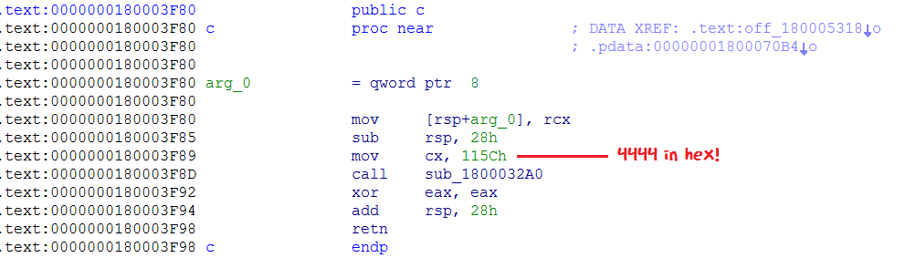

The argument to `sub_1800032A0` is 4444 - the port we saw the malware listening on for commands.
That's definitely a good start. The sub itself is fairly straightforward: It opens a socket,
binds and listens on the target port and fires off a thread to deal with each accepted connection.
The connection handler is at `sub_180002BD0` (renamed process packet), which does the following:

* Read four bytes as a little-endian long (`packet_size`) from the connection.
* Use [`VirtualAlloc`] to allocate `packet_size` bytes.
* Store the `packet_size` at the start of the allocated block.
* Call `sub_1800028B0` to receive the remainder of the packet into the allocated block.
* Then switch based on the long at offset 4 in the packet (`command_code`)
* Once the packet is processed, the listener closes the connection and exits the thread, hence each
connection to 4444 is only ever used for a single command packet.

The `command_code` switch looks like this:

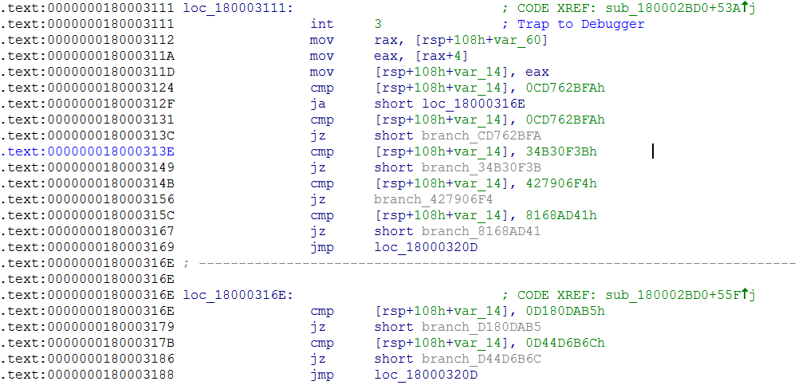

Where I have named the various branches with their corresponding command codes to make it easier
to distinguish them. I have no idea why the `INT 3` at the top would not cause an unhandled exception,
as it's not very clear how the exception management would work in the context of the injected payload -
the exception directory looks normal and seems to vector to the default C++ handler.

In any case, following through the command handling is a bit messy, but most boil down to 
[`DeviceIoControl`] commands issued to device `\\.\FLID`, which is vectored to `man.sys`.
In parallel, we can follow the `Ioctl` logic in the driver to get a full end-to-end picture.
It's a bit of a tedious process, but not that difficult (and not strictly necessary - you can
get away with guessing a lot of this). 
 The command correspondence looks as follows:

|Network Command|`payload.dll` handler|Ioctl code|Driver handler|
|---------------|-----------------------|---------|---------------|
|`0x34B30F3B`|`sub_180001DE0(pkt_payload, 0, 1)`|`0x23BEAC`|`InjectPayloadIntoProcess(inj, 0, 1, 0)`|
|`0x8168AD41`|`sub_180001DE0(pkt_payload, 1, 0)`|`0x237BE8`|`InjectPayloadIntoProcess(inj, 1, 0, 0)`|
|`0xCD762BFA`|`sub_180001DE0(pkt_payload, 0, 0)`|`0x22AF34`|`InjectPayloadIntoProcess(inj, 0, 0, 0)`|
|`0xD180DAB5`|`sub_180002080(pkt_payload)`|`0x22F378`|`sub_4580(...)`|
|`0xD44D6B6C`|`sub_1800026F0(pkt_payload)`|`0x2337BC`|`sub_1DB0(...)`|
|`0x427906F4`|`sub_180002520(pkt_payload)`||`DeviceIoControl(&pkt_payload[0], ...)`|

The first three command codes call the DLL injection function we've already seen and presumably install
various types of plugins. The fields of the injection request structure are taken from fields in the packet payload.
The last one simply performs a [`DeviceIoControl`] call using parts of the packet as arguments. 
The middle two are a bit more complicated:

* `0xD180DAB5` handled by `sub_45B0` in the driver does similar system calls as `InjectPayloadIntoProcess`
([`KeStackAttachProcess`], etc) and calls `sub_3510` which references [`RtlCreateUserThread`].
This is probably `call-plugin`.
* `0xD44D6B6C` handled by `sub_1DB0` in the driver only works with kernel objects, references `ObCreateObject`, `IoDriverObjectType`,
[`PsCreateSystemThread`] and  the string `FLARE_Loaded`. It seems that this function can dynamically load new drivers into the kernel! That's next-level scary.

Now we've mapped out the core functionality in the driver and its payload DLL (backdoor) and gained
a basic understanding of the command codes of the core implant. But there is one thing that doesn't add
up: The backdoor does not implement any encryption, but the command packets we see on the wire are encrypted.
It is possible that the driver comes with a 'vanilla' backdoor that deals with cleartext, but later downloads
a more advanced version that implements the (relatively simple) encryption we saw on the wire. We suspect
that the driver keeps dormant plugins encrypted, but the backdoor listener has to be in cleartext while it's still
listening, therefore we should be able to locate it. As we've already created a [Yara] signature
for `rc4_crypt`, which is used to obfuscate strings
in all the binaries we've seen so far, we should be able to locate the newer version of the backdoor by scanning
for that function!

The [Yara] rule is in [`rc4_crypt.yara`](./rc4_crypt.yara) and running `yarascan` produces a treasure-trove
of hits:

* Process 820 `svchost.exe` has a single hit which looks like a partial buffer
* Process 876 `svchost.exe` lights up like a Christmas Tree! We have multiple hits all over the place
starting with `0xb11150` indicating that the live backdoor is installed at `0xb10000`, and multiple
other hits at odd offsets ending at `...6c` or `...ec`.
* Process 1124 `explorer.exe` has a hit as `0x2401150` which looks like another active plugin
* Process 1352 `vmtoolsd.exe` has multiple hits, most of which look partial except for one singular prize: 
An intact copy of `man.sys` at offset `0x39fa961` which can be extracted with
`volshell`<sup id="a_volshell_bug">[6](#f_volshell_bug)</sup>.

The bad news is that the active backdoor at `0xb10000` is the vanilla version we've already analysed, however
the other hits in 876 merit further investigation. Checking them out in `volshell`:

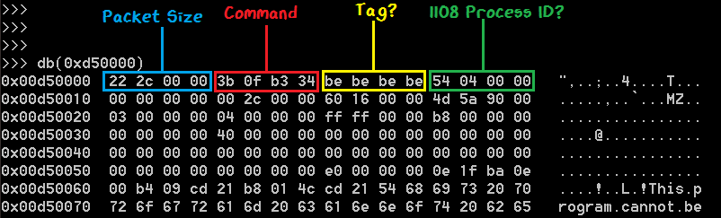

That looks like a full command packet issuing one of the install-plugin commands (`0x34B30F3B`) with full
binary payload. We saw the backdoor network code using [`VirtualAlloc`] to store incoming network packets,
but it was calling [`VirtualFree`] afterwards:

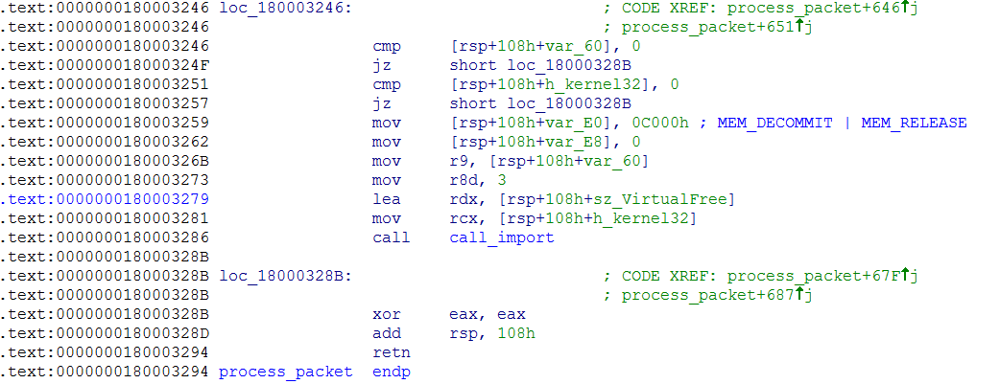

It seems to be calling `VirtualFree(pMem, 0, MEM_DECOMMIT | MEM_RELEASE)`, that should do the job, right?


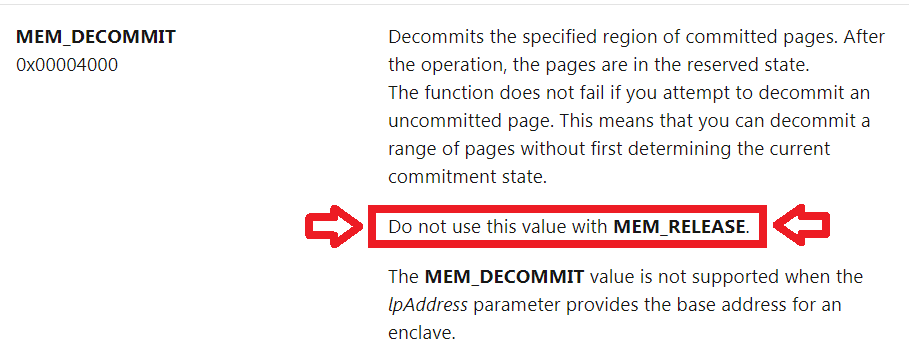

Morpheus could not have made it clearer! It takes two separate calls to [`VirtualFree`] to give back
the memory: One to decommit all pages in the allocated region (size needs to be specified) and a second
one to release the region back to the system (size must be zero). It looks like the backdoor implant
has been leaking every single command packet! And they should be waiting for us in 876's address space.

## 4.<span id="a_c_command_and_conquer"/> Command & Conquer 

The [Volatility] script [`extract_cmds.py`](./extract_commands.py) scans all pages in the address 
space of process 876 looking for one of the valid backdoor command codes at offset `0x0004` and then
extracts the relevant packet (using the `DWORD` at offset `0x0000` as lengths). All packets are
saved as a continuous stream into [`streams.bin`](./cmd_streams.bin), which we can then parse at
our leisure. You can run this script from `volshell` as follows:

```Python
>>> import sys
>>> sys.path.append('.')                   # Need to explicitly add '.' to Python path
>>> import extract_cmds
>>> extract_cmds.run(addrspace())          # Script needs access to kernel Adress Space object
```
```
0000000000b20000: 00008212 d44d6b6c
0000000000d50000: 00002c22 34b30f3b
0000000000d60000: 00002c22 8168ad41
0000000000d80000: 00005022 cd762bfa
0000000000d90000: 00000126 427906f4
0000000000da0000: 00003622 cd762bfa
0000000000db0000: 00000126 427906f4
0000000000dc0000: 00004c22 cd762bfa
0000000000dd0000: 00000126 427906f4
0000000000df0000: 0000001a d180dab5
...
0000000001b50000: 0000001e d180dab5
0000000001be0000: 0000001a d180dab5
0000000001ca0000: 0000011f d180dab5
0000000001d70000: 00000f12 d44d6b6c
30 command packets extracted
```

Now we have all the plaintext of all command packets we should be able to extract all plugins and
also work out the encryption that's happening on the wire. We have found 30 commands from the leaked
packets in 876. The captured TCP traffic only contains 20 TCP streams hitting port 4444 which we
can match with the last 20 leaked packets (ordering by virtual address should be the same as ordering by time of arrival).
That gives us plenty of plaintext/ciphertext pairs we can XOR together to get encryption key. Alternatively,
even if we hadn't found the leaked packets, the encryption key is plainly visible in the ciphertext of the two
 bigger command  packets towards the end of the stream. Here is the one from attacker port 1062:

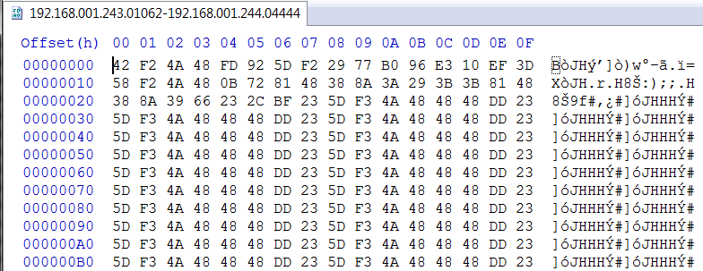

Clearly the key for command connections is `5d f3 4a 48 48 48 dd 23`. We still don't know exactly how this
encryption takes place, our only remaining suspect being the mysterious kernel driver
`FLARE_Loaded_0` that is dynamically loaded at `0xfffffa80042d0000`. Our best lead is the packets
we got from the memory leak, we can parse them using a combination of guessing by looking at the contents,
and reversing bits of `man.sys` and its backdoor DLL. 

We have worked out the rough outline of the `install-plugin` command, we can flesh it
 out a bit more by looking at more samples:

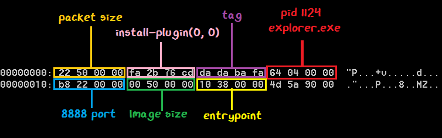

The plugin binaries in the `install-plugin` packets have intact debug strings like:

```
e:\dropbox\dropbox\flareon_2019\code\cryptodll\objchk_win7_amd64\amd64\c.pdb
e:\dropbox\dropbox\flareon_2019\code\screenshotdll\objchk_win7_amd64\amd64\s.pdb
```

The filename itself is not helpful but the project name (fifth subdirectory in the path) makes the purpose
of the plugin very clear. In order to interpret the `ioctl` command we need to 
skim through the payload DLL code again. `ioctl` is handled by the following snippet:

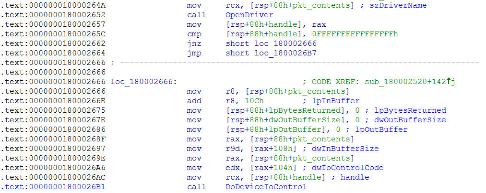

Hence the `ioctl` command must be structured like:

```c++
struct cmd_ioctl
{
    struct pkt_header   hdr;                // 000 DWORD size; DWORD cmd
    char                driver_name[0x104]  // 008
    DWORD               ioctl_code;         // 10C
    DWORD               data_size;          // 110
    BYTE                data[1];            // 114 variable length
} ;
```

The `call-plugin` commands seem to come in various sizes and support an additional plugin-specific
sub-command as well as a variable size argument list. It's quite easy to guess the shape of the
arguments without reversing the respective plugins:

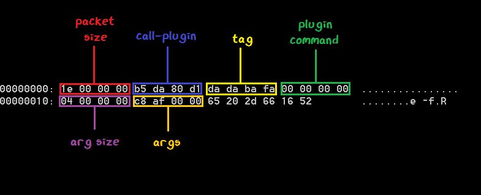

If you are hyper-focused, you will have noticed that every single packet we looked at has an extra six bytes
at the end which do not seem to be necessary (for example the `call-plugin` command above only uses`0x18`
of the `0x1e` bytes in the packet). This looks like another malware platform bug - the bytes themselves
do not appear to contain a hidden message, they just look like Heartbleed-style leakage from the memory of the controller
process.

The script [`parse_commands.py`](./parse_commands.py) uses all of our insights on the structure of the
command packets to parse [`streams.bin`](./cmd_streams.bin). It displays all the commands in human-readable
form, extracts the plugins into the [`binaries`](./binaries) directory, and also extracts the individual
command packets into the [`commands`](./commands) directory.

```
00 install-driver(stmedit)
01 install-plugin01(cryptodll, tag=0xbebebebe, pid=1108 dwm.exe, port=0
02 install-plugin10(networkdll, tag=0xdededede, pid=876 svchost.exe, port=0
03 install-plugin00(keylogdll, tag=0xfabadada, pid=1124 explorer.exe, port=8888
04 ioctl(FLND, 0x0013fffc, { 00 00 b8 22 f7 8f 78 48 47 1a 44 9c })
05 install-plugin00(screenshotdll, tag=0xbeda4747, pid=1124 explorer.exe, port=7777
06 ioctl(FLND, 0x0013fffc, { 00 00 61 1e 4a 1f 4b 1c b0 d8 25 c7 })
07 install-plugin00(filedll, tag=0xdefa8474, pid=2508 procexp64.exe, port=6666
08 ioctl(FLND, 0x0013fffc, { 00 00 0a 1a d5 69 94 fa 25 ec df da })
09 call-plugin(screenshotdll, 0x00000000)
0a call-plugin(screenshotdll, 0x00000000)
0b call-plugin(keylogdll, 0x00000000, 45000)
0c call-plugin(screenshotdll, 0x00000000)
0d call-plugin(screenshotdll, 0x00000000)
0e call-plugin(keylogdll, 0x00000000, 45000)
0f call-plugin(keylogdll, 0x00000000, 45000)
10 call-plugin(screenshotdll, 0x00000000)
11 call-plugin(screenshotdll, 0x00000000)
12 call-plugin(screenshotdll, 0x00000000)
13 call-plugin(keylogdll, 0x00000000, 45000)
14 call-plugin(screenshotdll, 0x00000000)
15 call-plugin(screenshotdll, 0x00000000)
16 call-plugin(keylogdll, 0x00000000, 45000)
17 call-plugin(screenshotdll, 0x00000000)
18 call-plugin(screenshotdll, 0x00000000)
19 call-plugin(filedll, 0x7268f598, "C:\", "keys.kdb")
1a call-plugin(keylogdll, 0x00000000, 45000)
1b call-plugin(screenshotdll, 0x00000000)
1c call-plugin(filedll, 0x1e3258ab, "C:\keypass\keys.kdb")
1d install-driver(shellcodedriver)
30 total commands
```

And now we have the intact binaries for all the plugins that the attacker installs as well as the sequence
of commands they issue. The very first command installs a driver called `stmdedit` which has a very
interesting set of imports:

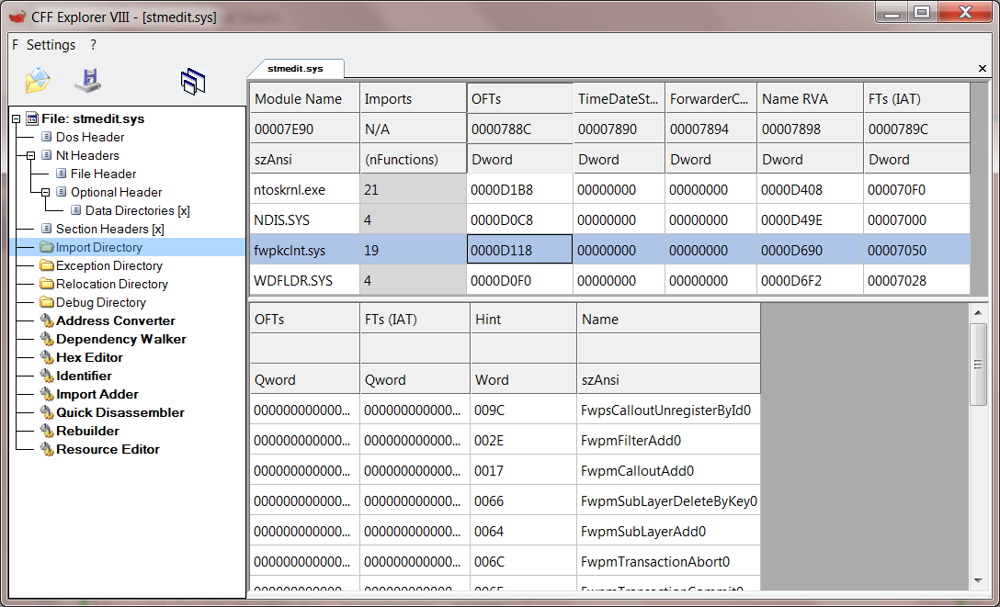

All the functions with the `Fwp` prefix (e.g. [`FwpmFilterAdd0`]) are part of the [Windows Filtering Platform],
which is an API that provides full network filtering access for all network layers. It can be used to
implement firewall functionality (including Deep Packet Inspection), transparent socket encryption and
much more. On the-flip side, it is quite complicated to use making `stmedit` quite hard to reverse.<sup id="a_stmedit">[7](#f_stmedit)</sup>

Thankfully we don't actually need to dive into `stmedit`. The three `ioctl` commands issued to `\Driver\FLND`
after plugin installation look like the contain the corresponding keys:

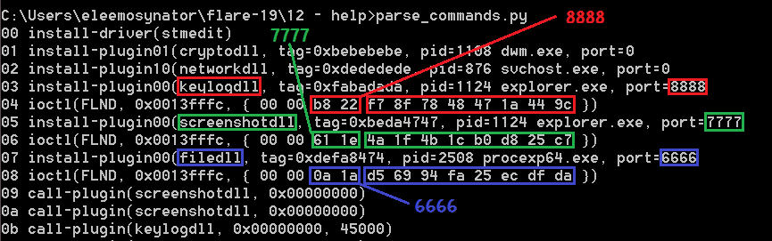

It seems that the `ioctl` command configures the XOR encryption key for each connection. The structure of the command
is probably:

```C++
struct stmedit_ioctl_13fffc
{
    WORD local_port;
    WORD remote_port;
    BYTE key[8];
};
```

There are a couple of other ways of finding the keys for the `stmedit` encryption. If we assume the driver
keeps the keys in the kernel pool, we can search the pool for a known key (say the one for 4444), and then
look for pool blocks with the same size. The [Volatility] script [`poolscan.py`](./poolscan.py) searches all
kernel pool blocks of a specific tag for a given pattern:

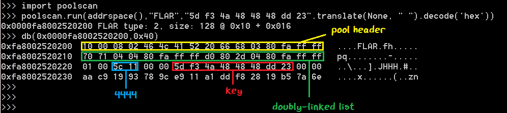

After finding this pool block, we can follow the linked list (tedious because it contains blocks that
don't have keys) or just search for pool blocks of the same size (128). It turns out that there are only
five such blocks, four contain the `stmedit` keys and the last one contains the registry configuration
key for `man.sys` (if you remember `DriverEntry` keeps a copy of that in the pool).

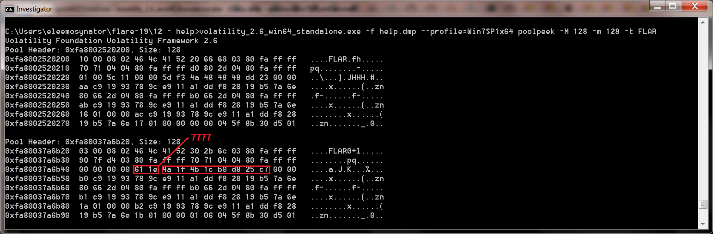

Indeed, even if you don't find the leaked command packets, it still possible to obtain the keys using the
same line of reasoning: After dumping `stmedit`, assume that the keys will be stored in a fixed-size structure,
look for all fixed size allocations in the code (references to [`ExAllocatePoolWithTag`]) and search for
blocks of that size with the `'FLAR'` tag. It turns out that `stmedit` only allocates fixed size blocks of
`0x68` and `0x80` bytes (you need to round them up to paragraphs and add the pool header size) which quickly
leads you to the keys.

There is a way to get the keys that requires even less x86 reverse engineering: The various encrypted bitmap streams
have slightly different sizes even though they're clearly not compressed. A closer look at the ends of the streams,
or a search for zeroes or even an attempt to break the XOR-encryption using colour statistics will lead you
to this anomaly:

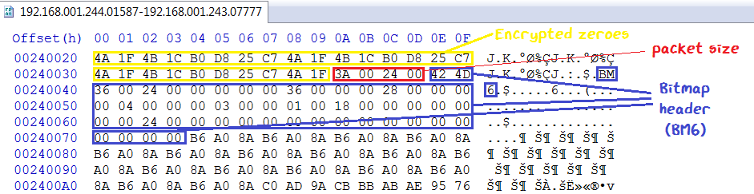

`stmedit` has a weird bug that seems to attach the start of the plaintext to the end of the encrypted
communication. As the attacker's network protocol closes connections after it receives the expected packet
length, the leak is only visible on the wire and would not have been easily picked up during the testing
process. Either way, it gives us a significant lever to break open the encryption with. The script
[`scan_streams.py`](./scan_streams.py) can extract all output keys from the encrypted streams in the [`streams`](./streams)
directory.
```
C:\Users\eleemosynator\flare-19\12 - help>scan_streams.py
192.168.001.244.01586-192.168.001.243.07777: getkey() failed
7777: key: 4a1f4b1cb0d825c7
8888: key: f78f7848471a449c
6666: key: d56994fa25ecdfda
C:\Users\eleemosynator\flare-19\12 - help>
```

## 5.<span id="a_c_the_final_problem"/> The Final Problem

Now we have all the keys for the `stmedit` encryption we can decode all the exfil'ed payloads. Let's start
with the screenshots:

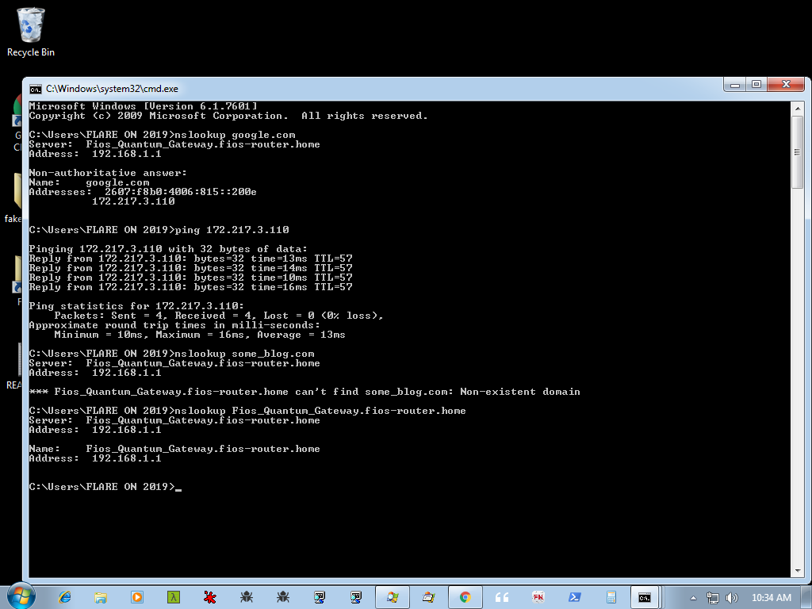

We see the user (`FLARE ON 2019`) messing around on the command prompt trying to ping and lookup things.
They then go on the [`flare-on.com`] site and then ask Google: "Is encrypting something twice better than once?"
And then they try to open a [KeePass] database called `keys.kdb` twice, succeeding only the second time:

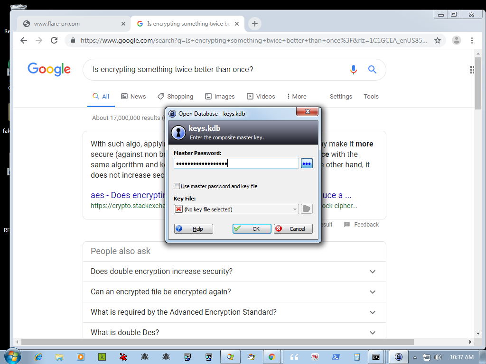

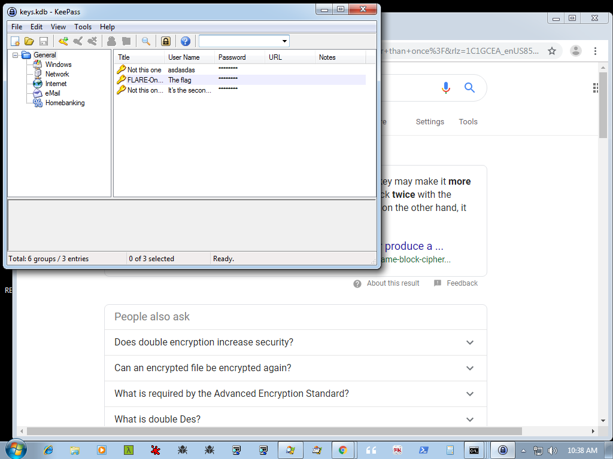

Our target is within sight! We had seen the attacker using their `filedll` plugin on `C:\keepass\keys.kdb`
whilst simultaneously deploying their keylogger to capture the password. All we need to do is decrypt those streams
and the flag will finally be ours!

Naturally the double-encryption Google query was a hint. The responses sent to ports 8888 and 6666 have
an additional layer of encryption. Well, there is this special plugin called `cryptodll` which is our
most likely suspect. Let's pull it up in [IDA] and run [`decrypt_strings.py`](./decrypt_strings.py).
As `cryptodll` uses [`GetProcAddress`] to access API calls instead of directly calling `call_import`,
we have to name a couple of stack variables manually. After that little chore is over we get to:

<!--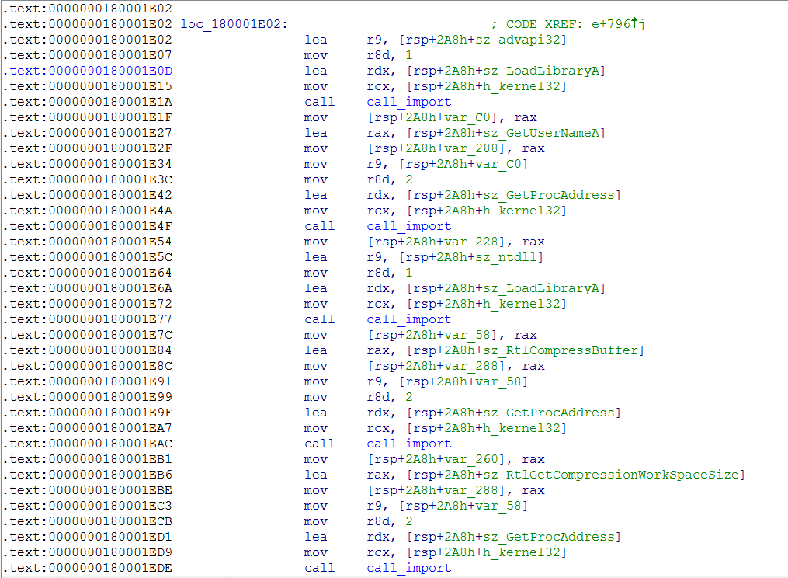-->


It looks like `cryptodll` uses the quasi-documented `ntdll` compression function [`RtlCompressBuffer`]
 with parameter
`0x102` (maximum `LZNT11` compression) and then encrypts the result with [RC4] using the current username
(in ASCII) as the key. The relevant username will correspond to the user who owns the process. If we look back
to our notes, the `cryptodll` plugin was injected into process `1108 dwm.exe` which is the window manager
and normally uses the credentials of the user logged into that window station (see also [`sessions`](./scans/sessions.txt)).
But there is one more catch, because there is always one more catch. The `key_size` parameter given to
`rc4_crypt` comes straight from [`GetUserNameA`] (in `edx`, from `var_10`) and according to the [MSDN][`GetUserNameA`]
documentation, [`GetUserNameA`] returns the number of characters in the username *INCLUDING* the zero
terminator. Hence our [RC4] decryption key will be `"FLARE ON 2019\0"`. The script
 [`decrypt_responses.py`](./decrypt_responses.py) will decrypt all response streams from the [`streams`](./streams)
directory and store the results in the [`traffic`](./traffic) directory with filenames constructed from the
plugin and the source port as sequence number.

Thankfully the file format of the keylogger responses is fairly easy to guess by looking at the hexdumps:

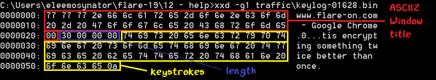

Each keylog file contains a sequence of: zero-terminated window title followed by a length-prefixed block
of keystrokes, presumably typed into that window. The script [`show_keylog.py`](./show_keylog.py) parses and
displays all the keylog files in the [`traffic`](./traffic) directory.

```
C:\Users\eleemosynator\flare-19\12 - help>show_keylog.py
keylog-01589.bin
C:\Windows\system32\cmd.exe:
  nslookup googlecom<ENTER>
  ping 1722173110<ENTER>
  nslookup soeblogcom<ENTER>
  nslookup fiosquatumgatefiosrouterhome<ENTER>

keylog-01609.bin
Start menu:
  chrome<ENTER>

keylog-01628.bin
www.flare-on.com - Google Chrome:
  tis encrypting something twice better than once<ENTER>

keylog-01633.bin
Start menu:
  kee
<DYN_TITLE>:
  th1sisth33nd111<ENTER>
Start menu:
  kee<ENTER>
<DYN_TITLE>:
  th1sisth33nd111

keylog-01636.bin
Start menu:
  kee<ENTER>
<DYN_TITLE>:
  th1sisth33nd111
```

And now we have our [KeePass] password: <span style="font-size:large">**`th1sisth33nd111`**</span>.
The `filedll` plugin is clearly being used to first find (response is `C:\keepass\keys.kdb`) and then
steal the key database ([`file-01639.bin`](traffic/file-01639.bin) has the [KeePass] database header). 
All we need to do is fire up [KeePass], load the database and enter the password:

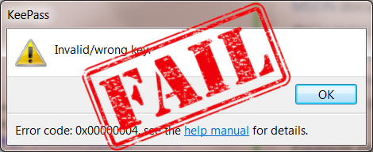

So that went well then. We have clearly missed something, and anyway the password seemed suspiciously
simple. Comparing what we see the user typing on the screen:

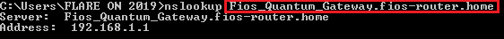

with the keylogger record:

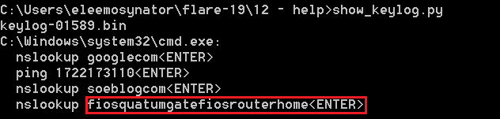

The attackers must have outsourced the keylogger project to a lowest bidding consultancy and forgotten
to specify that an APT-grade keylogging product must capture both the capitalization of letters and the
presence of special characters! Disturbingly, it seems that the keylogger also misses out the occasional
character (`'soeblogcom'` should have been `'someblogcom'`). Thankfully, the keylogger records show
three different attempts the user makes to unlock the database. In all three cases the logged password is
exactly the same, indicating that the user tried different combinations of upper/lower case characters and
reassuring us that we are not missing any characters. We are going to have to brute-force our way through
 this stage and given how expensive the [KeePass] [KDF] is likely to be, we'll need to collect as many clues as possible in order
to cut down our search space.

The first clue comes from the penultimate screenshot [`screenshot-01635.bmp`](./traffic/screenshot-01635.bmp):

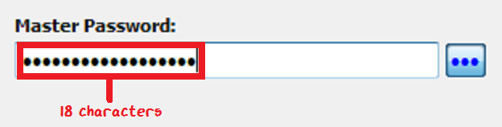

The password we saw in the keyboard log was 15 characters, therefore we are missing three special characters.

The next clue is the name the user has chosen for his router: `Fios_Quantum_Gateway`. They have
a preference for a strange snake/camel hybrid. Since the password we have has four words, it's quite
likely that the three missing special characters are three underscores separating the four words.

The three `'1'`s at the end of the password look a bit out of place. Keyboard interceptors receive events
for each keystroke, so when the user types capital-'A' (assuming Caps-Lock is off) the keyboard interceptor
will see a keypress event for `<SHIFT>` then a second keypress event for the letter `'a'`. It seems
that the attacker's consultants delivered a keylogger that does not track the state of the shift key. On the
US (and UK) keyboards, `SHIFT-1` corresponds to the exclamation mark `'!'`. On that basis it is much
more likely that the three `'1'`s at the end of the password are actually three exclamation marks (and if you
think about it, the FLARE team are unlikely to give us too hard a brute-forcing task right at the end of
such a complex challenge).

Putting all these thoughts together, our initial brute-force attack will start with the
password template: **`th1s_is_th3_3nd!!!`** and try all possible shift-states for the letters leaving
the final exclamation marks, the underscores and the `'3'`s alone (`SHIFT-3` is `'#'` which seems to make
no sense in that position). This leaves us 10 letters with two shift states each which is 1024 possibilities.
If we fail to find the password in that space, we'll start relaxing our assumptions (maybe different separator)
in steps and retry, always prioritizing the most likely combinations (i.e. all separators being the same character).

The script [`brute-doors.py`](./brute_doors.py) uses [`libkeepass`] to access the key database and performs the brute-force
attack described above. It optimizes the search by using an outer loop that iterates over the number _k_ of possible shifted
letters and an inner loop that for each _k_ iterates over the <sup>_n_</sup>C<sub>_k_</sub> combinations of _k_ shifted
letters chosen from _n_. As a result, the passwords with 'few' shifted letters will be tried before the 
less likely passwords with many shifted letters. It turns out to be a very effective method for this problem:

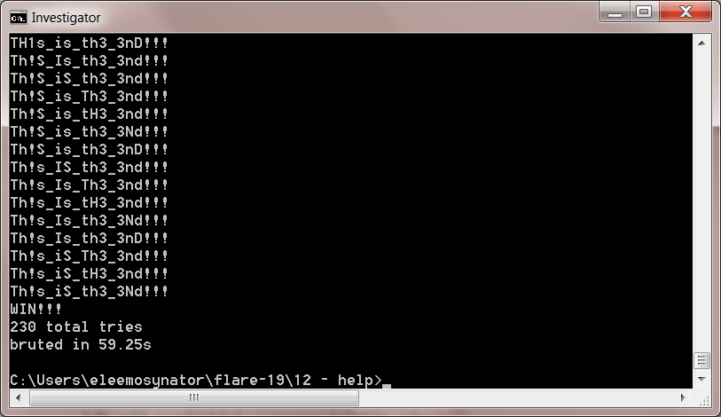

And now all we need to do is try **<span style="font-size:large">`Th!s_iS_th3_3Nd!!!`</span>** on [KeePass] and the flag
is ours:

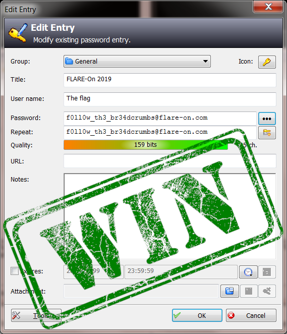

As has been the pattern with this challenge, there are more than one ways to do the endgame! The dump contains
a partial image of the database password and an inspired `yarascan` can pick that up:

Inspiration completely failed me when trying this approach - I only tried searching for the first part
of the string, even though the last part is more distinctive! Thanks to [@Dark_Puzzle] for pointing me
in the right direction here.

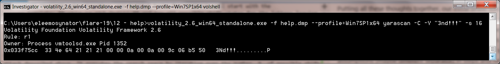

Ah, the mysterious `1352 vmtoolsd.exe` strikes back! Perhaps the password was on the guest/host clipboard
at some stage (like `man.sys`). A quick dive with `volshell` can lift it out:
```
>>> cc(pid=1352)
Current context: vmtoolsd.exe @ 0xfffffa8003686620, pid=1352, ppid=1124 DTB=0x14d1f000
>>> db(0x033f75cc-0x16)
0x033f75b6  0a 00 9a 06 b5 50 f3 00 00 80 9c 01 21 73 5f 69   .....P......!s_i
0x033f75c6  53 5f 74 68 33 5f 33 4e 64 21 21 21 00 00 0a 00   S_th3_3Nd!!!....
0x033f75d6  0a 00 9c 06 b5 50 f3 00 00 88 68 cf 66 f8 fe 07   .....P....h.f...
0x033f75e6  00 00 01 00 00 00 01 00 00 00 80 d3 97 03 00 00   ................
0x033f75f6  00 00 9e 06 b5 50 f3 00 00 88 68 cf 66 f8 fe 07   .....P....h.f...
0x033f7606  00 00 01 00 00 00 01 00 00 00 f0 05 93 03 00 00   ................
0x033f7616  00 00 a0 06 b5 50 f3 00 00 88 68 cf 66 f8 fe 07   .....P....h.f...
0x033f7626  00 00 01 00 00 00 01 00 00 00 60 63 ba 03 00 00   ..........`c....
>>>
```

## 6.<span id="a_c_degreelessness_mode"/> Degreelessness Mode

<p align="center">


<!--  -->

</p>

After all the deep kernel hackery we saw in `man.sys` and `stmedit` it feels a bit disappointing to
have to resort to educated guessing, partial brute-forcing or inspired searching in order to claim the flag.
Surely there must be a way that requires less luck to pull off?

Well, we saw the user type in the password and we saw the keylogger records. The characters of the password
travelled through quite a few layers from the low-level OS drivers to the high level Windows Messages until
they got to the [KeePass] login screen. Surely some of these images are still lying around in memory...

The architecture of the Windows keyboard driver ecosystem and the epic journey your typed characters undergo
before they arrive at your browser is described in very impressive detail in this excellent two-part article by
Nikolay Grebennikov, who was then CTO at Kaspersky Labs:

 * [Keyloggers: How they work and how to detect them (Part 1)](https://securelist.com/keyloggers-how-they-work-and-how-to-detect-them-part-1/36138/)
 * [Keyloggers: Implementing keyloggers in Windows. Part Two](https://securelist.com/keyloggers-implementing-keyloggers-in-windows-part-two/36358/)

Although the articles are a bit dated now, the basic hardware infrastructure has not changed in the intervening
years. The start of the journey of your keystrokes still looks like:

 * Keyboard issues a processor interrupt when a keystroke event (key-down or key-up) is ready to be processed.
 * The [Interrupt Service Routine] of the low-level keyboard driver `i8042prt.sys` handles the interrupt.
 * As the operating system may be busy with other things when the keyboard interrupt is received, `i8042prt.sys` stores
the keystroke event in a ring buffer (which resides in Non-Paged memory) which the OS can then process at its leisure.

Our target is this low-level ring buffer. According to lore (can't remember where I heard this), the Windows
keyboard buffer has space for 100 events, which might sound like a lot, but remember key-down and key-up are
separate events, and a shifted character will eat up two extra events for `SHIFT-DOWN` and `SHIFT-UP`, leaving
us with only about 30 characters in the end. This is still plenty of space for our password though.

It's [IDA] time again! Using `moddump` to lift `i8042prt.sys` results in a mangled IAT (at least [IDA] seems
confused about it). This may be a bug in `moddump` or due to parts of the import information being paged out.
In any event, we can look at the driver on our own Windows 7 VM to begin with. It's unlikely that the core
structures would change in such a well-established part of the system. Pulling up `i8042prt.sys` in [IDA]
results in my most favourite prompt:


Some versions of [IDA] can fail to download symbols, if that happens to you, just use the [`symchk.py`] script
from the [`pdbparse`] package to download the PDB manually (or look in the [WinDbg] symbols cache) and then 
explicitly load it into [IDA] using the `Load file` sub-menu. And look at these names:

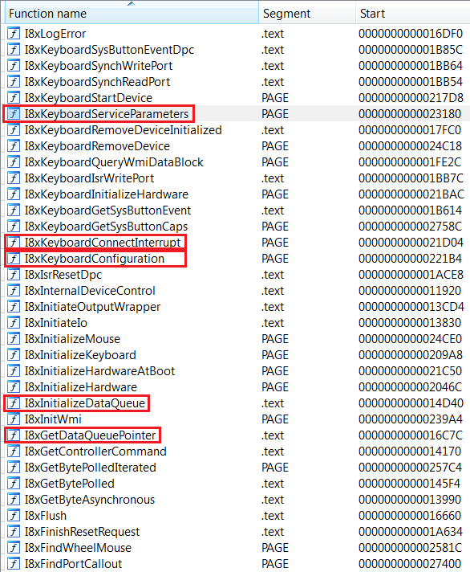

So many nicely documented targets for us to choose from! Having symbols is really like God Mode for Reverse Engineering:

<p align="center">

</p>

<!--  -->

Let's begin with `I8xKeyboardServiceParameters` which reads the configuration for the various keyboard
parameters from the registry using the [`RtlQueryRegistryValues`] kernel API. The registry parameters
include a value called `KeyboardDataQueueSize` which is a good thread to pull as following it will lead
us to the allocation of the keyboard buffer. The kernel call takes an array of instances of the following data
 structure:

```c++
typedef struct _RTL_QUERY_REGISTRY_TABLE {
    PRTL_QUERY_REGISTRY_ROUTINE QueryRoutine;               // 00
    ULONG Flags;                                            // 08
    PWSTR Name;                                             // 10
    PVOID EntryContext;                                     // 18
    ULONG DefaultType;                                      // 20
    PVOID DefaultData;                                      // 28
    ULONG DefaultLength;                                    // 30
} RTL_QUERY_REGISTRY_TABLE, *PRTL_QUERY_REGISTRY_TABLE;
```

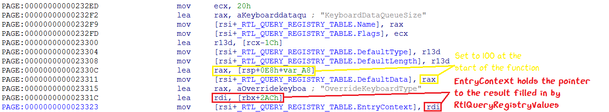

The keyboard data queue size will be put in offset `0x2ac` inside a structure held in register `rbx`.
Looking further up reveals that the value of `rbx` comes from the second argument supplied by the caller,
which is the function `I8xKeyboardStartDevice`:

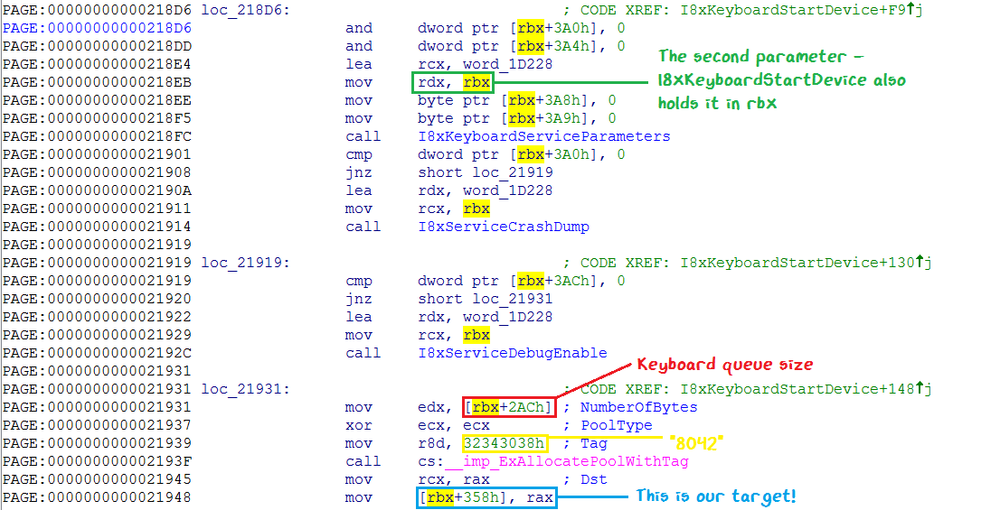

Alright! We have our target in sight, we just need to find the structure pointed to by `rbx`. Scrolling
backwards we find that `rbx` is used to store the first parameter to `I8xKeyboardStartDevice`, which is
called by `I8xStartDevice`:

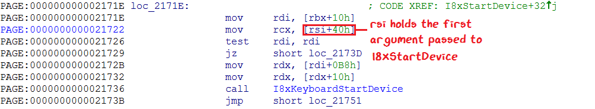

Which comes from an asynchronous callback stub:

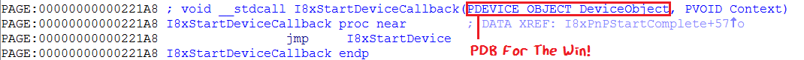

Don't you love `PDB` files? The mysterious argument is actually the `i8042prt` keyboard
[`DEVICE_OBJECT`] and offset `0x40` in that structure holds the `DeviceExtension` pointer. The
`DeviceExtension` part of the object is meant to be a device-specific and driver-specific data area
that is opaque to the OS (and everyone else). We can find the relevant [`DEVICE_OBJECT`] structure
using [`devicetree`](./scans/devicetree.txt), which puts it at `0xfffffa8001ec9400` (you want
the `i8042prt` device that is attached to keyboard-like upstream device like `\Driver\kbdclass`).
We know that the keyboard buffer size is at offset `0x2ac` of `DeviceExtension` and the pointer to
the keyboard buffer is at `0x358`. It's `volshell` time!

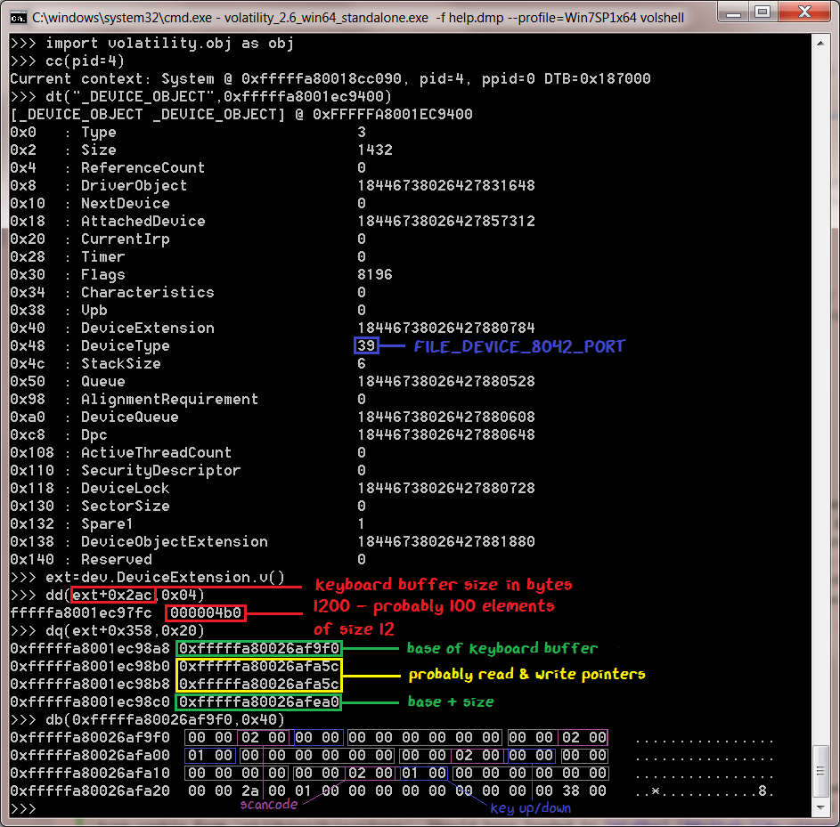

We have found what looks like the keyboard buffer, and an extra bonus! There are three pointers bundled
after the keyboard buffer base pointer: The last one points to the top of the buffer (equal to `buffer_base` + `buffer_size`),
and the middle two are equal and point somewhere inside the buffer. The obvious guess is that these are the
read and write pointers and they are equal because the buffer is currently empty (i.e. every keystroke
event has been consumed by the OS). Assuming the buffer is filled forward (i.e. write pointer is incremented after a 
character is put in), then they must currently be pointing to the oldest events, hence we'll cut the buffer at this point
and stitch the earlier part (from the start to the write pointer) at the end.
We also have a surprise to deal with: We had seen earlier
the Keyboard Data Queue Size (stored at offset `0x2ac` of `DeviceExtension`) being read from the registry
and defaulted to 100 (at the start of the `I8xKeyboardServiceParameters`), then we saw `I8xKeyboardStartDevice`
allocating that many bytes from the kernel pool, leading us to believe that the keyboard buffer had single
bytes entries. However when we look at the actual data, we find a buffer that is twelve times bigger than
expected with individual entries that appear to be twelve bytes long. A second more careful look at
`I8xKeyboardServicesParameters` reveals the following bit of code:

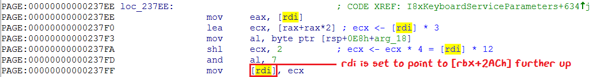

Okay, so the Keyboard Data Queue Size gets multiplied in-place by 12 - that's an odd way of doing things, but
at least it explains the mystery away. We can extract and save the keyboard buffer from `volshell`, after
adjusting it for the position of the write pointer:

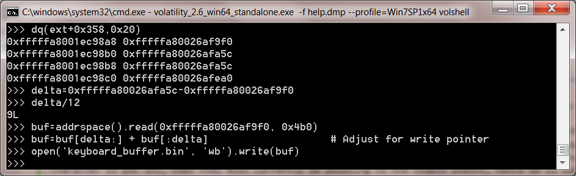

Now we have the buffer, let's turn back to decoding the keystrokes. We saw the following shape in `volshell`:

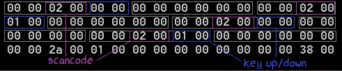

Each record is 12 bytes with the first six being three 16bit words and the second six being consistently
zero. Of the first three words, the very first one is always zero, the second one holds a scan-code and the
third one is the 'key-up'/'key-down' flag. I'm going to assume that zero is 'key-down': This may sound counter-intuitive,
but remember that the i8042 sends scan-codes with the top bit clear to signify 'key-down' and set to
signify 'key-up' and I'm guessing that the present day keyboard buffer evolved from the original BIOS
keyboard buffer in an incremental manner that probably maintained this convention (also, I tried it out and
it worked fine). In the dump above we see the key with scan-code `0x02` (`'1'`) being pressed and released
twice - this is probably part of the `'111'` at the end of the password.

We can decode the scan-codes by using a combination of the [`VkKeyScan`] and [`MapVirtualKey`] Windows
APIs, but bear in mind that these will use your current keyboard layout to do the mapping - if you want to
decode scan-codes that came from a different Region, you'll need to load and activate the relevant keyboard
for that Region before calling the scan-code mapping APIs. The script [`build_scancode_map.py`](./build_scancode_map.py)
creates a scan-code to character map using the current keyboard layout and saves it to [`scancode_map.json`](./scancode_map.json)
(the script requires [`pywin32`]). The script [`parse_keyboard_buffer.py`](./parse_keyboard_buffer.py)
can use this saved mapping to produce the actual characters from an extracted keyboard buffer:

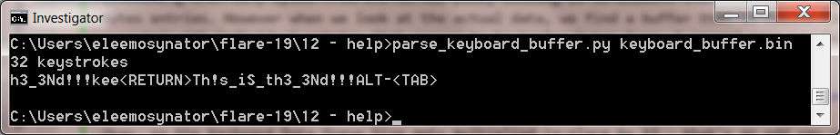

A quicker alternative is the volatility script [`dump_keyboard_buffer.py`](./dump_keyboard_buffer.py)
which carries out the whole process of identifying the i8042 port driver, the keybord device and it's 
extension structure and then lifts the keyboard buffer pointers from there (it also has some heuristics to make it
robust to version changes that would impact structure offsets):

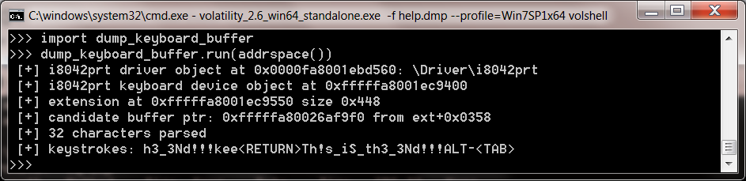

The easier way to do this would be to extract all pool blocks with tag `'8042'` and guess which one
holds the keyboard buffer (it's kind of obvious really), but we then we wouldn't be reversing any code
and where's the fun in that?

## 7.<span id="a_c_kwisatz_haderach"/> The Shortening of the Way

<p align="center">


<!--  -->

</p>

Perhaps there is an alternative and much shorter way of solving this. When we first opened the crash dump,
we noticed the [KeePass] process. What if the key database is still in the memory image of the process?
Can we lift the flag straight out?

We need to work out how to locate the password database in the process memory.
As [KeePass] is open-source software, we can look up its data structures in the source code and use
that knowledge to construct search patterns. We first need to find the exact version of [KeePass] in
 We can extract the executable image from process
`2648` using the [Volatility] `procdump` plugin. The version record on the extract file identifies it
as `1.37` and we can download the full source code from:

* https://sourceforge.net/projects/keepass/files/KeePass%201.x/1.37/KeePass-1.37-Src.zip/download.

The interesting (for us) part of the application is in the `KeePassLibCpp` folder (under the `KeePassLibC`
project). The main class used to hold an open database is called `CPwManager` and is defined in the
header file `PwManager.h`:

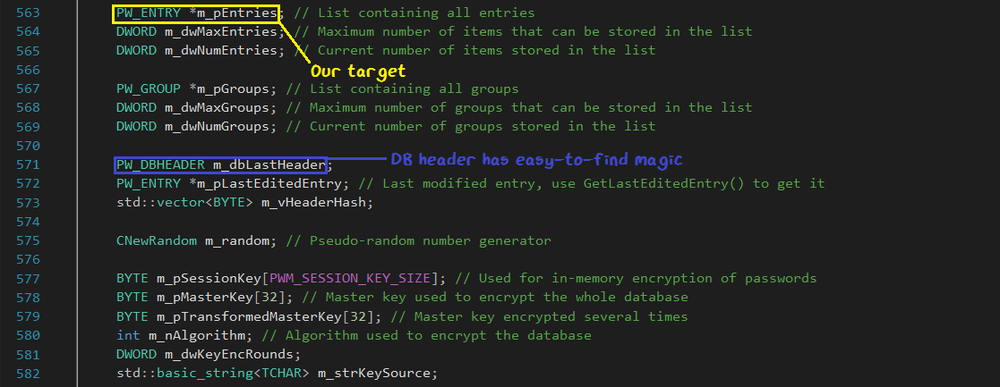

Each instance of `CPwManager` contains a copy of the key database header, which begins with a known
8-byte signature (`PWM_DBSIG_1` and `PWM_DBSIG_2` encoded little-endian), which should make it easy
to find. A `yarascan` for the signature picks up a hit at address [`0x0032cbf8`](./scans/yara_kdb_2648.txt)
in the `2648 KeePass.exe` process:

```
C:\Users\eleemosynator\flare-19\12 - help>volatility_2.6_win64_standalone.exe -f help.dmp --profile=Win7SP1x64 yarascan -p 2648 -Y "{ 03 d9 a2 9a 65 fb 4b b5 }" -s 32
Volatility Foundation Volatility Framework 2.6
Rule: r1
Owner: Process KeePass.exe Pid 2648
0x0032cbf8  03 d9 a2 9a 65 fb 4b b5 03 00 00 00 04 00 03 00   ....e.K.........
0x0032cc08  ea 77 fe 19 34 6a 5b 2f 14 65 70 e1 fc 89 a1 00   .w..4j[/.ep.....
```

 It looks like the opened database is in crash-dump!
We saw that `CPwManager` holds a pointer to an array of password entries, now let's look at the definition
of the password entry structure in `PwStructs.h`:

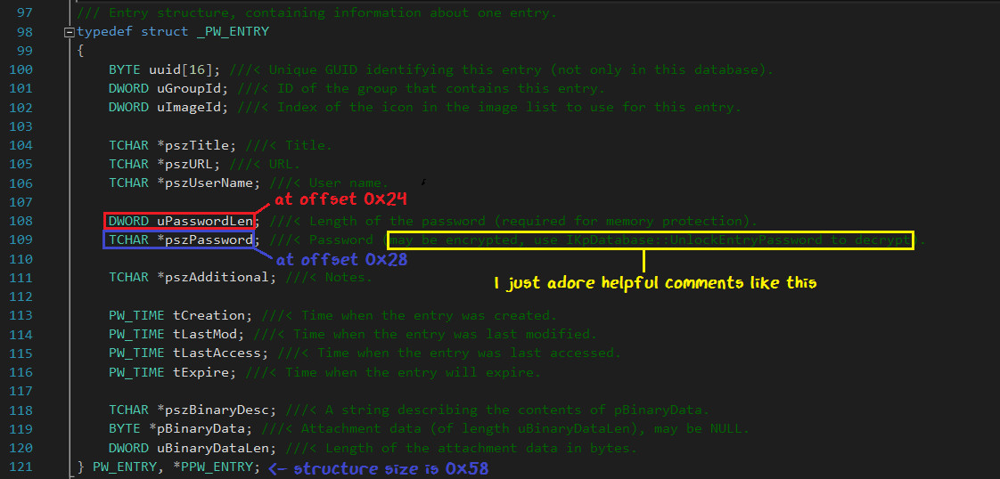

It looks like password are held in encrypted form in memory, but at least we are given a reference
to the responsible routine  `UnlockEntryPassword` defined in `PwManager.cpp`:

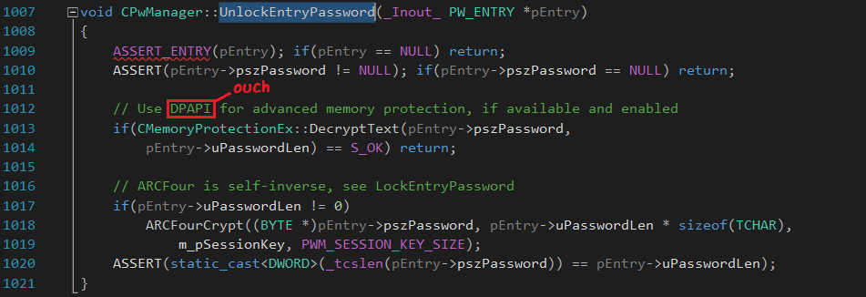

The reference to [`DPAPI`] is definitely not the best news. This is a Microsoft Windows API that delegates
the encryption of sensitive application data to the kernel. The implementation of `CMemoryProtectionEx::DecryptMemory`
simply rounds up the data size to a multiple of 16 (`CRYPTPROTECTMEMORY_BLOCK_SIZE`) and calls
[`CryptUnprotectMemory`] with parameter `CRYPTPROTECTMEMORY_SAME_PROCESS`. This is the 'lightweight'
part of [`DPAPI`] which encrypts a data blob with a key that is specific to the process that issued the
API call. The comments in the source file suggest that use of [`DPAPI`] is not always enabled, but we
should be able to tell if it's been used by checking if the size of the encrypted data has been rounded
up to a multiple of 16 (the alternative is [RC4] which maintains the size of the encrypted data).
 Armed with this knowledge, we are ready to dive into the [KeePass] process with `volshell`:

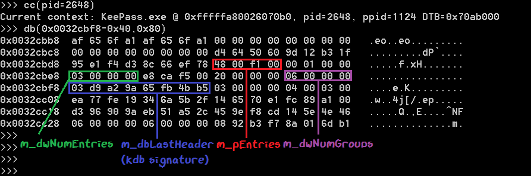

The password entries start at `0x00f10048` and each is `0x58` long. If you remember the screenshot earlier,
we are after the second  entry:

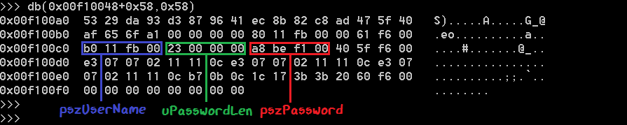

The username is at `0x00fb11b0` and the password at `0xf1bea8` with length `0x23`:

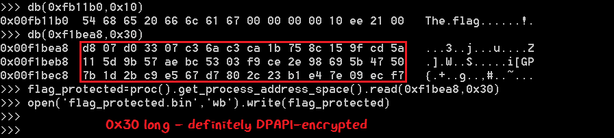

It looks like the encrypted form of the flag is `0x30` long signifying that `DPAPI` had been enabled in
the [KeePass] process. Once we have saved the encrypted flag in `flag_protected.bin`, we are ready to
begin our assault on [`DPAPI`]. The first entrypoint to look at is [`CryptProtectMemory`] which is exported
from `crypt32.dll`. As usual, we can use our own copy of this binary (instead of exporting out of the 
crash-dump) and import the relevant symbol file into [IDA]:

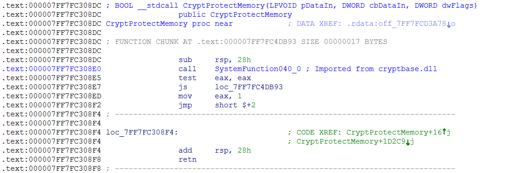

Looks like we'll need to follow that rabbit into `cryptbase.dll` export `SystemFunction040`:

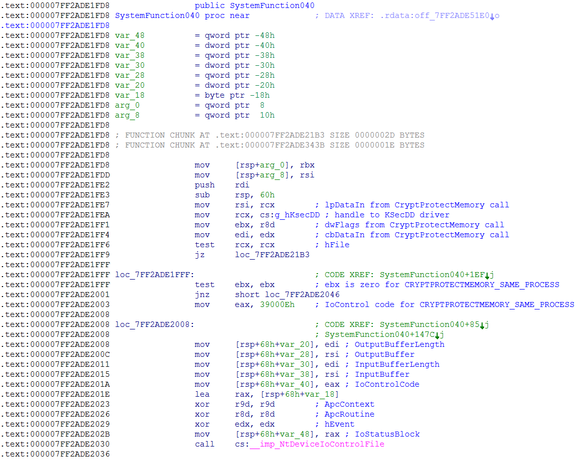

And `cryptbase.dll` in turn issues [`DeviceIoControl`] code `0x39000E` on `KSecDD` using the
internal native API [`NtDeviceIoControlFile`]. Into the kernel we go: Pulling up `KSecDD.sys` in [IDA],
loading debug symbols and then looking up the helpfully sign-posted `KsecDeviceControl` function leads to:

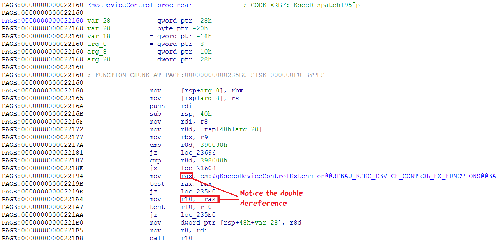

It seems that most [`DeviceIoControl`] calls into `KSecDD` are delegated through this strange long symbol
which demangles to:

```c++
_KSEC_DEVICE_CONTROL_EX_FUNCTIONS * gKsecpDeviceControlExtension;   // pointer to function table,
                                                                    // hence the double dereference
```

We can dig further into `KSecDD.sys` to find where it is initialized, however since we have a snap-shot
of the state of `KSecDD` in our crash-dump, we can simply examine the symbol directly. As [Volatility] does
not have built-in support for symbols, it is much easier to do this by loading `help.dmp` into [WinDbg]. 
Using the dereference operator (`poi`) gets us to our target immediately:

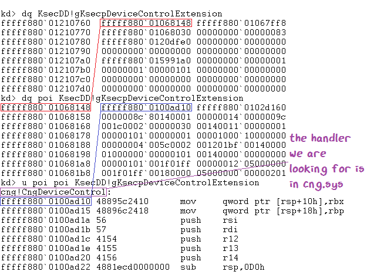

Aha! The device control extension for `KSecDD` actually lives in `cng.sys`. Further down the rabbithole
we go, starting with `CngDeviceControl` in `cng.sys`. After some boiler plate, this function goes through
a switch structure that [IDA] does a pretty good job of decoding. Tracing through to the branch that handles
`0x39000e`, we arrive at a seemingly complex piece of code that deals with a group of six [`DeviceIoControl`]
codes, all of which get routed to the function`CngEncryptMemory`:

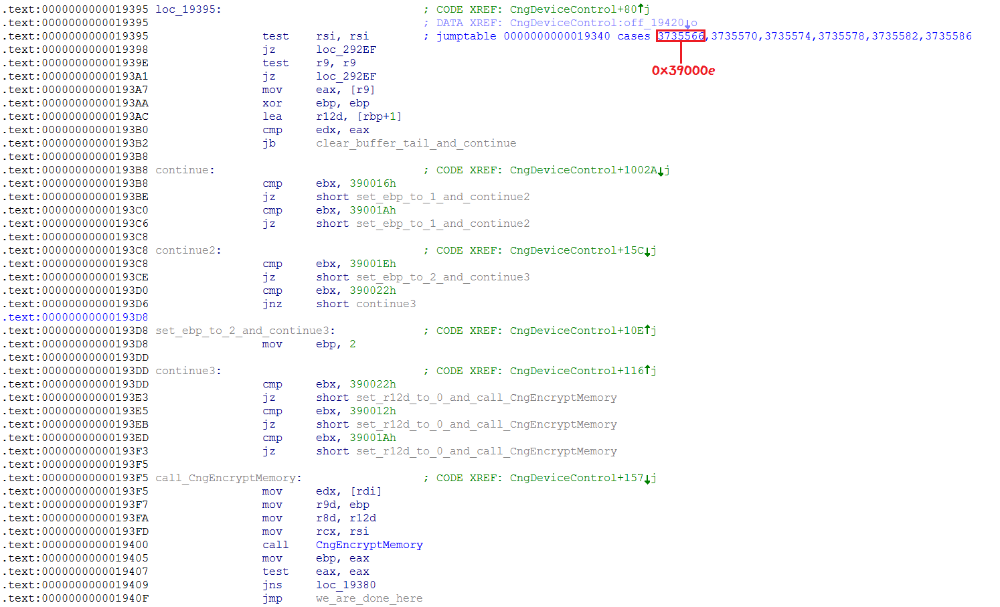

I have given the various labels more descriptive names in order to make the logic a bit easier to understand,
but fundamentally the bit of code above maps the six different [`DeviceIoControl`] codes into the values of
 the last two arguments passed to `CngEncryptMemory`. The six different codes correspond to all combinations
 of values of the `dwFlags` passed to `CryptProtectMemory` and the two possible directions: `Protect`
 and `Unprotect`. These are
then mapped back to the original value of `dwFlags` which is stored in `ebp` and passed into `CngEncryptMemory`
as the fourth argument (in `r9d`), and the direction flag which is stored in `r12d` and passed into `CngEncryptMemory` as the
third argument (in `r8d`). In summary the signature of `CngEncryptMemory` is:

```c++
NTSTATUS CngEncryptMemory(PVOID pMemory, DWORD dwSize, DWORD dwDirection, DWORD dwFlags);
```

And the mapping between [`DPAPI`] calls and `CngEncryptMemory` looks like:

|`DAPI` call|`cryptbase.dll` function|`dwFlags`|ioctl code|`ebp`|`r12d`|
|:---------|:----:|:--------:|:---------:|:---:|:----:|
|`CryptProtectMemory`|`SystemFunction040`|`SAME_PROCESS`|`0x39000e`|0|1|
|`CryptProtectMemory`|`SystemFunction040`|`CROSS_PROCESS`|`0x390016`|1|1|
|`CryptProtectMemory`|`SystemFunction040`|`SAME_LOGON`|`0x39001e`|2|1|
|`CryptUnprotectMemory`|`SystemFunction041`|`SAME_PROCESS`|`0x390012`|0|0|
|`CryptUnprotectMemory`|`SystemFunction041`|`CROSS_PROCESS`|`0x39001a`|1|0|
|`CryptUnprotectMemory`|`SystemFunction041`|`SAME_LOGON`|`0x390022`|2|0|

This pattern of translation of parameter values to separate ioctl codes and then back
to parameter values is eerily reminiscent of the pattern we saw with `InjectPayloadIntoProcess` function
in `man.sys`.

We are interested only in `CRYPTPROTECTMEMORY_SAME_PROCESS`, which corresponds to a value of zero for
`dwFlags` and hence the fourth argument of `CngEncryptMemory` passed in `r9d`:

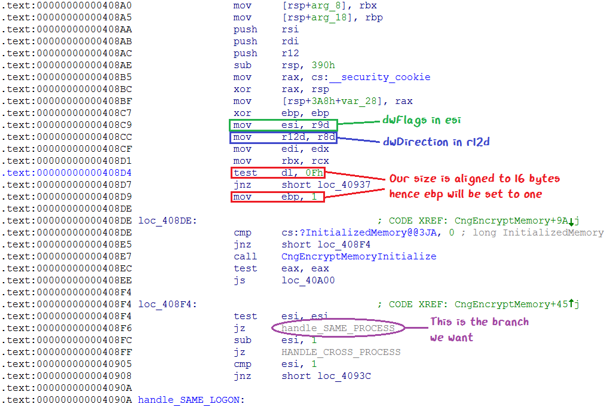

Remember that [KeePass] rounded up the protected block size to a multiple of 16 (`CRYPTPROTECTMEMORY_BLOCK_SIZE`).
This is in line with the MSDN documentation for [`CryptProtectMemory`], but it seems that `CngEncryptMemory` has
a compatibility code-path for an older version that required data sizes that were multiples of 8.<sup id="a_triple_des">[8](#f_triple_des)</sup>
 This is controlled by a flag in `ebp`, which will be set to 1 in our case. Following on from
 `handle_SAME_PROCESS`:

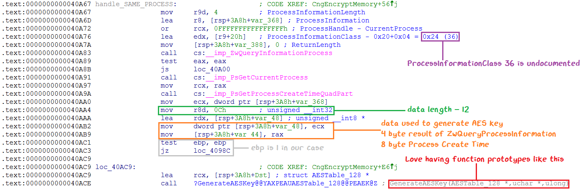

As we are still in God Mode, we get to see the names of functions and even the prototype for `GenerateAESKey`
which presumably derives an [AES] key schedule (first argument) from a data blob passed as a pointer and
length in the second and third arguments. The data blob used to generate the [AES] key is a 4-byte result
from calling [`ZwQueryInformationProcess`] with and undocumented value (36) for `ProcessInformationClass`
concatenated with the `QWORD` representation of the process creation timestamp. A little Google-ing quickly
leads us to the definition for the undocumented value of `ProcessInformationClass`: the [`ReactOs`] 
source claims it corresponds to [`ProcessCookie`] which is a random 32-bit value generated by the kernel
on process initiation - the ideal ingredient for a process-specific encryption key. Both the process
creation time and the process cookie are fields in the [`_EPROCESS`] structure, so we'll have no problem
lifting them from the crash dump. Let's take a closer look at `GenerateAESKey`.

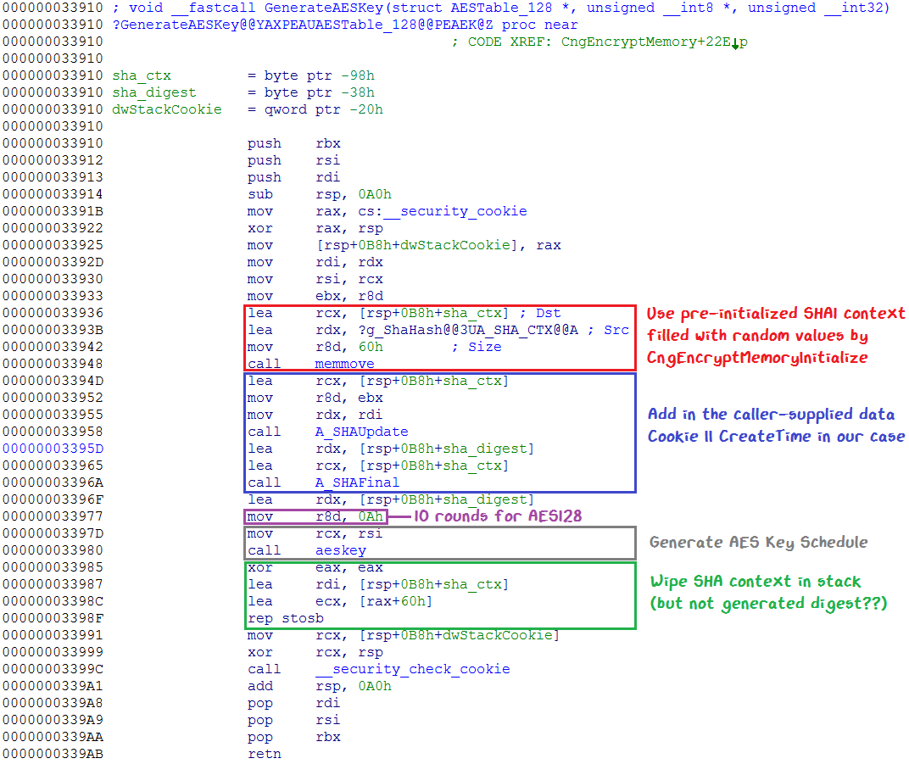

That's fairly straightforward, it appends the process-specific data to 
a static global [SHA1] context and uses the first 16 bytes of the resulting digest as the AES128 key.
We should be able to lift the contents of the [SHA1] context by looking up the symbol `g_ShaHash`.
Now back to `CngEncryptMemory`:

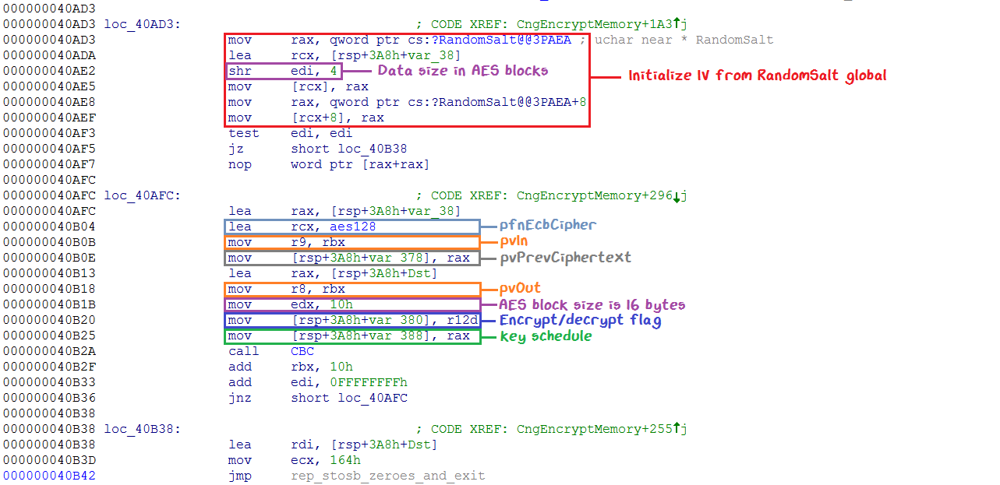

The encryption is done use AES128 in [CBC] mode courtesy of the generic [CBC] implementation function
with signature:

```c++
typedef void (*PFNECBCIPHER)(PVOID pvOutBlock, PVOID pvInBlock, PVOID pvKeySchedule, DWORD dwDirection);

void CBC(PFNECBCIPHER pfnEcbCipher, DWORD dwBlockSize, PVOID pOut, PVOID pIn, PVOID pvKeySchedule, DWORD dwDirection, PVOID pvPrevCipherText)
```

The initial value of `PrevCiphertext` is the [IV] which is taken from `cng` global symbol `RandomSalt`.
All we need to do now is collect the [SHA1] seed, the [KeePass] process cookie and start timestamp and
the [IV] from `RandomSalt` and we can decrypt the flag. We can dive back into [WinDbg] to extract all
these values:

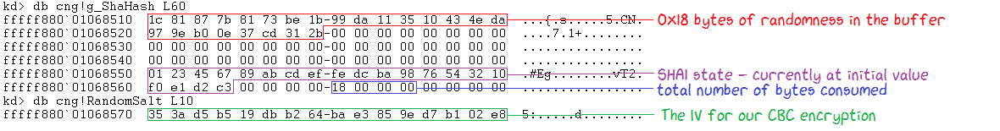

The [SHA1] context structure generally consists of three ingredients: A 64 byte buffer for the current
block being read, a 160 bit (20 byte) [SHA1] state which is initialized to a specific value and a 64bit
count of the total number of characters that have been consumed. Each `'Update'` operation adds characters
to the buffer until its full upon which the SHA1 core '`Transform'` operation is executed to derive the
new [SHA1] state from the previous state and the full 64-byte buffer. As the [SHA1] state is still at its
initial value and the consumed byte count is less than 64, we can just read the random seed used from the
top of the buffer.

Continuing with [WinDbg], we can use the `!process` command to find the pointer to the [`_EPROCESS`]
structure in order to lift the process cookie and creation timestamp:

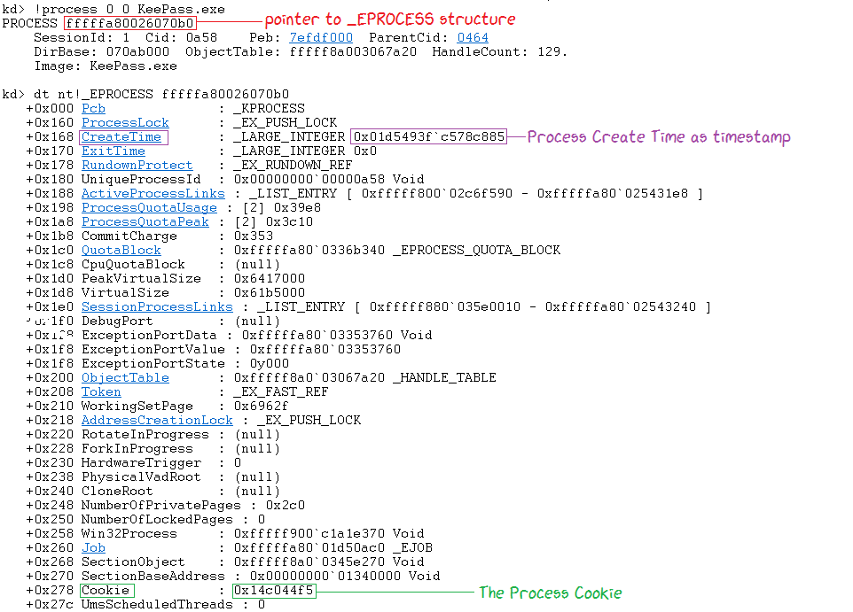

Copy/Pasting all these values into the simple Python script [`decrypt_flag.py`](./decrypt_flag.py):

```Python
''' Standalone script for Flare-On 6 challenge 12
    Decrypt DAPI-encrypted flag blob from KeePass memory Image
'''
from Crypto.Cipher import AES
from Crypto.Hash import SHA1
import struct

def get_hex(s):
    return s.translate(None, ' -').decode('hex')

flag_crypted = open('flag_protected.bin', 'rb').read()

# Prepare the AES key
ctx = SHA1.new()
ctx.update(get_hex('1c 81 87 7b 81 73 be 1b 99 da 11 35 10 43 4e da 97 9e b0 0e 37 cd 31 2b')) # from hex dump
ctx.update(struct.pack('<LQ', 0x14c044f5, 0x1d5493fc578c885))    # Process cookie and Creation Time
aes_key = ctx.digest()[:16]

iv = get_hex('35 3a d5 b5 19 db b2 64-ba e3 85 9e d7 b1 02 e8') # copy/pasted from the hex dump

flag = AES.new(aes_key, AES.MODE_CBC, IV=iv).decrypt(flag_crypted)

print flag[:flag.find('\0')]
```

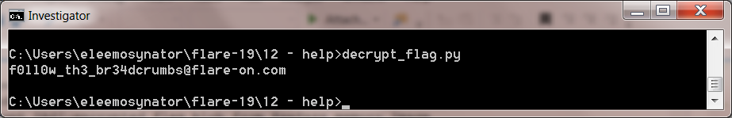

## 8.<span id="a_c_the_general_problem"/> The General Problem<sup id="a_the_general_problem">[9](#f_the_general_problem)</sup>

<p align="center">
 <a href="https://xkcd.com/974/"></a>
</p>

After delving into the guts of `cng.sys`, it seems a shame to stop at just covering only the `SAME_PROCESS`
mode of operation and not extend our tools to support all modes. Let's have a quick look at `CROSS_PROCESS`:

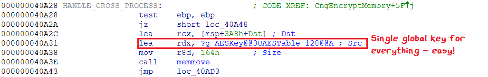

That was straightforward, a single-initialization global [AES] key, stored as an expanded key schedule
in the global variable named `g_AESKey`. Now turning to `SAME_LOGON`:

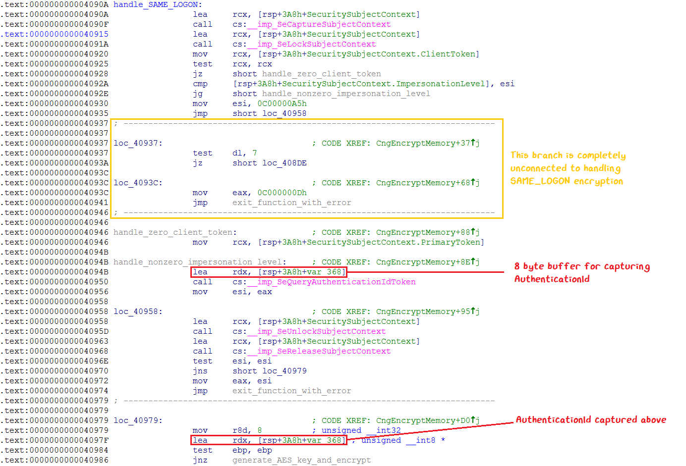

That's a bit more complicated. I have imported the definition of [`SECURITY_SUBJECT_CONTEXT`] and labelled
the result of [`SeCaptureSubjectContext`], as well as labelling the various branches to make the logic
a bit easier to understand. The `SAME_LOGON` flag requires that the protected data can be shared between
processes that are part of the same logon session.
To achieve this, the derived [AES] key is generated by `GenerateAESKey` fed with the result of
[`SeQueryAuthenticationIdToken`]. The `AuthenticationId` is a Locally Unique Identifier ([`LUID`]) that is guaranteed
to be distinct for each logon session on a given machine. The `AuthenticationId` is part of the
[`_TOKEN`] structure which is easy to access via [`_EPROCESS`]. The [Machines That Think](https://bsodtutorials.wordpress.com/)
blog has a really good article on tokens and the [`_TOKEN`] structure here: https://bsodtutorials.wordpress.com/2014/08/09/windows-access-tokens-token-and-_token/

We also saw earlier that there was code path which dealt with (legacy?) data sizes that are multiples of 8
instead of 16. `CngEncryptMemory` keeps a flag in `ebp` set to `true` for multiple-of-16 sizes
and `false` for the legacy mode. Following through that code path, it turns out that `cng.sys` simply
uses a different cipher, namely [Triple-DES], which has an 8-byte (64 bit) block size:

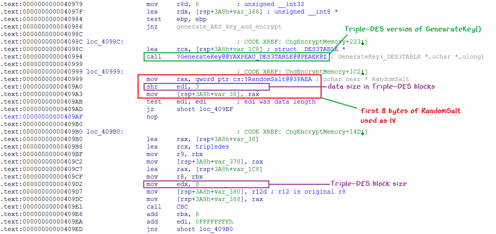

The ingredients that go into the keys for `SAME_PROCESS` and `SAME_LOGON` are the same,
but there is a separate `GenerateKey()` implementation for [Triple-DES] keys:

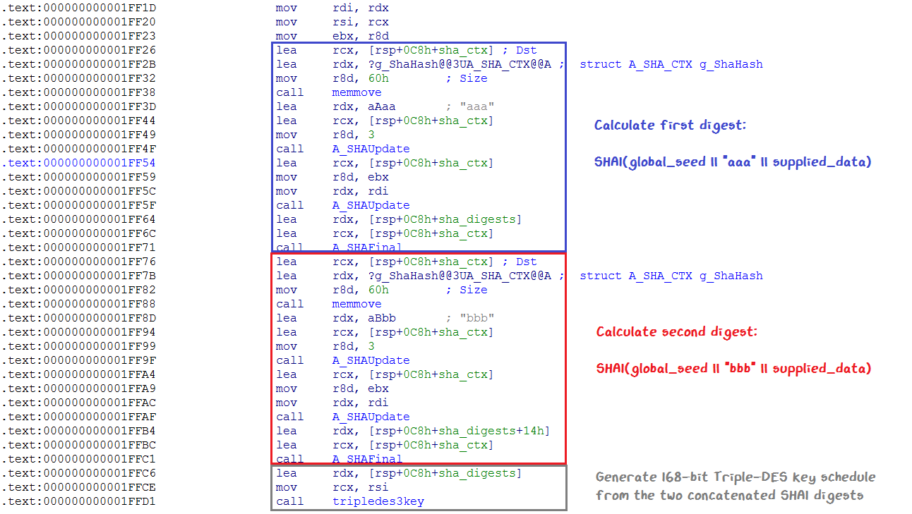

For some reason the [Triple-DES] implementation uses a 168-bit key generated from the concatenation
of two related [SHA1] digests. That's a bit of an odd choice given that [Triple-DES] has at most
112 bits of security as each [DES] round has 56 bits security and one can mount a [Meet-In-The-Middle Attack][MITMA]
by creating a hash of all 2^56 possible inversions of the last round.

In any case, the `CROSS_PROCESS` code path also uses a fixed global key schedule, but this
time it's a [Triple-DES] key schedule. The global keys, the [IV] and seed hash are all initialized
in `CngEncryptMemoryInitialize` which starts off by generating three blocks of random numbers
of sizes 24, 16 and 16 respectively:

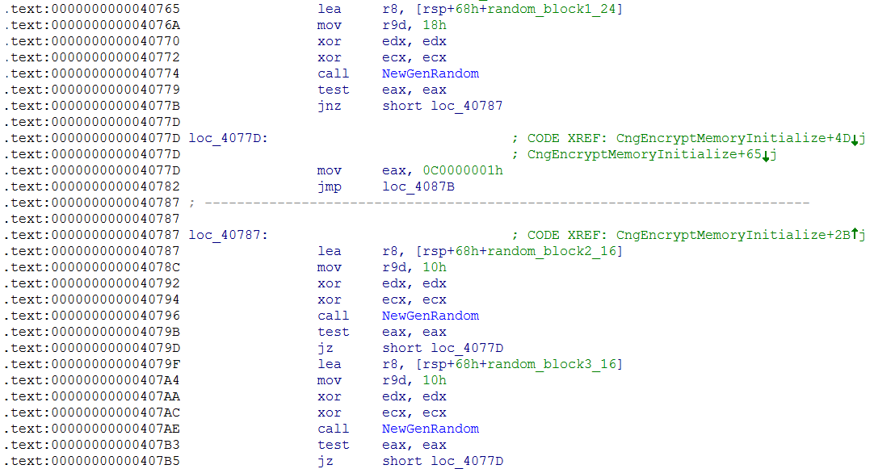

It then proceeds to use these three blocks to seed the global hash variable (`g_ShaHash`),
the `CROSS_PROCESS` [Triple-DES] and [AES] key (`g_DES3Key` and `g_AESKey`), a global
unused hash `g_AESHash` and the common [IV] `RandomSalt`:

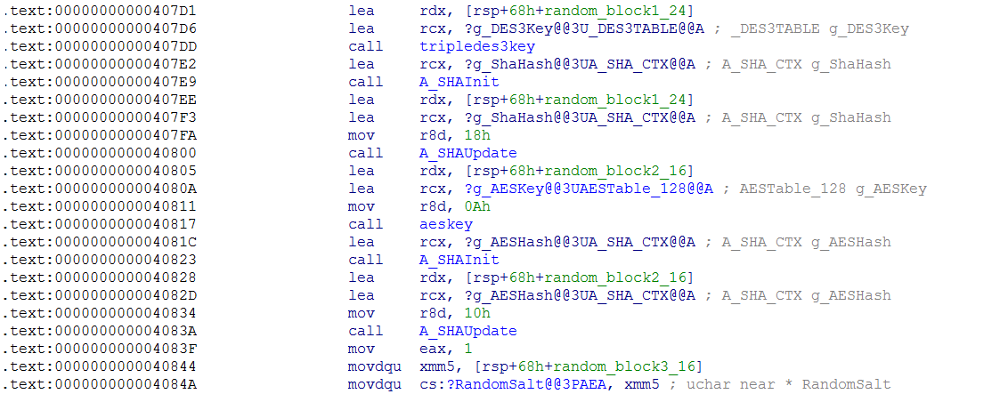

It seems that the same 24 random numbers in the global seed hash `g_ShaHash` are also used as
the global [Triple-DES] key `g_DES3Key`, so we won't need to reverse the [DES] key schedule
to get the key. Similarly, the initialization code saves the same 16 bytes used for the `g_AESKey`
key schedule into the (unused?) hash context `g_AESHash`. As the first [AES] subkey is the
full key, we have a choice between lifting the global [AES] key from the key schedule or the
buffer of the `g_AESHash` context. We can quickly verify all this in [WinDbg]:

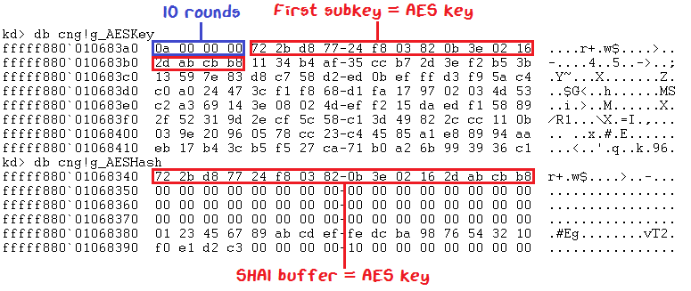

Now we know how to extract all the necessary keys and decrypt memory regions protected by
[`CryptProtectMemory`]. Using the debugging symbols should make our code robust to various
service packs and patches, but we still need to settle one more question: How does all this
look in Windows 10?

The Windows 10 version of `cng.sys` is bigger (by 60%) and more complicated. Several names
have been changed to protect the innocent. The broad differences are:

 * `CngEncryptMemory` is now called `CngEncryptMemoryEx`
 * The compiler uses [SSE] instructions more aggressively and unrolls small `memcpy` calls into
   [SSE] 128-bit 'mov' operations.
 * `CngEncryptMemoryEx` uses a new higher level API for Cryptographic Primitives (functions
    like `SymCrypt*`).
 * The core algorithm (key derivation, ingredients used for various values of `dwFlags`) is
   exactly the same, but mangled symbol names are different because they've been migrated
   to the `SymCrypt` types.
 * The `RandomSalt` symbol is no longer exposed in the `pdb` file (maybe no longer declared
   as `extern`?).

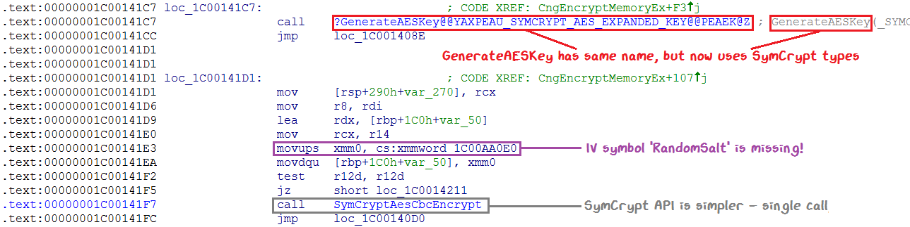

On first Autoanalysis [IDA] mis-typed the symbol `WPP_MAIN_CB` as [`DEVICE_OBJECT`],
which resulted in `RandomSalt` being mis-identified as `WPP_MAIN_CB.DeviceExtension`.
Clearing the type of `WPP_MAIN_CB` removed that issue.

The `SymCrypt` structures have slightly different shape, but it's easy to work out the relevant
offsets by looking at the data from a Windows 10 dump in [WinDbg].

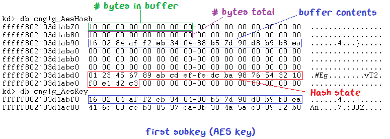

Now we have all the data we need to build a generic tool that can decrypt data protected with
[`CryptProtectMemory`]. We can get the symbols for the relevant version of  `cng.sys` from
the Microsoft Symbol Server and use them to locate the keys in the memory image. The only
complication is finding the location of the [IV] (`RandomSalt`) in Windows 10 crash-dumps.
The best way to get this is to use [`distorm3`] or [`capstone`] to disassemble `CngEncryptMemoryInitialize`
and locate a `rip`-relative write (or writes) for a block of 16 bytes.

The [Volatility] script [`dpapi.py`] puts all this knowledge together. It offers a couple
of functions capable of decrypting memory areas protected with the [`CryptProtectMemory`] API:

```Python
dpapi.unprotect_memory(address_space, pid, data_address, data_size, dwFlags=dpapi.SAME_PROCESS, verbose=False)
dpapi.unprotect_memory_blob(address_space, pid, data, dwFlags=dpapi.SAME_PROCESS, verbose=False)
```

Internally, it downloads the symbol file for the version `cng.sys` in the crash dump and uses
[`pdbparse`] to extract the global symbols and find the locations of the `cng` keys.

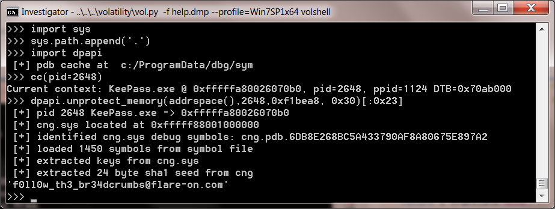

With this final tool in hand we can write a very simple volatility script ([`dump_keepass.py`](./dump_keepass.py))
which can dump the contents of every open [KeePass] database in a memory image:

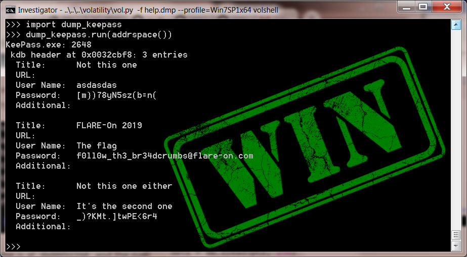

## 9.<span id="a_c_hackery"/> COMING SOON - Hackery in the kernel with `man.sys`


## 10.<span id="a_c_epilogue"/> Epilogue and Acknowledgements

What a journey! This was the first forensic challenge I have ever done and I enjoyed it immensely.
`help` is very well crafted offering seemingly impenetrable conundrums (on-the-wire encryption vs.
plaintext communication in the code), hard-core kernel hackery (reflectively loading kernel drivers),
malware paraphernalia (encrypted stack strings, plugin-based platforms) with a bit of cryptanalysis
and some plain old password brute-guessing on the side. Every puzzle had multiple solutions suited
to different skillsets and the whole experience was fascinating. Even though it wasn't the hardest
challenge I've ever done, it was definitely the most engaging and the one I've spent the most time on.
Thank you again Ryan Warns ([@NOPAndRoll]) and thanks to the FLARE team, [@nickharbour] for organizing
and [@fireeye] for sponsoring the Flare-On challenge.

My route through the challenge is pretty much as described, except that I failed to pull off the brute-guessing
bit due to the dumbest bug ever (outer brute loop didn't exit on winning, so 'WIN' message had scrolled
off the top when I checked back, and things went downhill from there - ALWAYS LOG EVERYTHING), and I
also failed to scan for the more distinctive part of the password, so I resorted to reversing `i8042prt.sys`
and lifting the password out of the keyboard buffer. I also worked on extracting the flag straight from
the [KeePass] process, but I only completed that after I had finished the keyboard approach. All in, I
had great fun and learned quite a lot.

Personal thanks go out to [@Dark_Puzzle] for pointing out the right way to scan for the password,
and [@LeeAtBenf] for proofreading my rantings and providing some decent and constructive feedback,
some of which was taken on board - also the spellchecker suggestion helped.
Additional thanks go out to Randall Munroe of [xkcd](https://xkcd.com) for his permissive license which
allowed Black Hat of [Laser Pointer](https://what-if.xkcd.com/13/) fame to help spur us
on to deeper kernel spelunking. Additionally, Randall's hand-writing font came in 
very handy for marking up disassemblies!

I hope you enjoyed reading this guide, and remember:

<p align="center">


<!--  -->

</p>

[@eleemosynator]


Footnotes
---
<b id="f_winver">1.</b> Initially I misremembered the Windows build numbers and misidentified this as
a Windows 10 dump, which led me down a wonderful rabbit hole trying to track down the kernel object
type cookie from `nt!ObGetObjectType`. Should have loaded in [WinDbg] which correctly identifies
the crash-dump OS version as Windows 6.1.7601.18741.[&#x21a9;](#a_winver)

<b id="f_net_activity">2.</b> I zoomed in on these particular connections because the ports 4444, 6666, 7777, 8888
and very unusual, do not have any standard services associated with them and all appear to be related to the
same underlying process. Also 4444 was the backdoor port installed by the [Blaster Worm](http://virus.wikidot.com/blaster).
So there is that as well. [&#x21a9;](#a_net_activity)

<b id="f_hostname">3.</b> We can also get the victim host name by checking `HKLM\CurrentControlSet\Control\ComputerName\ActiveComputerName` using
the `printkey` [Volatility] plugin. The following incantation sorts this out:
```
volatility_2.6_win64_standalone.exe -f help.dmp --profile=Win7SP1x64 printkey -o 0xfffff8a000024010 --key ControlSet001\Control\ComputerName\ActiveComputerName
```
Where `0xfffff8a000024010` is the location of the `SYSTEM` hive from [`hivelist`](./scans/hivelist.txt). [&#x21a9;](#a_hostname)

<b id="f_driver_note">4.</b> In the Windows driver model, a single kernel module can create multiple
drivers and each driver in turn can serve multiple devices. User-space processes can only access devices
through [`CreateFile`] (and then [`DeviceIoControl`]) and then only if the driver creates a symbolic link
associating the kernel device (typically `\Device\lawnmower`) and a user-visible moniker. [&#x21a9;](#a_driver_note)

<b id="f_rip_relative">5.</b> I've loaded my driver at zero base. This does not cause any relocation
problems because 64-bit code uses rip-relative addressing for most data access. See the section of
the Intel manual: https://xem.github.io/minix86/manual/intel-x86-and-64-manual-vol2/o_b5573232dd8f1481-72.html.
[IDA] protects your sanity from all that mess by displaying the actual target offset. [&#x21a9;](#a_rip_relative)

<b id="f_volshell_bug">6.</b> The current version of the [Volatility] address space object has a rather serious
bug that causes non-page-aligned reads that span many pages to return corrupt data. The workaround is to
read from the start of the page and throw away the parts you don't need. To extract `man.sys` from
`vmtoolsd.exe` you should do the following:
```Python
>>> cc(pid=1352)
Current context: vmtoolsd.exe @ 0xfffffa8003686620, pid=1352, ppid=1124 DTB=0x14d1f000
>>> db(0x39fa951,0x100)
```
```
0x039fa951  00 00 00 08 6d 61 6e 2e 73 79 73 00 00 00 be 60   ....man.sys....`
0x039fa961  4d 5a 90 00 03 00 00 00 04 00 00 00 ff ff 00 00   MZ..............
0x039fa971  b8 00 00 00 00 00 00 00 40 00 00 00 00 00 00 00   ........@.......
0x039fa981  00 00 00 00 00 00 00 00 00 00 00 00 00 00 00 00   ................
0x039fa991  00 00 00 00 00 00 00 00 00 00 00 00 c8 00 00 00   ................
0x039fa9a1  0e 1f ba 0e 00 b4 09 cd 21 b8 01 4c cd 21 54 68   ........!..L.!Th
0x039fa9b1  69 73 20 70 72 6f 67 72 61 6d 20 63 61 6e 6e 6f   is.program.canno
0x039fa9c1  74 20 62 65 20 72 75 6e 20 69 6e 20 44 4f 53 20   t.be.run.in.DOS.
0x039fa9d1  6d 6f 64 65 2e 0d 0d 0a 24 00 00 00 00 00 00 00   mode....$.......
0x039fa9e1  f5 b5 50 c2 b1 d4 3e 91 b1 d4 3e 91 b1 d4 3e 91   ..P...>...>...>.
0x039fa9f1  b1 d4 3f 91 ac d4 3e 91 b8 ac ad 91 b2 d4 3e 91   ..?...>.......>.
0x039faa01  b8 ac bd 91 b0 d4 3e 91 b8 ac b4 91 b3 d4 3e 91   ......>.......>.
0x039faa11  b8 ac af 91 b0 d4 3e 91 52 69 63 68 b1 d4 3e 91   ......>.Rich..>.
0x039faa21  00 00 00 00 00 00 00 00 50 45 00 00 64 86 05 00   ........PE..d...
0x039faa31  9c b1 43 5d 00 00 00 00 00 00 00 00 f0 00 22 00   ..C]..........".
0x039faa41  0b 02 09 00 00 50 00 00 00 5c 00 00 00 00 00 00   .....P...\......
```
```Python
>>> man_sys = proc().get_process_address_space().read(0x39fa000,0x10000)
>>> man_sys = man_sys[0x961:]              # Throw away first 0x961 bytes
>>> man_sys[:0x10].encode('hex')
'4d5a90000300000004000000ffff0000'
>>> open('binaries/man.sys', 'wb').write(man_sys)
```

The actual bug in [Volatility] is just a 'braino' where the wrong variable was being used to keep
track of alignment during reads (it was using initial address versus current address). I have fixed
this in my fork of the repository. You can see the changes here: https://github.com/volatilityfoundation/volatility/compare/master...eleemosynator:master
 
 [&#x21a9;](#a_volshell_bug)

<b id="f_stmedit">7. </b> Our FLARE tormentors have given us a helpful pointer here: One of Microsoft
[Windows Filtering Platform] sample drivers is also called `stmedit`: https://github.com/microsoft/Windows-driver-samples/tree/master/network/trans/stmedit.
The evil version of `stmedit` is based on this sample. [&#x21a9;](#a_stmedit)

<b id="f_triple_des">8. </b> The legacy codepath uses exactly the same key derivation algorithms (with different seeds)
and encrypts the memory block with [Triple-DES] in [CBC] mode. [Triple-DES] has a block size of 64 bits (8 bytes). [&#x21a9;](#a_triple_des)

<b id="f_the_general_problem">9. </b> <a href="https://xkcd.com/974/">"The General Problem"</a> is a cartoon by Randall Munroe, reproduced here thanks to his
very permissive license. Original available on: https://xkcd.com/974/ [&#x21a9;](#a_the_general_problem)

[//]:\beginsection{links}
[IDA]:https://www.hex-rays.com/products/ida/support/download.shtml
[AES]:https://en.wikipedia.org/wiki/Advanced_Encryption_Standard
[DES]:https://en.wikipedia.org/wiki/Data_Encryption_Standard
[SSE]:https://en.wikipedia.org/wiki/Streaming_SIMD_Extensions
[Triple-DES]:https://en.wikipedia.org/wiki/Triple_DES
[MITMA]:https://en.wikipedia.org/wiki/Meet-in-the-middle_attack
[SHA1]:https://en.wikipedia.org/wiki/SHA-1
[SHA-1]:https://en.wikipedia.org/wiki/SHA-1
[SHA]:https://en.wikipedia.org/wiki/SHA-1
[CBC]:https://en.wikipedia.org/wiki/Block_cipher_mode_of_operation#CBC
[IV]:https://en.wikipedia.org/wiki/Initialization_vector
[Volatility]:https://www.volatilityfoundation.org/
[NetworkMiner]:http://www.netresec.com/?page=NetworkMiner
[Wireshark]:https://www.wireshark.org/
[VMWare]:https://www.vmware.com/uk/products/workstation-player.html
[TCPflow]:https://www.tecmint.com/tcpflow-analyze-debug-network-traffic-in-linux/
[Rekall]:http://www.rekall-forensic.com/
[yara]:https://virustotal.github.io/yara/
[WinDbg]:https://docs.microsoft.com/en-us/windows-hardware/drivers/debugger/debugger-download-tools
[KeePass]:https://keepass.info/
[RC4]:https://en.wikipedia.org/wiki/RC4
[Unicorn]:https://www.unicorn-engine.org/
[KDF]:https://en.wikipedia.org/wiki/Key_derivation_function
[Windows Filtering Platform]:https://docs.microsoft.com/en-gb/windows/win32/fwp/windows-filtering-platform-start-page
[LDR Module List]:http://sandsprite.com/CodeStuff/Understanding_the_Peb_Loader_Data_List.html
[PEB]:http://undocumented.ntinternals.net/index.html?page=UserMode%2FUndocumented%20Functions%2FNT%20Objects%2FProcess%2FPEB.html
[Interrupt Service Routine]:https://docs.microsoft.com/en-us/windows-hardware/drivers/kernel/introduction-to-interrupt-service-routines
[`DPAPI`]:https://docs.microsoft.com/en-us/previous-versions/ms995355(v%3Dmsdn.10)
[`ReactOs`]:https://reactos.org/
[`ProcessCookie`]:https://doxygen.reactos.org/d2/dea/psdk_2winternl_8h.html#a986543046e9a63c091c874efae0565d6
[`_EPROCESS`]:https://www.nirsoft.net/kernel_struct/vista/EPROCESS.html
[`SECURITY_SUBJECT_CONTEXT`]:https://docs.microsoft.com/en-us/windows-hardware/drivers/ddi/content/wdm/ns-wdm-_security_subject_context
[`LUID`]:https://docs.microsoft.com/en-gb/windows/win32/api/winnt/ns-winnt-luid
[`_TOKEN`]:https://www.nirsoft.net/kernel_struct/vista/TOKEN.html

[@nickharbour]:https://twitter.com/nickharbour
[@fireeye]:https://twitter.com/fireeye
[@m_r_tz]:https://twitter.com/m_r_tz
[@spresec]:https://twitter.com/spresec
[@williballenthin]:https://twitter.com/williballenthin
[0xmwilliams]:https://twitter.com/0xmwilliams
[@mykill]:https://twitter.com/mykill
[@jay_smif]:https://twitter.com/jay_smif
[@mikesiko]:https://twitter.com/mikesiko
[@eleemosynator]:https://twitter.com/eleemosynator
[@Dark_Puzzle]:https://twitter.com/Dark_Puzzle
[@LeeAtBenf]:https://twitter.com/LeeAtBenf
[@AlexRRich]:https://twitter.com/AlexRRich
[@sandornemes]:https://twitter.com/sandornemes
[@MalwareMechanic]:https://twitter.com/MalwareMechanic
[@dhanesh_k]:https://twitter.com/dhanesh_k
[@NOPAndRoll]:https://twitter.com/NOPAndRoll
[@t00manybananas]:https://twitter.com/t00manybananas

[`DriverEntry`]:https://docs.microsoft.com/en-gb/windows-hardware/drivers/ddi/content/wdm/nc-wdm-driver_initialize
[`DRIVER_OBJECT`]:https://docs.microsoft.com/en-gb/windows-hardware/drivers/ddi/content/wdm/ns-wdm-_driver_object
[`IoCreateDevice`]:https://docs.microsoft.com/en-us/windows-hardware/drivers/ddi/content/wdm/nf-wdm-iocreatedevice
[`DEVICE_OBJECT`]:https://docs.microsoft.com/en-gb/windows-hardware/drivers/ddi/content/wdm/ns-wdm-_device_object
[`PsLookupProcessByProcessId`]:https://docs.microsoft.com/en-us/windows-hardware/drivers/ddi/content/ntifs/nf-ntifs-pslookupprocessbyprocessid
[`KeStackAttachProcess`]:https://docs.microsoft.com/en-us/windows-hardware/drivers/ddi/content/ntifs/nf-ntifs-kestackattachprocess
[`ZwAllocateVirtualMemory`]:https://docs.microsoft.com/en-us/windows-hardware/drivers/ddi/content/ntifs/nf-ntifs-ntallocatevirtualmemory
[`GetProcAddress`]:https://docs.microsoft.com/en-us/windows/win32/api/libloaderapi/nf-libloaderapi-getprocaddress
[`GetProcAddressA`]:https://docs.microsoft.com/en-us/windows/win32/api/libloaderapi/nf-libloaderapi-getprocaddress
[`VirtualAlloc`]:https://docs.microsoft.com/en-us/windows/win32/api/memoryapi/nf-memoryapi-virtualalloc
[`DeviceIoControl`]:https://docs.microsoft.com/en-us/windows/win32/api/ioapiset/nf-ioapiset-deviceiocontrol
[`VirtualFree`]:https://docs.microsoft.com/en-us/windows/win32/api/memoryapi/nf-memoryapi-virtualfree
[`FwpmFilterAdd0`]:https://docs.microsoft.com/en-us/windows/win32/api/fwpmu/nf-fwpmu-fwpmfilteradd0]
[`flare-on.com`]:http://flare-on.com/
[`GetUserNameA`]:https://docs.microsoft.com/en-us/windows/win32/api/winbase/nf-winbase-getusernamea
[`CreateFile`]:https://docs.microsoft.com/en-us/windows/win32/api/fileapi/nf-fileapi-createfilea
[`CreateFileA`]:https://docs.microsoft.com/en-us/windows/win32/api/fileapi/nf-fileapi-createfilea
[`RtlQueryRegistryValues`]:https://docs.microsoft.com/en-us/windows-hardware/drivers/ddi/content/wdm/nf-wdm-rtlqueryregistryvalues
[`ExAllocatePoolWithTag`]:https://docs.microsoft.com/en-us/windows-hardware/drivers/ddi/content/wdm/nf-wdm-exallocatepoolwithtag
[`RtlCompressBuffer`]:https://docs.microsoft.com/en-us/windows-hardware/drivers/ddi/content/ntifs/nf-ntifs-rtlcompressbuffer
[`MapVirtualKey`]:https://docs.microsoft.com/en-us/windows/win32/api/winuser/nf-winuser-mapvirtualkeya
[`MapVirtualKeyA`]:https://docs.microsoft.com/en-us/windows/win32/api/winuser/nf-winuser-mapvirtualkeya
[`VkKeyScan`]:https://docs.microsoft.com/en-us/windows/win32/api/winuser/nf-winuser-vkkeyscana
[`VkKeyScanA`]:https://docs.microsoft.com/en-us/windows/win32/api/winuser/nf-winuser-vkkeyscana
[`RtlCreateUserThread`]:https://undocumented.ntinternals.net/index.html?page=UserMode%2FUndocumented%20Functions%2FExecutable%20Images%2FRtlCreateUserThread.html
[`PsCreateSystemThread`]:https://docs.microsoft.com/en-us/windows-hardware/drivers/ddi/content/wdm/nf-wdm-pscreatesystemthread
[`DispatchDeviceControl`]:https://docs.microsoft.com/windows-hardware/drivers/ddi/content/wdm/nc-wdm-driver_dispatch
[`CryptUnprotectMemory`]:https://docs.microsoft.com/en-gb/windows/win32/api/dpapi/nf-dpapi-cryptunprotectmemory
[`CryptProtectMemory`]:https://docs.microsoft.com/en-us/windows/win32/api/dpapi/nf-dpapi-cryptprotectmemory
[`NtDeviceIoControlFile`]:https://docs.microsoft.com/en-us/windows/win32/api/winternl/nf-winternl-ntdeviceiocontrolfile
[`ZwQueryInformationProcess`]:https://docs.microsoft.com/en-us/windows/win32/procthread/zwqueryinformationprocess
[`SeCaptureSubjectContext`]:https://docs.microsoft.com/en-us/windows-hardware/drivers/ddi/content/ntifs/nf-ntifs-secapturesubjectcontext
[`SeQueryAuthenticationIdToken`]:https://docs.microsoft.com/en-us/windows-hardware/drivers/ddi/content/ntifs/nf-ntifs-sequeryauthenticationidtoken

[`libkeepass`]:https://pypi.org/project/libkeepass/0.2.0/
[`pdbparse`]:https://github.com/moyix/pdbparse
[`pywin32`]:https://pypi.org/project/pywin32/
[`PyCrypto`]:https://pypi.python.org/pypi/pycrypto
[`distorm3`]:https://pypi.org/project/distorm3/
[`requests`]:https://pypi.org/project/requests/
[`pefile`]:https://pypi.org/project/pefile/
[`PyCryptodome`]:https://pycryptodome.readthedocs.io/en/latest/index.html
[`capstone`]:https://www.capstone-engine.org/
[`keystone`]:https://www.keystone-engine.org/
[`unicorn`]:https://www.unicorn-engine.org/
[`symchk.py`]:https://github.com/moyix/pdbparse/blob/master/examples/symchk.py

[`dpapi.py`]:./dpapi.py
[`pdbtool.py`]:./pdbtool.py
[`pdbcache.py`]:./pdbcache.py
[`symcache.py`]:./symcache.py

[//]:\endsection{links}

<!--
[//]: # - [NetworkMiner][NetworkMiner]: Good network traffic triage and classification tool, however free version
[//]: #   will not parse `PcapNg` files, you can use `TShark` from the [Wireshark] package to convert.
-->