# 07 - anode

<p align="center">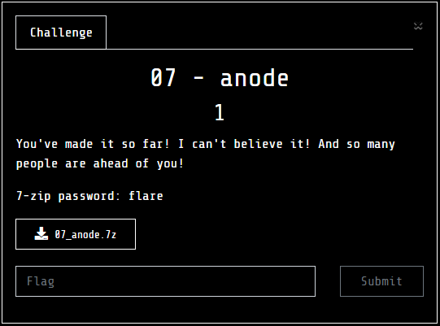</p>

Tools
---
- [CFF Explorer Suite][CFF]: CFF Explorer (Explorer Suite) - Graphical PE file parser with built-in Resource and Hex Editors
- [IDA Pro][IDA]: Excellent disassembler/decompiler/debugger (there is a free edition of v7.0)

anode by any other name...
---

The challenge archive drops a single executable named `anode.exe` which comes in at an imposing 54MB!
Between the name, the icon () and a quick scan with a hex editor:

<p align="center">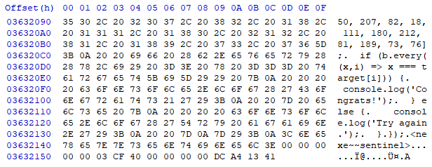</p>

we can work out that this is JavaScript embedded in an executable. A quick Google search gets us to [nexe] which 
seems to be the [Frozen Python] equivalent for JavaScript. There seem to be no off-the-shelf unpackers, but 
the JavaScript source code is uncompressed cleartext in the binary, so should be easy to extract - we just need
to know where begins and ends. The relevant part of the source code is in [compiler.ts](https://github.com/nexe/nexe/blob/1eeac1b538098352508b6af77faf71bd2409c55f/src/compiler.ts#L297), 
however it's just as easy to use [ProcMon] to capture the relevant operations:

<p align="center">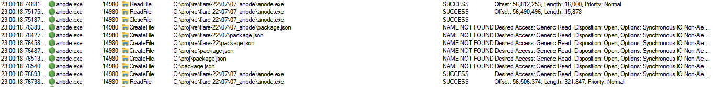</p>

The core part of the JavaScript is 321,847 bytes long, located at offset 56,504,374 in `anode.exe`. The script
in [unnexe.py] can be used to extract the embedded JavaScript into a separate file.


---

Leaving Kansas
---

 Running the script should produce [anode.js](./anode.js), which starts off with:


 ```Javascript
const readline = require('readline').createInterface({
  input: process.stdin,
  output: process.stdout,
});

readline.question(`Enter flag: `, flag => {
  readline.close();
  if (flag.length !== 44) {
    console.log("Try again.");
    process.exit(0);
  }
  var b = [];
  for (var i = 0; i < flag.length; i++) {
    b.push(flag.charCodeAt(i));
  }

 ```

  So far, so good - it prompts you for a 44 character flag and we know that the last 13 are going to be `'@flare-on.com'`.
  The next bit is much more perplexing:

```Javascript
  // something strange is happening...
  if (1n) {
    console.log("uh-oh, math is too correct...");
    process.exit(0);
  }
```

 That comment is giving us a hint that all is not well in the state of Denmark. `1n` is JavaScript slang
 for `BigInt(1)`, but somehow inside `anode.exe` when it is converted to `Boolean` it results in `false`,
 which is trippy to say the least. The rest of the code is even more bizarre:
 
 ```Javascript
 
  var state = 1337;
  while (true) {
    state ^= Math.floor(Math.random() * (2**30));
    switch (state) {
      case 306211:
        if (Math.random() < 0.5) {
          b[30] -= b[34] + b[23] + b[5] + b[37] + b[33] + b[12] + Math.floor(Math.random() * 256);
          b[30] &= 0xFF;
        } else {
          b[26] -= b[24] + b[41] + b[13] + b[43] + b[6] + b[30] + 225;
          b[26] &= 0xFF;
        }
        state = 868071080;
        continue;
	//
	// <---snip----snip----snip----snip----snip----snip----snip----snip----snip----snip----snip--->
	//
      default:
        console.log("uh-oh, math.random() is too random...");
        process.exit(0);
    }
    break;
  }

```

A 9,500 line state machine which implements a cipher that encrypts the `b` array containing the flag. It looks very much
like [control flow flattened](http://www.inf.u-szeged.hu/~akiss/pub/fulltext/laszlo2007obfuscating.pdf) code, except that the state
machine is being driven by numbers drawn from `Math.random()`, with additional random samples mixed into the encryption
operations!

The last bit of the JavaScript code just compares the encrypted `b` array to the encrypted flag 
(called `target`) and prints a success or failure message before exiting.

```Javascript
  var target = [106, 196, 106, 178, 174, 102, 31, 91, 66, 255, 86, 196, 74, 139, 219, 166, 106, 4, 211, 68, 227, 72, 156, 38, 239, 153, 223, 225, 73, 171, 51, 4, 234, 50, 207, 82, 18, 111, 180, 212, 81, 189, 73, 76];
  if (b.every((x,i) => x === target[i])) {
    console.log('Congrats!');
  } else {
    console.log('Try again.');
  }
```

Whatever hope we had of treating this as a pure JavaScript challenge and using debugging tools to solve it
have now been completely dashed. In order to reproduce the random numbers and `BigInt` calculations we will
have to run our code inside the environment of `anode.exe`.

 We can wrap every cipher operation around a `console.log()` call, taking care to include the value of
any `Math.random()` samples used, and then use the logged output to invert
the cipher (converting `+=` to `-=` and vice-versa, and then reversing the order of operations), but that's
a bit fiddly and not a whole lot of fun.

However, the simple structure of the cipher gives us the opportunity to use one of my favourite elementary methods of cryptanalysis
which proved to be the bane of home-made crypto of the 90s and 00s.

---

Divided they fall
---

If we quickly glance through the code, we can see that only the following operations are being used:

 * Integer Addition 
 * Integer Subtraction
 * Bitwise XOR

The interesting thing about these operations is that they only ever propagate information 'upwards' from bit 0 to bit N and never in the
other direction. More specifically, in all these operations, bit 0 (the lowest bit) of each result is only a function of bit 0 of all
the inputs into the calculation. Similarly, bit 1 is only a function of bits 0 and 1 of all the inputs, but not a function of any of the
higher bits.

These characteristics mean that we can use a **Divide and Conquer Attack** where we brute force bit 0 of all the bytes in the input (flag) until we match
bit 0 of all the bytes of the output, then after we have solved for all bit 0s in the input, we attack bit 1 using the bit 0 values we have already determined
and so on until we have the full input (flag). If we assume that each of the 31 unknown bytes of the flag has 7 bits, this approach reduces
the number of operations we need for a brute-force from $2^{93}$ to $7 * 2^{31} \sim 2^{34}$, which is much more feasible.

And it gets even better! For any addition or subtraction operation, bit 0 of the result is just the XOR of bit 0 of the two inputs. This is
just a mathematical expression of the primary school addition rules:

|Primary School Rule |XOR Equivalent|
|--------------------|--------------|
| Even + Even = Even |`0 ^ 0 = 0` |
| Odd + Odd = Even   |`1 ^ 1 = 0` |
| Odd + Even = Odd   |`1 ^ 0 = 1` |

In other words, after the whole cipher has run, bit zero of each byte of the output will be the XOR of some 
selection of the bit 0 of the input bytes, possibly XOR'ed with `1` in some places due to the constants
 added or subtracted at each step of the cipher (these constants are mostly drawn from `Math.random()` and play
 the role of a 'key' for this cipher).

 Focusing on bit 0 only, we can exploit these properties to reverse this part of the cipher. The first step is to work out
 which inputs of the cipher affect which outputs using the following process:

 * Choose a reference input $P$ (say all 'A') and run it through the cipher to get a reference output $C = E(P)$
 * For each byte $k$ in the input:
     * Create an input $P^{(k)}$ which is the same as $P$ except for bit 0 of the $k$-th byte which is flipped.
     * Run the cipher on $P^{(k)}$ to get the new output $C^{(k)} = E(P^{(k)})$.
     * Calculate the XOR between the reference output $C$ and $C^{(k)}$ as $D^{(k)} = C^{(k)} \oplus C$.
     * Each non zero bottom bit in $D^{(k)}$ tells us that the corresponding output byte is influenced by byte $k$ of the input.
 * Hence we get a set of XOR-based equations that relate flipped bits in the input $x_k$ to flipped bits in the output $y_j$.
 * We can solve these equations to get which combination of bits to flip in $P$ in order to have it's output become the flag $T$
     (specifically, the $y_j$ need to correspond to the XOR of $C$ with $T$).

What's perhaps a bit less obvious is that bit 1 of the result of an addition is also the XOR of bit 1
of the inputs XOR'ed with the carry from below, which only depends on bit 0! This means that once have
have determined bit 0 of every byte of the key, we can reuse exactly the same process above to calculate bit 1 and so on, until
we have the complete input.

---

A Short Example
---

For example, suppose our cipher performs the following operations on a 4-byte input:

```Javascript
	b[0] ^= (b[1] ^ b[3]) + 0x93;
	b[1] -= (b[0] + b[2]) ^ 0x74;
	b[2] += (b[0] - b[3]) ^ 0xaa;
	b[3] ^= (b[1] ^ b[2]) - 0x55;
 ```

 Suppose our target is $T =\lbrack 241, 254, 78, 28 \rbrack$:
 
 * We start by encrypting `AAAA` to give $\lbrack 210, 218, 124, 16 \rbrack$, this is our  reference output $C$.
 * We then encrypt `@AAA` to give $\lbrack 211, 225, 121, 2 \rbrack$. XOR'ing this with $C$ gives $D^{(0)} = \lbrack 1, 59, 5, 18 \rbrack$
 * The bottom bits of $D^{(0)}$ are `1110`, meaning that flipping the bottom bit of `input[0]` results in bit flips at positions 0, 1, and 2 in the output.
 * Continuing with `A@AA`, `AA@A`, `AAA@` we discover that flipping `input[1]` flips outputs 0, 2 and 3, `input[2]` flips outputs 1 and 2 and `input[3]` flips outputs 0 and 1.

 We can summarize our findings in the following table of equations:

```math
\begin{array}{ccccccccr}
  x_0&\oplus&x_1&      &   &\oplus&x_3&=y_0&(1)\\
  x_0&      &   &\oplus&x_2&\oplus&x_3&=y_1&(2)\\
  x_0&\oplus&x_1&\oplus&x_2&      &   &=y_2&(3)\\
     &      &x_1&      &   &      &   &=y_3&(4)\\
\end{array}
```

 Where the $x_k$ are the flipped bits in the input (i.e. the bottom bits of the input XOR'ed with $P$), the $y_j$ are the
 flipped bits in the output (bottom bits of output XOR'ed with $C$) and the $\oplus$ symbol denotes the XOR operation.
 Notice that we've collected all the bits that influence a given output in rows (effectively, bit 0 of $D^{(k)}$ forms the
 columns of matrix).

 The equations above tell us how output bits will flip (compared to the bits of $C$) if we flip various bits of the input.
 We know the target $T$ we need to hit and can calculate its XOR with $C$ (our reference output) to get $\lbrack 35, 36, 50, 12\rbrack$.
 The bottom bits of $T \oplus C$ are `1000` and these are the values of $y_j$ we need to target. Therefore, we need to solve the
 system of equations to obtain $x_j$. We can actually use [Gaussian Elimination], as we would for a system of equations in real numbers,
 however instead of subtraction, we just XOR equations together to eliminate variables. In the above example, equation (4) gives us
 the value for $x_1$. We can then XOR (4) into equations (1) and (3) to eliminate $x_1$

```math
\begin{array}{cccccccccr}
  x_0&      &   &      &   &\oplus&x_3&=&y_0 \oplus y_3 &(1')\\
  x_0&      &   &\oplus&x_2&\oplus&x_3&=&y_1&(2)\\
  x_0&      &   &\oplus&x_2&      &   &=&y_2 \oplus y_3&(3')\\
     &      &x_1&      &   &      &   &=&y_3&(4)\\
\end{array}
```

 And then XOR equation (3') into equation (2) in order to eliminate $x_0$ and $x_2$:

```math
\begin{array}{cccccccccr}
  x_0&      &   &      &   &\oplus&x_3&=&y_0 \oplus y_3 &(1')\\
     &      &   &      &   &      &x_3&=&y_1\oplus y_2\oplus y_3&(2')\\
  x_0&      &   &\oplus&x_2&      &   &=&y_2 \oplus y_3&(3')\\
     &      &x_1&      &   &      &   &=&y_3&(4)\\
\end{array}
```

And then complete the solution with two further moves to give:

```math
\begin{array}{cccc}
  x_0&=&y_0\oplus y_1\oplus y_2\\
  x_1&=&y_3\\
  x_2&=&y_0\oplus y_1\oplus y_3\\
  x_3&=&y_1\oplus y_2\oplus y_3\\
\end{array}
```

The target values for the $y_j$ will be the bit 0 of the XOR of $T$ with $C$, which is `1000`. Substituting
these in, gives us that $x_k$ are `0101`. Remember that the $x_k$ are the bit flips we need to
apply to our initial input `AAAA`, which means that our solution for bit 0 of the input is now `A@A@`. 
Now we have the values for bit 0, we can then continue the same process with bit 1 until we get the whole input.

---

Contact with the Enemy
---

We have a good plan for attacking the cipher, however we need to modify the code inside `anode.exe` to print the result of the cipher
instead of comparing it to the target. The script [patch_anode.py](./patch_anode.py) will create a copy of `anode.exe` with our choice
of JS script embedded into it. To execute our cryptanalytic attack, we need to modify `anode.js` so that it prints the output of the
cipher instead of comparing it to the target  - we can do this by removing the `if` statement and replacing it with `console.log(b.join("m"));`.
The file [showoutput.js](./showoutput.js) has this exact modification. Running `patch_anode.py showoutput.js` should produce a patched
version of `anode.exe` called `anode_showoutput.exe`.

The script [dandc.py](./dandc.py) can then execute the Divide and Conquer attack as described above. It's quite fun to watch it work:

<p align="center">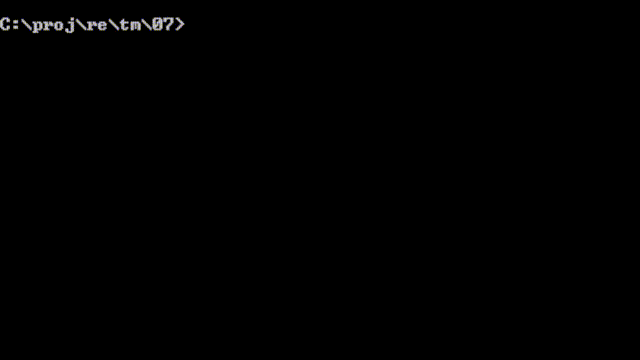</p>

---


Root of all evil
---
We got the flag, but we still have some more mysteries to solve. It seems that `anode` is using some fixed seed for the random number
generator. Perhaps we can work out what it is by sampling a sequence of random numbers from `anode`. In order to make our experiments
easier, let's create another patched version of `anode` that can be used to run arbitrary code. The code in [patch.js](./patch.js) (shown below)
will load any JS file specified on the command line and enter a `REPL` interface afterwards. Running `patch_anode.py patch.js` should
create `anode_patch.exe` a

```Javascript
// Patch for anode
// Load modules from the command line and run a REPL
var loaded = [];

// argv[0] is the node binary, argv[1] is the main js file
for (var i = 2; i < process.argv.length; ++i) {
	const module_name = "./" + process.argv[i];
	console.log("Loading: " + module_name);
	loaded.push(require(module_name));
}
// Load the repl

const repl = require('repl');

const exe_path_elts = process.argv[0].split('\\');
const exe_name = exe_path_elts[exe_path_elts.length - 1].split('.')[0];

repl.start(exe_name + '>');
```

And running it gives:

<p align="center">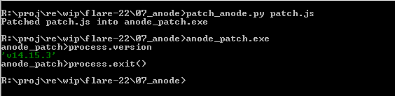</p>

So `anode` is built on version `v14.15.3` of `NodeJS`. [GitHub] has got all versions of the source nicely tagged with version numbers
so we can find the relevant snapshot and look up the workings of `Math.random()`. The relevant definition is at line 438 of
[`math.tq`](https://github.com/nodejs/node/blob/e725355e5cdd77ac9287dea9c0d2958c994e8c27/deps/v8/src/builtins/math.tq#L438)
under the Javascript V8 engine builtins interface, reproduced below.

It seems that random numbers are generated in blocks using `RefillMathRandom()` and then served to the user *backwards* for some bizarre
reason (`smiIndex` gets decremented by one when numbers are pulled out and triggers a refill when it hits zero).


```Typescript
// ES6 #sec-math.random
extern macro RefillMathRandom(NativeContext): Smi;

transitioning javascript builtin
MathRandom(js-implicit context: NativeContext, receiver: JSAny)(): Number {
  let smiIndex: Smi =
      Cast<Smi>(context[NativeContextSlot::MATH_RANDOM_INDEX_INDEX])
      otherwise unreachable;
  if (smiIndex == 0) {
    // refill math random.
    smiIndex = RefillMathRandom(context);
  }
  const newSmiIndex: Smi = smiIndex - 1;
  context[NativeContextSlot::MATH_RANDOM_INDEX_INDEX] = newSmiIndex;

  const array: FixedDoubleArray = Cast<FixedDoubleArray>(
      context[NativeContextSlot::MATH_RANDOM_CACHE_INDEX])
      otherwise unreachable;
  const random: float64 =
      array.floats[Convert<intptr>(newSmiIndex)].ValueUnsafeAssumeNotHole();
  return AllocateHeapNumberWithValue(random);
}
```

With a bit of sleuthery and guesswork can find that `RefillMathRandom()` gets mapped to `MathRandom::RefillCache()` in 
[external-reference.cc](https://github.com/nodejs/node/blob/e725355e5cdd77ac9287dea9c0d2958c994e8c27/deps/v8/src/codegen/external-reference.cc#L588).
This, in turn is defined in [math-random.cc](https://github.com/nodejs/node/blob/v14.15.3/deps/v8/src/numbers/math-random.cc), because where else
would it be. It seems that one can use a fixed seed by setting the `FLAG_random_seed` variable, which is forced to 12347 by the
`--predictable` command line flag. Otherwise the initial seed is taken from an internal C++ random number generator. The seed is then
processed through [`MurmurHash3`] to generate the initial state of the RNG (funnily enough, the `SetSeed()` method uses a different
way of initializing the state from the seed supplied to it, but I digress). The RNG Core is [`XorShift128`], which is well
known. The unexpected twist is that `NodeJS` extracts random numbers from the state of the RNG by just read the first half of the state
before converting to a double. That's seriously weird as the comment above the extraction line claims that it's using `xorshift128+`
which defines the output as the sum of the two 64-bit words of the state. Using only the top word is a suboptimal decision as
XorShift128 is very weakly mixing and taking just part of its internal state results in very poor quality random numbers. On the other
hand, this poor decision will make it a lot easier for us to infer the internal state of the RNG by sampling random numbers.
The random numbers are generated in `kCacheSize` blocks, where `kCacheSize` is defined to be 64 in [`math-random.h`](https://en.wikipedia.org/wiki/Xorshift).

```C++
Address MathRandom::RefillCache(Isolate* isolate, Address raw_native_context) {
  Context native_context = Context::cast(Object(raw_native_context));
  DisallowHeapAllocation no_gc;
  PodArray<State> pod =
      PodArray<State>::cast(native_context.math_random_state());
  State state = pod.get(0);
  // Initialize state if not yet initialized. If a fixed random seed was
  // requested, use it to reset our state the first time a script asks for
  // random numbers in this context. This ensures the script sees a consistent
  // sequence.
  if (state.s0 == 0 && state.s1 == 0) {
    uint64_t seed;
    if (FLAG_random_seed != 0) {
      seed = FLAG_random_seed;
    } else {
      isolate->random_number_generator()->NextBytes(&seed, sizeof(seed));
    }
    state.s0 = base::RandomNumberGenerator::MurmurHash3(seed);
    state.s1 = base::RandomNumberGenerator::MurmurHash3(~seed);
    CHECK(state.s0 != 0 || state.s1 != 0);
  }

  FixedDoubleArray cache =
      FixedDoubleArray::cast(native_context.math_random_cache());
  // Create random numbers.
  for (int i = 0; i < kCacheSize; i++) {
    // Generate random numbers using xorshift128+.
    base::RandomNumberGenerator::XorShift128(&state.s0, &state.s1);
    cache.set(i, base::RandomNumberGenerator::ToDouble(state.s0));
  }
  pod.set(0, state);

  Smi new_index = Smi::FromInt(kCacheSize);
  native_context.set_math_random_index(new_index);
  return new_index.ptr();
}
```

Finally, the `base::RandomNumberGenerator::ToDouble()` conversion, the `XorShift128()` core and the `MurmurHash3()` implementation
all live in [`random-number-generator.h`](https://github.com/nodejs/node/blob/36805e852471cc7a24524a329848da5c8f163864/deps/v8/src/base/utils/random-number-generator.h).
The salient bit of `ToDouble()` is below. It returns a `double` between 0 and 1 which is defined by the top 52 bits of the first half 
of the `XorShift128` state.

```C++
  // Static and exposed for external use.
  static inline double ToDouble(uint64_t state0) {
    // Exponent for double values for [1.0 .. 2.0)
    static const uint64_t kExponentBits = uint64_t{0x3FF0000000000000};
    uint64_t random = (state0 >> 12) | kExponentBits;
    return base::bit_cast<double>(random) - 1;
  }
```

Since the definition of `XorShift128` only permutes bits around and XOR's them together, we can use exactly the same Linear Algebra
approach we used to crack `anode` to back out the initial state from a set of random numbers drawn from inside `NodeJS`. We can
structure our attack as follows:

 1. Extract a block of 64 random doubles from `anode` and save them to a file.
 2. Select the first 4 doubles generated reading backwards from the end of the file, to give us enough bits to be able to back out the state (strictly 128 bits should be enough,
 but `XorShit128` is so poorly mixing that a lot of the bits are redundant and we have to draw about 160 or so before we can reliably
 back out the ).
 3. Map the doubles back to the 52 bits extracted from the first half of the `XorShift128` state.
 4. Build the set of equations (response matrix) that map a single bit flip in the state of `XorShift128` to a its impact on 4 blocks of
 52 bits extracted from its state.
 5. Solve the system of equations using the numbers calculated in step (3) as RHS to get the initial state of the RNG.

 The JS script [dump_randoms.js](./dump_randoms.js) will save the first 64 doubles drawn from `Math.random()` in binary format in a file
 tagged with the name of the executable. We can run this in both NodeJS and `anode` and compare the results.
 The script [crack_xorshift.py](./crack_xorshift.py) carries out the attack outlined above given a binary file with the first 64 random
 doubles (it only uses the last) four. It even goes a step further and tries to find the original seed by applying the inverse of `Murmur3Hash` to
 the initial state. We can feed it data from either `anode` or NodeJS.

 <p align="center">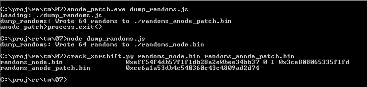</p>

 So the magic initial state is `0xce6a1a53db4c540360c43c4809ad2d74`. We could search the binary that bit pattern, but where's the fun
 in that? We can do a lot better. Even though `anode.exe` seems forbidding at 50MB+, it turns out that it has a large number of named
 exports which make it quite tractable. We can just pull it up in [IDA] and look for `refill` in the `Names` window which quickly takes
 us to `v8::internal::ExternalReference v8::internal::ExternalReference::refill_math_random(void)`:

 <p align="center">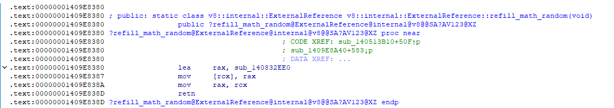</p>

 And thence to `sub_140832EE0` which has to be `MathRandom::RefillCache`:

 <p align="center">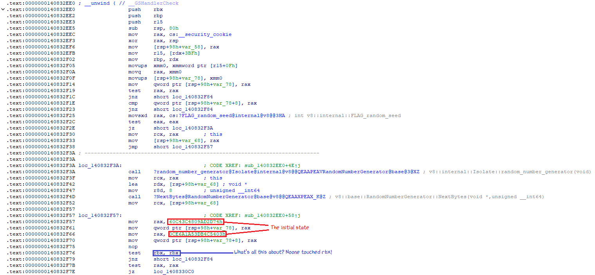</p>

 The state is set explicitly to the value we backed out earlier! A little close inspection on the lifetime and handling of the contents
 of `rbx` should convince you that this code was probably not generated by a compiler, but rather patched in by the author of the challenge!

 Anyway, one mystery solved and one more remaining.


<p align="center"></p>


Not-Kansas revisited
---

We still don't know what evil hackery was causing logical conditions involving `BigInt` to behave so counter-intuitively. There are
quite a few ways to change the behaviour of coercion to Boolean, so we'll have to experiment a bit to figure out where to look first.
The REPL interface is most helpful here.

<p align="center">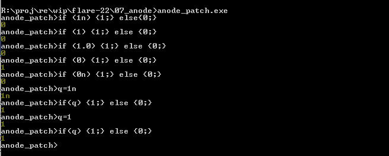</p>

It seems that variables coerce to Boolean correctly, but literals do not. Literal `BigInts` seem to coerce to Boolean false whereas
literal integers seem to coerce to the opposite of what one would expect. This actually narrows down our search. After digging through
the codebase for Boolean conversion involving literals, we come up with `Literal::ToBooleanIsTrue()` defined in
[ast.cc](https://github.com/nodejs/node/blob/e725355e5cdd77ac9287dea9c0d2958c994e8c27/deps/v8/src/ast/ast.cc#L1013).

```c++
bool Literal::ToBooleanIsTrue() const {
  switch (type()) {
    case kSmi:
      return smi_ != 0;
    case kHeapNumber:
      return DoubleToBoolean(number_);
    case kString:
      return !string_->IsEmpty();
    case kNull:
    case kUndefined:
      return false;
    case kBoolean:
      return boolean_;
    case kBigInt: {
      const char* bigint_str = bigint_.c_str();
      size_t length = strlen(bigint_str);
      DCHECK_GT(length, 0);
      if (length == 1 && bigint_str[0] == '0') return false;
      // Skip over any radix prefix; BigInts with length > 1 only
      // begin with zero if they include a radix.
      for (size_t i = (bigint_str[0] == '0') ? 2 : 0; i < length; ++i) {
        if (bigint_str[i] != '0') return true;
      }
      return false;
    }
    case kSymbol:
      return true;
    case kTheHole:
      UNREACHABLE();
  }
  UNREACHABLE();
}
```

Luckily, that particular symbol is in the exports of `anode.exe`, so we can pick it up in [IDA] immediately (I've filled in the values
of the `Type` enumeration defined in [ast.h](https://github.com/nodejs/node/blob/e725355e5cdd77ac9287dea9c0d2958c994e8c27/deps/v8/src/ast/ast.h#L899)):


<p align="center">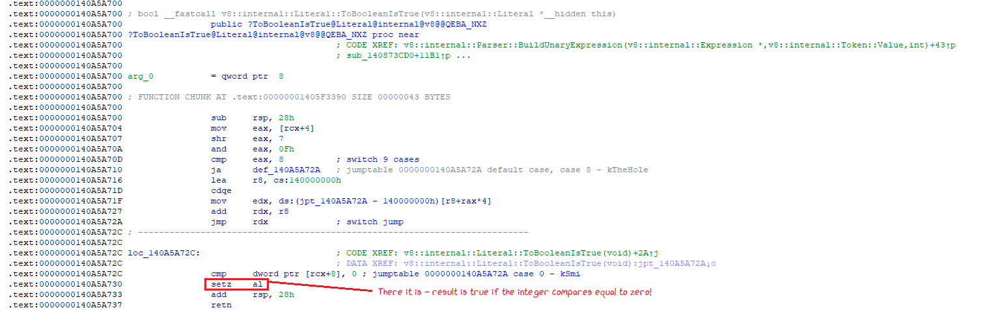</p>

The first case deals with integers (`kSmi` is 0): Fairly clearly, integer coercion to Boolean is inverted to normal convention.
A bit further down we have the case for `BigInt`:

<p align="center">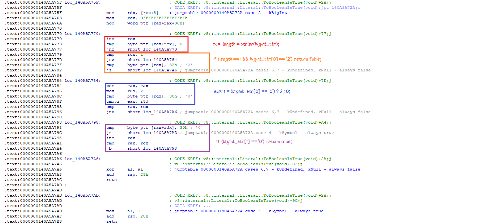</p>

This one is a bit more interesting. It turns out that the only way a `BigInt` literal coerces to true is if it is non-zero, but contains a zero somewhere
in its decimal form. We can test these in the REPL shell:

<p align="center">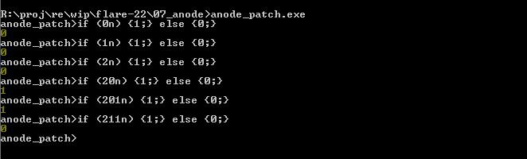</p>

And that's it! `anode` has finally given up all its mysteries. It seems fairly clear that the challenge author patched the binary in a few
selective places to achieve their aims. 

```
n0t_ju5t_A_j4vaSCriP7_ch4l1eng3@flare-on.com
```


Afterword
---
I hope you enjoyed the description of the Divide and Conquer cryptanalysis technique! If you want an opportunity to practice, I'll be
publishing a couple of cryptanalysis challenges based on an amusing cipher I encountered back in the late 90s. Check my 
[challenges repository](https://github.com/eleemosynator/challenges) for updates.

Have fun,

[@eleemosynator]

[CFF]:http://www.ntcore.com/exsuite.php
[nexe]:https://github.com/nexe/nexe
[Frozen Python]:https://docs.python-guide.org/shipping/freezing/
[ProcMon]:https://learn.microsoft.com/en-us/sysinternals/downloads/procmon
[unnexe.py]:./unnexe.py
[Gaussian Elimination]:https://en.wikipedia.org/wiki/Gaussian_elimination
[`MurmurHash3`]:https://en.wikipedia.org/wiki/MurmurHash
[`XorShift128`]:https://en.wikipedia.org/wiki/Xorshift
[IDA]:https://www.hex-rays.com/products/ida/support/download.shtml
[@eleemosynator]:https://twitter.com/eleemosynator
