Malwarebytes CrackMe 2
=====

A write-up for the second Malwarebytes CrackMe from [@hasherezade](https://twitter.com/hasherezade) available from her Malwarebytes [blog](https://blog.malwarebytes.com/security-world/2018/04/malwarebytes-crackme-2-another-challenge/).


Tools
--
- [Virtual Box][VBox]: A free VM implementation for running untrusted code
- [IDA Pro][IDA]: Indispensible
- [WinDbg][WinDbg]: The standard Windows platform debugger
- [x64dbg][x64dbg]: Alternative free debugger with very good feature set
- [CFF Explorer Suite][CFF]: Very good PE explorer
- [Python][Python]: For general messing around
- [PyCrypto][PyCrypto]: Python module implementing a suite of common cryptographic primitives
- [uncompyle6][uncompyle6]: Versatile Python bytecode decompiler
- [python-exe-unpacker][python-exe-unpacker]: General unpacker for frozen Python executables
- [Process Explorer][ProcExp]: For observing running processes (also has built-in strings utility)

Zen and the Art of Reverse Engineering
===

[mb_crackme_2.exe](https://goo.gl/7zX66h) is an 8.3MB executable. We can use [CFF Explorer][CFF] to have 
a quick look at its header structure and resources:

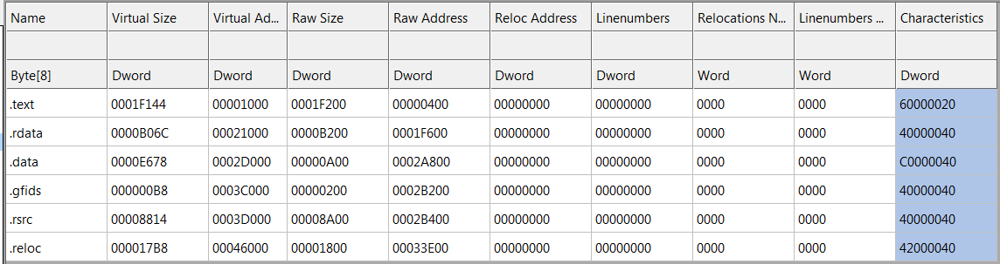

The headers indicate that most of the volume of the binary is in the `.text` section, and the resources only contain the app icon.
It's a fairly large file, so scanning it in hex editor for clues is too time consuming, however looking for very long strings using
the Unix [`strings`](https://en.wikipedia.org/wiki/Strings_(Unix)) tool does turn up a couple of items:

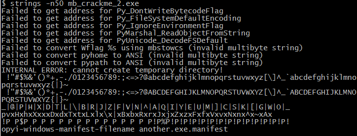

The error messages seem to refer to Python-esque symbols. A quick detonation inside a [VM][VBox] confirms that 
we are looking at a [Frozen Python](http://docs.python-guide.org/en/latest/shipping/freezing/) executable, which is a single
binary that contains a full Python environment together with the bytecode of the application and the bytecode of all
dependencies. Using [Process Explorer][ProcExp]
we can work out which libraries the crackme is loading at runtime:

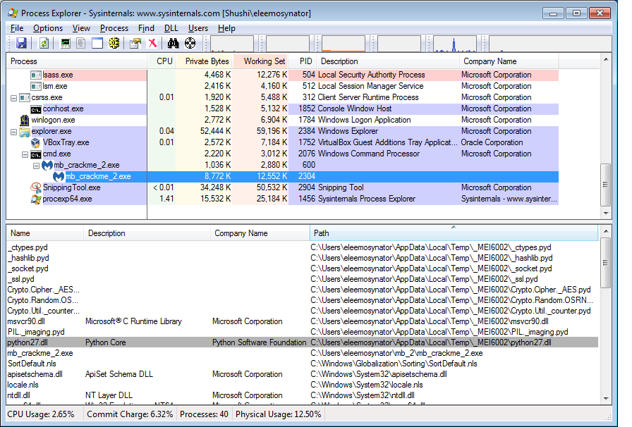

Notice how `mb_crackme_2.exe` spawns a second copy of itself which loads a number of dlls
(including `python27.dll`) from a folder in the temp directory. Presumably the parent copy
of `mb_crackme_2.exe` created that temp directory and unpacked all the dependency dlls into it.

Unpacking frozen Python is not a particularly fun task, but thankfully there are many ready-made
unpackers out there. I use [python-exe-unpacker][python-exe-unpacker] because it can seamlessly
deal with both of the most common Python packers:

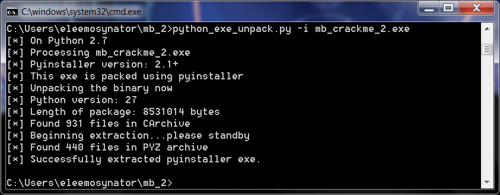

All the code of the challenge is in the file called `another`, however we can't decompile it
because the file header has been truncated. Check [this](https://0xec.blogspot.co.uk/2017/12/reversing-pyinstaller-based-ransomware.html)
helpful article for the details and more general useful information on reverse-engineering frozen Python.
I've written a quick script [`fixpyc.py`](./fixpyc.py) which fixes the headers of a list of
compiled python files. Just run `fixpyc.py another` and we're ready to decompile with [`uncompyle6`][uncompyle6]
 (you may need to rename the file to `another.pyc` as `uncompyle6` can be a bit finnicky about file extensions).
The result of this process is a ~300 line Python script that is surprisingly legible. With this at hand, we're now
ready to dive into the main challenge.

Level 1: Login
--

Running the crackme produces the following screen:

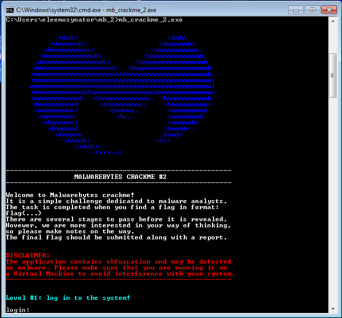

We can easily find the logic behind the login screen in the script:

```python
def main():
    key = stage1_login()
    if not check_if_next(key):
        return
```

It seems that Level 1 is handled by a specific function:

```python
def stage1_login():
    show_banner()
    print colorama.Style.BRIGHT + colorama.Fore.CYAN
    print 'Level #1: log in to the system!'
    print colorama.Style.RESET_ALL
    login = raw_input('login: ')
    password = getpass.getpass()
    if not (check_login(login) and check_password(password)):
        print 'Login failed. Wrong combination username/password'
        return None
    else:
        PIN = raw_input('PIN: ')
        try:
            key = get_url_key(int(PIN))
        except:
            print 'Login failed. The PIN is incorrect'
            return None

        if not check_key(key):
            print 'Login failed. The PIN is incorrect'
            return None
        return key
```

The login process requires three inputs: A username, a password and a PIN. The username and password
seem to have straightforward checks:

```python
def check_login(login):
    if login == 'hackerman':
        return True
    return False

def check_password(password):
    my_md5 = hashlib.md5(password).hexdigest()
    if my_md5 == '42f749ade7f9e195bf475f37a44cafcb':
        return True
    return False
```

The username is in cleartext and the password is checked against an unsalted [MD5][MD5] which
is very easy to break with [Google](https://www.google.co.uk/search?q=42f749ade7f9e195bf475f37a44cafcb), to yield the password:
`Password123` (case-sensitive).

The PIN is treated in a slightly more convoluted manner: First a `key` is derived from the PIN using
the function `get_url_key(PIN)` and then this `key` is verified using `check_key()`:

```python
def get_url_key(my_seed):
    random.seed(my_seed)
    key = ''
    for i in xrange(0, 32):
        id = random.randint(0, 9)
        key += str(id)

    return key

def check_key(key):
    my_md5 = hashlib.md5(key).hexdigest()
    if my_md5 == 'fb4b322c518e9f6a52af906e32aee955':
        return True
    return False
```

The `key` is generated by seeding the Python random number generator with the PIN and then drawing
32 numbers between 0 and 9 to form a 32-digit decimal string. Verification is performed by checking the
[MD5][MD5] hash of the `key`. Given the complexity of the `key`, we can't really hope to invert
the [MD5][MD5] hash directly. Having said that, the PIN is likely to be a four to six digit decimal
number and we can very easily try all values in that range, form the corresponding keys and check
their [MD5][MD5] hashes. In the worst case, we'll have to perform one million [MD5][MD5] hashes and
thirty-two million calls to the random number generator. This should only take a few minutes on the average
laptop. Ordinarily we would have to copy/paste the definitions of `get_url_key()` and `check_key()`, but
as it happens, `another.py` uses the [`__main__`](https://docs.python.org/2/library/__main__.html)
Python idiom which allows us to simply import it without triggering it's `main()` function
and pick and choose whichever functions we want to call. The only caveat is that all the dependencies
of `another.py` need to be installed, so you might need to `pip install pycrypto Pillow colorama` before
you can run [brute_key.py](./brute_key.py):

```python 
import another

for i in xrange(1000000):
    key = another.get_url_key(i)
    if another.check_key(key):
        print 'PIN: ', i
        print 'key: ', key
        break
```

It takes only a few seconds to run on a laptop, to produce:

```
PIN:  9667
key:  95104475352405197696005814181948
```

And now we have the full credentials we need to login:

```
login: hackerman
password: Password123
PIN: 9667
```


Intermission: Loading Level 2...
===

Now we have managed to complete Level 1, let's have a look at the next parts of the `main()` function:

```python
def main():
    key = stage1_login()
    if not check_if_next(key):
        return
    else:
        content = decode_and_fetch_url(key)
        if content is None:
            print 'Could not fetch the content'
            return -1
        decdata = get_encoded_data(content)
        if not is_valid_payl(decdata):
            return -3
        print colorama.Style.BRIGHT + colorama.Fore.CYAN
        print 'Level #2: Find the secret console...'
        print colorama.Style.RESET_ALL
        load_level2(decdata, len(decdata))
```

The function `check_if_next()` pops the success messages box and prompts you to confirm you're ready for Level 2.
The `key` we derived from the `PIN` (which is returned by the `stage1_login()` function) is
fed into `decode_and_fetch_url()` which uses it to decrypt an AES-encrypted URL 
(the internal class `AESCipher` is merely used to handle the [PKCS#7 padding](https://en.wikipedia.org/wiki/Padding_(cryptography)#PKCS7)).
We can use a short [script](./fetch_level2_v1.py) to decrypt the URL and fetch the data. While we're
at it, we can also wrap the `fetch_url()` function to make it print the URL before downloading its target.

```python
import another

PIN = 9667

# wrap another.fetch_url() so that we can print the URL before it's fetched

fetch_url_original = another.fetch_url
def fetch2(x):
    print 'url: ' + x
    return fetch_url_original(x)
another.fetch_url = fetch2


def main():
    key = another.get_url_key(PIN)
    data = another.decode_and_fetch_url(key)
    print 'fetched', len(data), 'bytes'

if __name__ == '__main__':
    main()
```

It turns out that the decrypted URL is [https://i.imgur.com/dTHXed7.png](https://i.imgur.com/dTHXed7.png).


It's a completely valid PNG file, however it only seems to contain noise. Clearly the PNG format is
merely used as a container for the actual payload. Storing malicious content in innocuous file
formats is a common malware technique that is used to evade network monitoring/filtering tools - in this
example the traffic pattern will look like a simple fetch of an image from [imgur](https://imgur.com/).
The PNG file format is a good container because it uses lossless compression for its contents.

The function `get_encoded_data()` is responsible for extracting the payload from the PNG container:

```python
def get_encoded_data(bytes):
    imo = Image.open(io.BytesIO(bytes))
    rawdata = list(imo.getdata())
    tsdata = ''
    for x in rawdata:
        for z in x:
            tsdata += chr(z)

    del rawdata
    return tsdata
```

It just uses the [Python Image Library](https://pillow.readthedocs.io/en/5.1.x/) to parse the image
format and extract the decompressed contents into a single binary string. This is then validated by `is_valid_payl()`:

```python
def is_valid_payl(content):
    if get_word(content) != 23117:
        return False
    next_offset = get_dword(content[60:])
    next_hdr = content[next_offset:]
    if get_dword(next_hdr) != 17744:
        return False
    return True
```

This looks a bit strange until you realise that 23117 is decimal for `0x5a4d` (`'MZ'`) and 17744 is decimal for `0x4550` (`'PE'`).
Clearly the decoded payload is some form of Windows PE executable. We can add a couple of lines to our
script to decode and save the payload. This is done in [fetch_level2.py](./fetch_level2.py), which saves
the payload to the file `level2_payload.dll`. A quick peek in [CFF Explorer][CFF] confirms that
we're looking at a DLL:

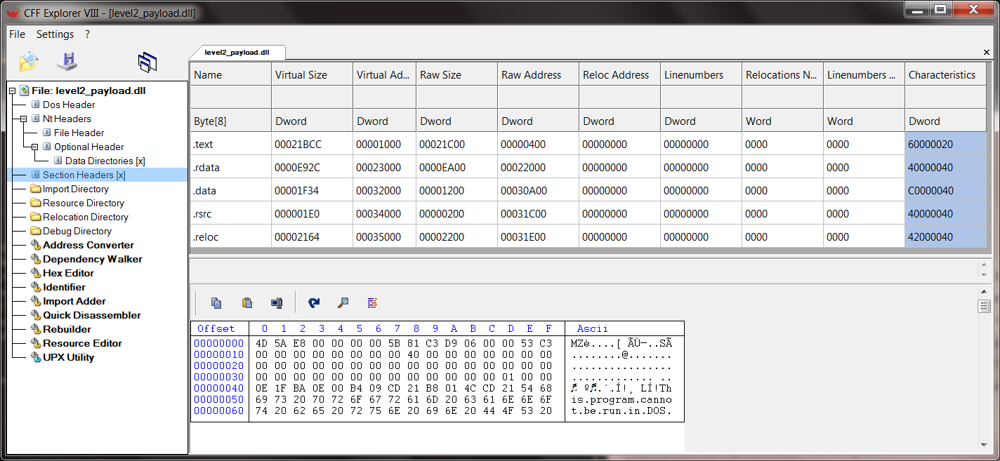

Once the payload has been fetched and decoded, the `main()` function
calls `load_level2()` which in turn uses the `prepare_stage()` function to execute it:

```python
def prepare_stage(content, content_size):
    virtual_buf = kernel_dll.VirtualAlloc(0, content_size, 12288, 64)
    if virtual_buf == 0:
        return False
    res = memmove(virtual_buf, content, content_size)
    if res == 0:
        return False
    MR = WINFUNCTYPE(c_uint)(virtual_buf + 2)
    MR()
    return True
```

This function has a bit of a surprise for us: Instead of saving down the payload and using `LoadLibrary()` to 
pull it into the process, it allocates a block of memory with `PAGE_EXECUTE_READ_WRITE` rights, 
copies the data into that block and transfers control to it at offset 2 by using the `WINFUNCTYPE` cast from
the [`ctypes`](https://docs.python.org/2/library/ctypes.html) module. In a way, the payload is being
treated like shellcode even though it is a well-formed DLL file. 

The technique we are looking at is
called [Reflective DLL Injection](https://www.andreafortuna.org/cybersecurity/what-is-reflective-dll-injection-and-how-can-be-detected/), which is shorthand for 
saying that instead of loading a DLL from disk by invoking the Windows Loader (LDR) using `LoadLibrary()`,
we implement our very own loader which allocates and fills the necessary memory blocks for each section
of the DLL, binds the imports, applies the relocations and calls the DLL entry point. This technique is
commonly used by malware authors in order to avoid detection by more naive AVs and leave very little
forensic evidence for analysis. The payload
in this crackme contains a tiny bit of shellcode on in the DOS part of the header that simply transfers
control to a Reflective Loader which has been compiled into the payload. The loader itself looks
like an exact copy of the original PoC by [Stephen Fewer](https://twitter.com/stephenfewer) which 
can be found [here](https://github.com/stephenfewer/ReflectiveDLLInjection/blob/master/dll/src/ReflectiveLoader.c).
It's a fun piece of code, but a lot easier to understand by looking at the source on github. 

Now we've figured out how the payload is executed, we can simply treat it as a normal DLL and pull it up in [IDA][IDA].

Level 2: Finding the Secret Console
===

 After initial autoanalysis has finished, we can start at the DLL entry point at `0x100086ac`,
 which just drops straight into `sub_10008579`. This is a long-ish sub which is probably part
 of the 'C++' runtime. It makes calls to several other subs, one of which is the application's
 `DllMain()` function. To avoid having to examine every single called sub, we can pay a little attention
 to the actual addresses:

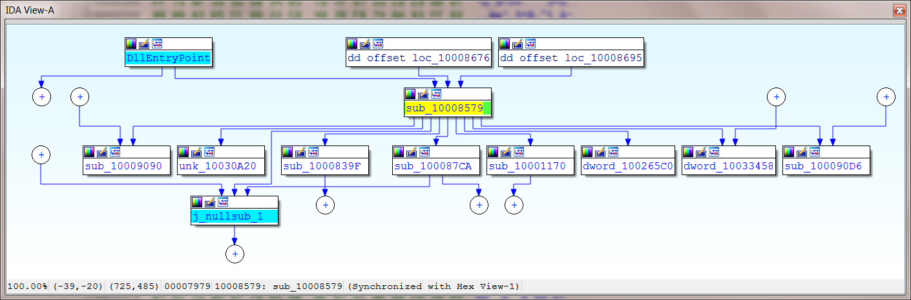
 
 All the subs have addresses very close to `sub_10008579` with the exception of `sub_10001170`.
 Remember that when the binary is linked together, all related functions in the statically-linked
 part of the runtime reside in a single module and hence end up very close to each other in the
 binary, whereas the user part of the code will end up somewhat further away. Hence it's reasonable
 to assume that `sub_10001170` is the `DllMain()` function we're looking for:

 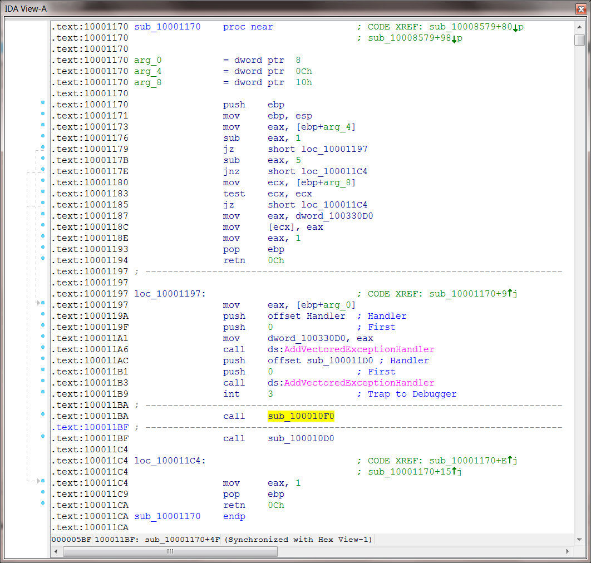

 This function contains a bit of a surprise: an `INT 3` right in the middle of normal program flow. In addition,
 IDA is giving us the hint that `sub_100010F0` never returns by putting the long dashed line
 comment under it. Indeed, if we look at this sub, we find that it just pops up a failure message.
 We're probably looking at some anti-debug trickery and more likely than not, execution flow
 will continue with `sub_100010D0` which is called at the end of this function. Still, it's
 interesting to pick this particular trick apart. The first section of the `sub_100010F0` sets
 up two exception handlers using [`AddVectoredExceptionHandler()`](https://msdn.microsoft.com/en-us/library/windows/desktop/ms679274(v=vs.85).aspx).
 The first handler sub has been automatically renamed to `Handler` by IDA (it's at `0x10001260`)
 and the second is `sub_100011D0`. As the first parameter passed to [`AddVectoredExceptionHandler()`](https://msdn.microsoft.com/en-us/library/windows/desktop/ms679274(v=vs.85).aspx)
 is zero in both cases, the two exception handlers will be called in the order they are registered.
  Let's take a quick look at them:

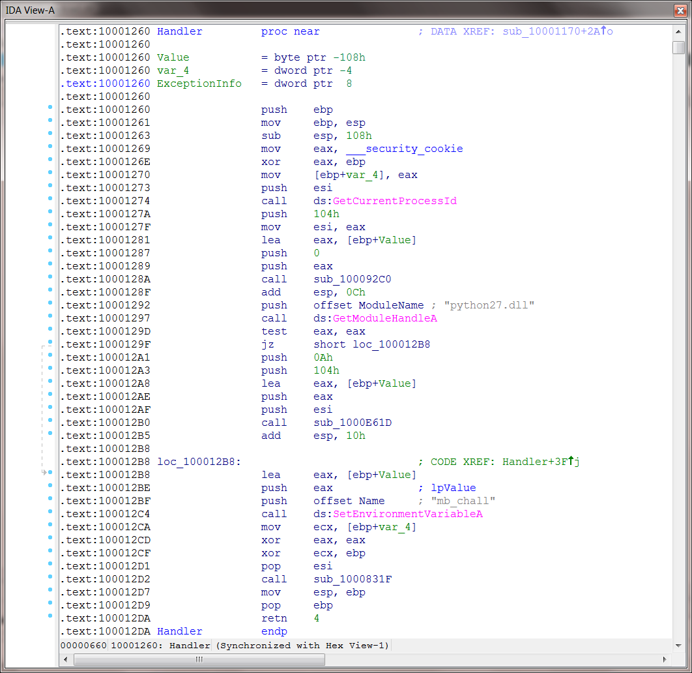

 This handler seems to check if `python27.dll` has been loaded by looking for a non-zero result
 from [`GetModuleHandle()`](https://msdn.microsoft.com/en-us/library/windows/desktop/ms683199(v=vs.85).aspx) and if
 it finds it loaded, it sets the environment variable `mb_chal1` to a non-blank string derived
 from the process id. Loosely converted to 'C', this function looks like:

 ```C
 LONG WINAPI handler1(struct _EXCEPTION_POINTERS *ExceptionInfo) {
	char Value[0x104];
	sub_100092C0(Value, 0, sizeof(Value));
	if (GetModuleHandle("python27.dll") != 0) {
		sub_1000E61D(GetCurrentProcessId(), Value, sizeof(Value), 10);
	}
	SetEnvironmentVariable("mb_chal1", Value);
	return EXCEPTION_CONTINUE_SEARCH;	// 0
 }
 ```

 Just by looking at the structure of the code and the signatures of the functions being called,
it's reasonable to guess that `sub_100092C0` is actually [`memset(void *buf, int c, size_t count)`](https://msdn.microsoft.com/en-us/library/0we9x30h.aspx)
 (matches the signature and
is clearly being used to initialize the `Value[]` character array) and `sub_1000E61D` is probably
[`_itoa_s(int value, char *buffer, size_t size, int radix)`](https://msdn.microsoft.com/en-us/library/0we9x30h.aspx)
as it's being used to convert an integer (the process id) to a string and the last argument passed in (10) probably signifies
that the result should be expressed in decimal. As an aside, the final call to `sub_1000831F` implements the Microsoft
'C' [buffer overrun protection](https://msdn.microsoft.com/en-us/library/8dbf701c.aspx).

In summary, the first exception handler looks for a loaded module called `python27.dll` (the python runtime)
and sets the environment variable `mb_chal1` to the process id if it finds it. Finally it tells the OS
to continue searching for an exception handler by returning `EXCEPTION_CONTINUE_SEARCH`.

The second handler is `sub_100011D0`:

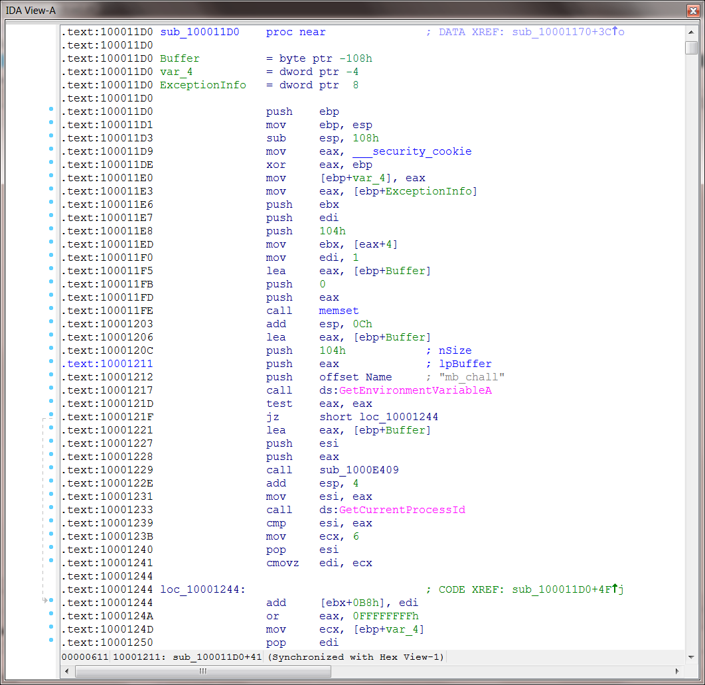

Which roughly translates to:

```C
LONG WINAPI handler2(struct _EXCEPTION_POINTERS *ExceptionInfo) {
	char Buffer[0x104];
	memset(Buffer, 0, sizeof(Buffer));
	PCONTEXT pctx = ExceptionInfo->ContextRecord;  // ebx
	DWORD delta = 1;                               // edi
	if (GetEnvironmentVariable("mb_chal1", Buffer, sizeof(Buffer))) {
		if (sub_1000E409(Buffer) == GetCurrentProcessId())   // probably atoi()
			delta = 6;
	}
	pctx->Eip += delta;		// EIP is at offset 0xB8 of CONTEXT, see WinNT.h or IDA standard structures
	return EXCEPTION_CONTINUE_EXECUTION;	// -1
}
```

The second handler increments EIP by 1 or by 6 depending on whether the first handler found
`python27.dll` loaded in memory and the tells the OS to continue programme execution as normal.
If we go back to the structure of the `DllMain()` function that sets up these handlers:

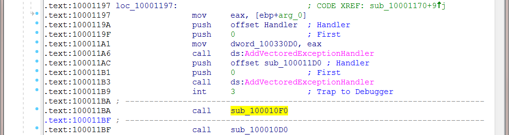

The `INT 3` instruction embedded in the code will cause an exception to be issued. When the exception
handler is called, the value of `EIP` saved in the context will point to `0x100011B9` corresponding
to the start of the `INT 3` instructure. This is an anti-debugging trick because any debuggers attached to
the process will assume that the exception is meant for them (as a result of a breakpoint) and consume it
rather than passing it on to the exception handlers.
Now, if no Python runtime is found loaded in memory, the exception handler in the payload will
increment `EIP` by 1 moving it to the `call sub_100010F0` instruction which pops up the fail
message box and exits. However, if the python runtime is present, `EIP` will be incremented by 6 skipping
the 5-byte call into the fail subroutine and moving to the `call sub_100010D0` instruction:

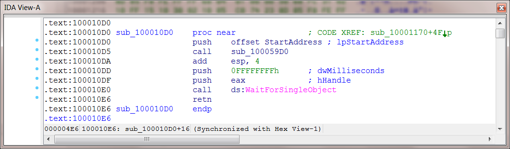
 
 This part uses `sub_100059D0` which calls [CreateThread()](https://msdn.microsoft.com/en-us/library/windows/desktop/ms682453(v=vs.85).aspx)
to start a background thread and then waits until the child thread completes using [WaitForSingleObject()](https://msdn.microsoft.com/en-us/library/windows/desktop/ms687032(v=vs.85).aspx)
on the returned handle. The starting point of the thread execution has already been renamed `StartAddress` by IDA.

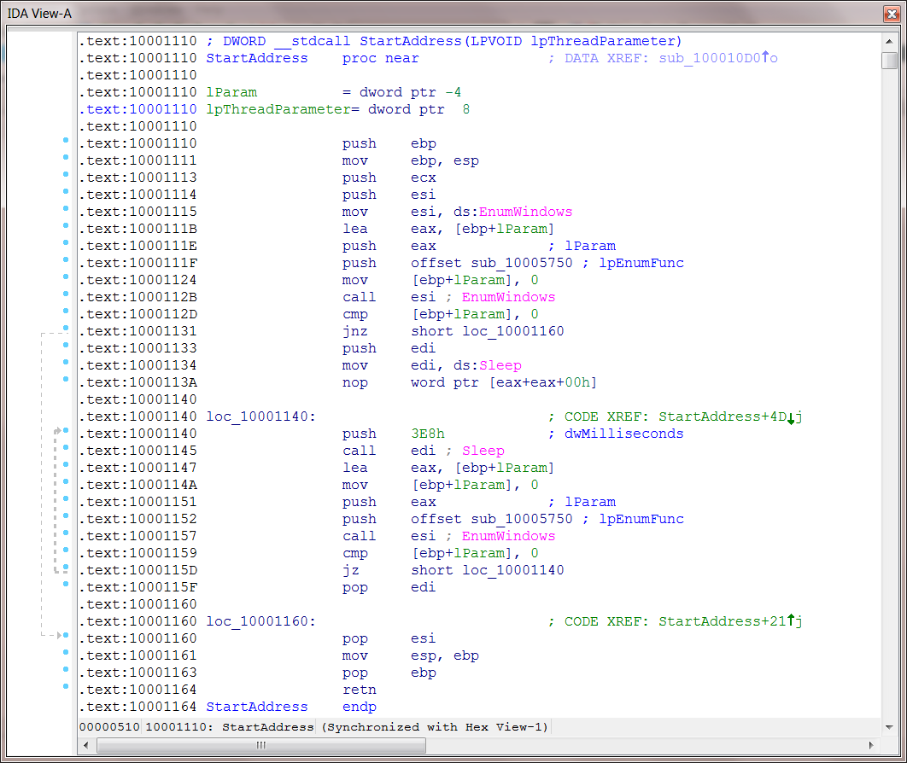

Seems straightforward enough: Spin in a one second (0x3e8 ms) cycle, enumerating all the top level windows with
callback `sub_10005750` until the callback sub sets a flag pointed to by its argument `lParam`.

The callback function itself sets up its stack cookie and exception handler and then does the following things:

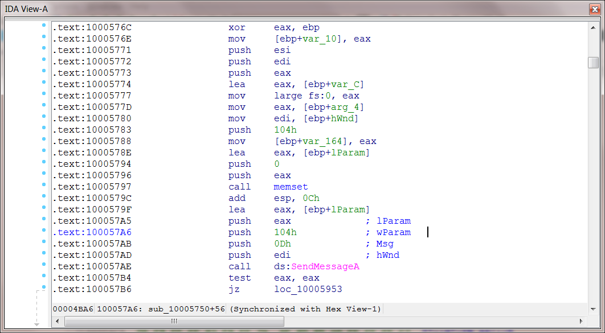

After initializing locals, the callback function sends windows message `0x0D`, which is
 [`WM_GETTEXT`](https://msdn.microsoft.com/en-us/library/windows/desktop/ms632627(v=vs.85).aspx)
 to the `hWnd` (which is the handle to the current window in the enumeration),
getting the result into the stack buffer at `lParam`.

We can skip over the next bit that simply copies a long string to the stack. As the code is using
xmm registers, IDA misidentifies the string as `xmmword_10002338C`, but if you force it into
ASCII, you'll find the message: `"Secret Console is waiting for the commands..."` The same piece
of code also calculates the length of this messages and stores in `ESI`.

The next part is a bit more interesting:

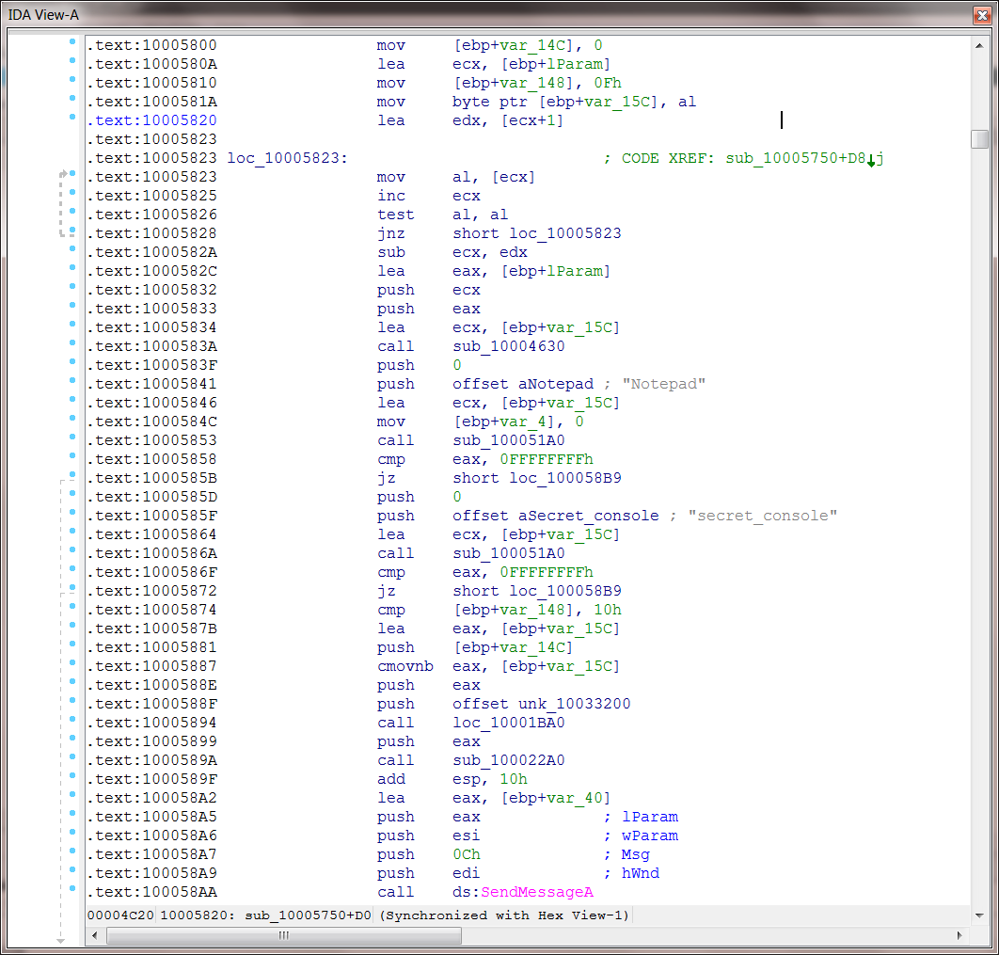

The top part of this section seems to be constructing some sort of object starting at `var_15C`.
We can assume we are looking at an actual object because the calls to `sub_10004630` and 
`sub_100051A0` pass a pointer to `var_15C` in the `ECX` register, which is the standard Microsoft
calling convention for object methods ([`__thiscall`](https://msdn.microsoft.com/en-us/library/ek8tkfbw.aspx)).
 Figuring out what the rest of the
 function does hinges on working out the class of this object. Let's collect what we know about it:

 1. Given the proximity of the initializations, the layout of the object looks like (size 0x18):
 ```
  0x00	BYTE[0x10]	var_15C = 0		; Initialized as BYTE, but also accessed as DWORD later
  0x10	DWORD		var_14C = 0
  0x14	DWORD		var_148 = 0x0F
```
 2. Post intialization, method `sub_10004630` is called with an ASCIIZ string as first parameter (the window text) and the length of the string as second.
 3. When the object is used between `0x10005874` and `0x10005887`, it's either used as a byte array starting at `var_15C` or
    as a pointer storing in `var_15C` depending whether field `var_148` has a value greater or equal to 16.

We are looking at an instance of `std::string` and it is the third clue that's the real giveaway. In the 
Microsoft implementation, the string object has an inner union between a pointer to an allocated buffer
and a character array of length 16. Strings that are shorter than 16 characters are stored directly
inside the `std::string` structure as an optimization. This leads to the giveaway comparison of the
buffer capacity with 16 and the `cmovnb` choosing between the address of the object itself and the
DWORD contained at the start of the object. All this is implemented in the header file `xstring`, although
it's admittedly not very easy on the eyes. The DWORD at offset 0x10 of the object (`var_14C`) is the 
string length and the DWORD at 0x14 (`var_148`) is the buffer capacity (reserved space).

```C
// Simplified layout of the std::string object
struct string_layout {
	union contents_union {
		char	buffer[16];
		char	*data;
	}		contents;		// offset 0x00
	size_t		size;			// offset 0x10
	size_t		reserved;		// offset 0x14
} ;
```

With all this context in mind, the next thing to work out is the purpose of `sub_100051A0`:
* It's a method of `std::string` as it's called with the address of `var_15C` in `ECX`.
* It has two arguments: an ASCIIZ string and an integer (zero used in both calls).
* It returns a DWORD with the special value -1 denoting some kind of failure.

The best match for these properties is [`size_t std::string::find(const value_type* ptr, size_type _Off = 0)`](https://msdn.microsoft.com/library/a9c3e0a2-39bf-4c8a-b093-9abe30839591.aspx#basic_string__find),
which returns `std::string::npos` (-1) when it fails to find a match.

Now we're getting somewhere. The level 2 payload runs through all the top-level windows until it
finds one with a caption that contains both: `secret_console` and `Notepad` and then sets the
caption of that window to the message `"Secret Console is waiting for the commands..."` (that's 
the `SendMessage` with `Msg=0x0C` denoting [`WM_SETTEXT`](https://msdn.microsoft.com/en-us/library/windows/desktop/ms632644(v=vs.85).aspx))
and activates it using `ShowWindow(hWnd, SW_SHOW)`.
Let's trigger this behaviour by firing up `notepad secret_console` after running the CrackMe and passing level 1:

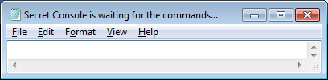

The level 2 payload has changed the title of the Notepad as expected, meanwhile back on the console window the crackme was started in:

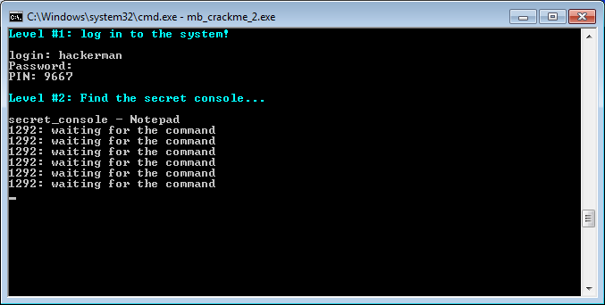

The first message is the original title of the Notepad window which is printed by the calls to
`loc_10001BA0` and `sub_100022A0` (probably `std::cout << buffer << std::endl` with `unk_10033200` being `std::cout`)
and the second set of messages are generated by the following bit of code:

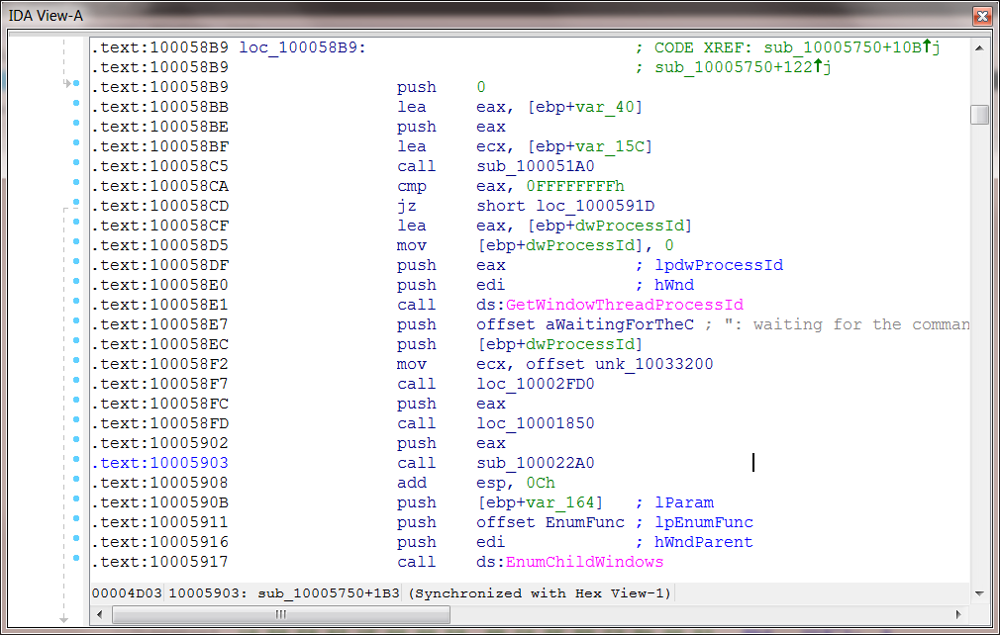

The call to `sub_100051A0` at the start filters for the windows whose caption (text) contains
the message `"Secret Console is waiting for the commands..."`

The next part streams a message to `std::cout` that contains the process id of the Notepad process (1292 in my example).
Finally, it enumerates all the child windows of the Notepad process with callback `EnumFunc` (again IDA trying to be helpful):

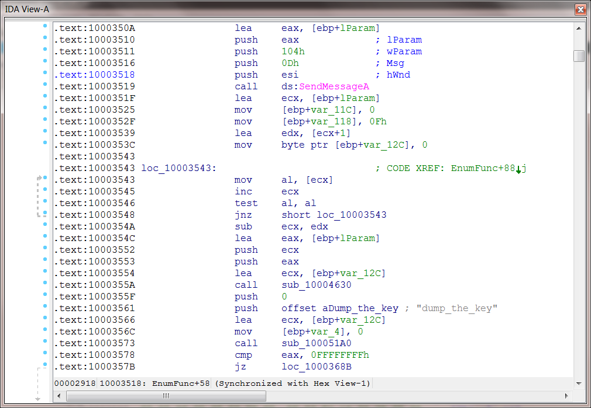

We see the same features we saw in the callback for the top level window enumaration: 
[`WM_GETTEXT`](https://msdn.microsoft.com/en-us/library/windows/desktop/ms632627(v=vs.85).aspx),
`std::string` construction and assignment (`sub_10004630`), `std::string::find` (`sub_100051A0`) etc.
This time around, the text `dump_the_key` in an inner window caption will trigger a further action in the code. Let's type
that in our 'secret console' notepad:


Level 3: The Color of Reverse Engineering
===

We're definitely on the right track, but it seems that the crackme is not quite done yet:

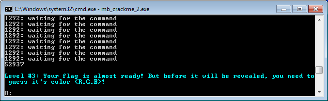

I guess we have one more level to solve, but before we go there, let's finish off reversing the
code in the level 2 payload. After triggering the `dump_the_key` check, we have the following:

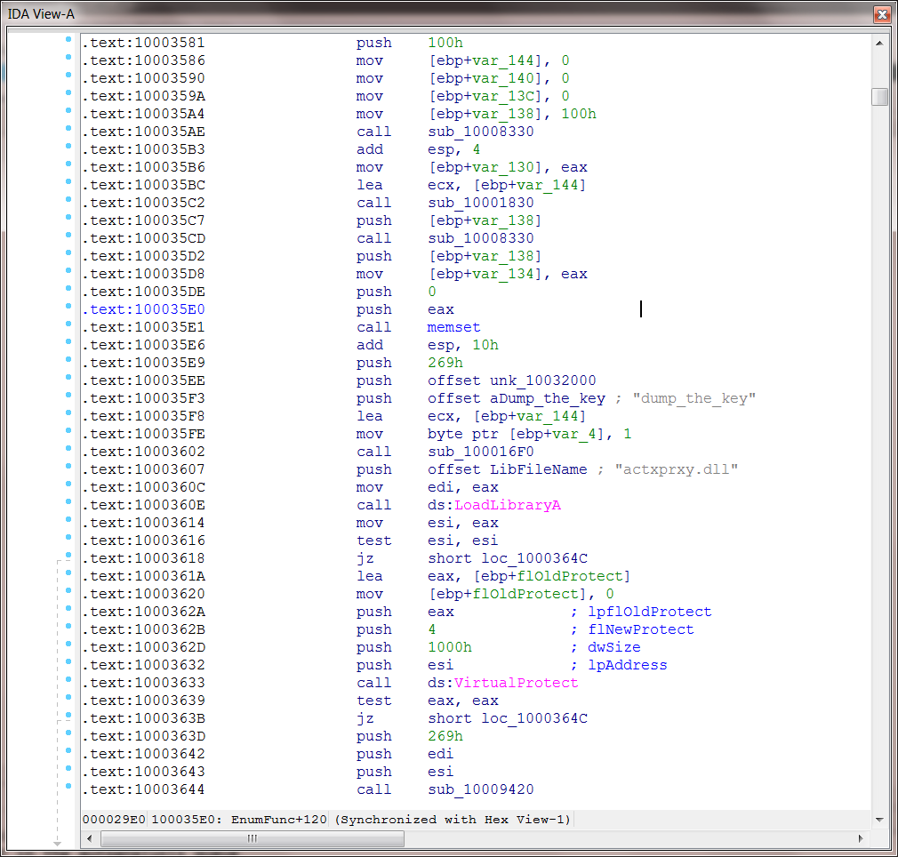

This section is a bit more involved. The first half sets up an object at `var_144`, using `sub_10008330`
(which turns out to be `malloc`) to initialize some of the members. We can loosely translate to C++ as follows:

```C++
// ...
   Object obj;	// default construction at var_144
   // variable psrc is held in EDI
   const void *psrc = obj.sub_100016F0("dump_the_key", unk_10032000, 0x269);  // unk_10032000 is a 0x269-long binary blob
   // variable pdst is held in ESI
   void *pdst = LoadLibrary("actxprxy.dll");
   if (!pdst)
      goto fail;
   DWORD flOldProtect = 0;
   if (!VirtualProtect(pdst /* ESI */, 0x1000, PAGE_READ_WRITE, &flOldProtect))
      goto fail;
   sub_10009420(pdst, psrc, 0x269);   // sub_10009420 turns out to be memcpy()
// ...
```

The signature and dataflow around `sub_100016F0` makes it look a lot like a decryption function, but the interesting
thing is what the code does with `actxprxy.dll`: After loading the library, it sets the memory access protection to read/write
on its first page (normally the header section of the binary) and overwrites it with the output (cleartext?) of `sub_100016F0`.
If we look back at the Python code in the crackme, execution moves to `decode_pasted()` after 
`load_level2()` returns:

```Python
def decode_pasted():
    my_proxy = kernel_dll.GetModuleHandleA('actxprxy.dll')
    if my_proxy is None or my_proxy == 0:
        return False
    else:
        char_sum = 0
        arr1 = my_proxy
        str = ''
        while True:
            val = get_char(arr1)
            if val == '\x00':
                break
            char_sum += ord(val)
            str = str + val
            arr1 += 1

        print char_sum
        if char_sum != 52937:
            return False
```

The Python code is reading a zero-terminated string from the begining of the loaded `actxprxy.dll`. Clearly,
neither the level 2 payload nor the python code intend to use this library. They are usng its loading address
as an easy-to-locate memory block to exchange data. The payload drops a decrypted string there and the Python code reads it.

We can go into the details of `sub_100016F0`, figure out the encryption algorithm (seems to have taken some ideas from [RC4](https://en.wikipedia.org/wiki/RC4),
but it looks like a much weaker cipher) and decrypt it. Alternatively, we can let the payload DLL do all that work for us
and just attach a debugger to the running crackme and lift the data out ourselves. Let's fire up [WinDbg][WinDbg] and
attach to the running `mb_crackme_2.exe` (assuming you've just completed level 2 on it). Remember that there
are two `mb_crackme_2.exe` processes running due to the Frozen Python unpacking procedure. You want to
attach to the 'inner' process which is typically the second one in System order - alternatively you can use
[Process Explorer][ProcExp] to find the one you want. On attaching, we immediately get:

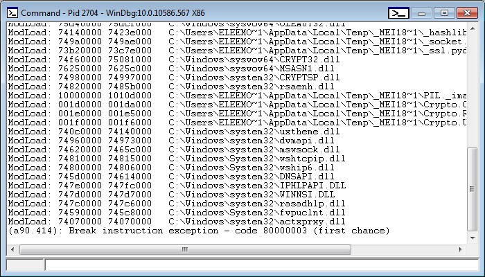

The load address of the `actxprxy.dll` has been identified for us, we can have a brief look at its contents:

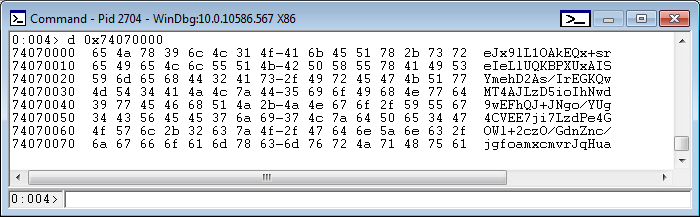

Nice! A [base64](https://en.wikipedia.org/wiki/Base64) encoded blob. We can save a copy of it to a file
 (`"flag.a64"` in this case) for further analysis (will come in handy). Remember the original size of the ciphertext was 0x269.

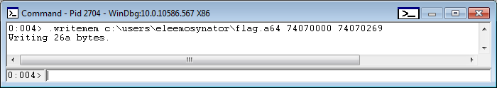

Now we can detach the debugger and take on the final stage of the challenge. Let's look at the rest
of the `decode_pasted()` function:

```Python
# ...
        colors = level3_colors()
        if colors is None:
            return False
        val_arr = zlib.decompress(base64.b64decode(str))
        final_arr = dexor_data(val_arr, colors)
        try:
            exec final_arr
        except:
            print 'Your guess was wrong!'
            return False

        return True
```

The `level3_colors()` function issues the guess-the-color message, prompts the user for three
integers between 0 and 255 corresponding the the Red, Green and Blue components of the requested color
 and converts these into a three-character binary string which it returns. `dexor_data()` implements
 a [Vignere-style](https://en.wikipedia.org/wiki/Vigen%C3%A8re_cipher) [XOR cipher](https://en.wikipedia.org/wiki/XOR_cipher).

Hence, after vanilla base64 decoding and zlib decompression, the result needs to be XOR-decrypted with a three-character
key to produce valid Python code (which is then exec'd). XOR is a very simple linear cipher that gives us
many opportunities to divide-and-conquer it by looking at all bytes encrypted with each character of the key separately,
and within each such group looking at individual bits separately. Let's start by loading up the base64 string we've saved from the debugging
session in a Python shell:


Now we can separate the ciphertext into three groups corresponding to each of the characters of the key:

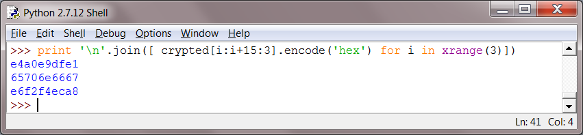

Notice that all the bytes in the first and third groups (printed on the first and third lines) have bit 7 set.
As this ciphertext should decrypt to Python code (ASCII), we can be sure that the first and third characters
of the key have bit 7 set. Let's strip that part out by decrypting using the key `\x80\x00\x80'. As the XOR cipher
is linear, we can perform successive decryptions as we discover bits of the key and then xor all our partial keys
together to get to the full key:

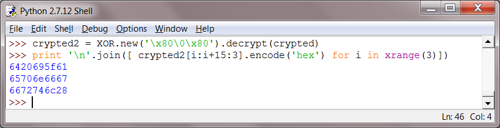

We now seem to have all three parts looking like ASCII. Time to look at the characters and see
what more information we can glean:

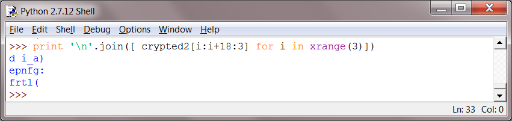

At this stage we would normally look at correlations between the streams, however reading downwards
on the printed grid indicates that we've already solved it:

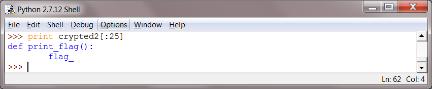

The color of our flag is [Purple](https://en.wikipedia.org/wiki/Web_colors#HTML_color_names): (128, 0, 128)! We should have
known! Reverse engineering is a skill that both Red teams and Blue teams need. All we need to do
is type it in:

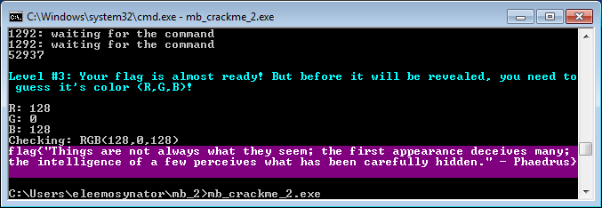


[VBox]:https://www.virtualbox.org/
[WinDbg]:https://docs.microsoft.com/en-us/windows-hardware/drivers/debugger/debugger-download-tools
[x64dbg]:https://x64dbg.com/
[IDA]:https://www.hex-rays.com/products/ida/support/download.shtml
[CFF]:http://www.ntcore.com/exsuite.php
[PyCrypto]:https://pypi.python.org/pypi/pycrypto
[Python]:https://www.python.org/
[uncompyle6]:https://github.com/rocky/python-uncompyle6
[python-exe-unpacker]:https://github.com/countercept/python-exe-unpacker
[MD5]:https://en.wikipedia.org/wiki/MD5
[ProcExp]:https://docs.microsoft.com/en-us/sysinternals/downloads/process-explorer